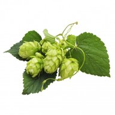

# Batches

|   | Batch # | Recipe | Status | ABV | IBU | EBC | OG | FG | BJCP Style | Type |
|---|---------|--------|--------|-----|-----|-----|----|----|------------|------|
|  | 11 | [08 SMaSH Magnum](batch_11/README.md) | Archived | 5.0 | 20 | 7.9 | 1.038 | 1.000 | 18A Blonde Ale | All Grain |
|  | 12 | [48 AnOtter Apple Cider](batch_12/README.md) | Completed | 6.0 | 0 | 8.3 | 1.040 | 0.994 | C1B English Cider | Extract |
|  | 13 | [49 AnOtter Perry Cider](batch_13/README.md) | Completed | 5.9 | 0 | 7.3 | 1.044 | 1.002 | C1D New World Perry | Extract |
|  | 14 | [09 SMaSH Sabro](batch_14/README.md) | Completed | 7.6 | 66 | 9.1 | 1.060 | 1.005 | 21B Specialty IPA | All Grain |
|  | 15 | [74 Wet Hops Blonde Ale (Chinook)](batch_15/README.md) | Completed | 5.1 | 22 | 6.7 | 1.036 | 1.000 | 12A British Golden Ale | All Grain |
|  | 16 | [75 Shameless Magpied Summer Ale](batch_16/README.md) | Completed | 5.1 | 24 | 7.9 | 1.042 | 1.006 | 18A Blonde Ale | All Grain |
|  | 17 | [61 Three Hops Blonde v2](batch_17/README.md) | Archived | 5.4 | 22 | 7.7 | 1.042 | 1.005 | 18A Blonde Ale | All Grain |
|  | 18 | [61 Three Hops Blonde v3](batch_18/README.md) | Archived | 5.0 | 22 | 7.7 | 1.042 | 1.008 | 18A Blonde Ale | All Grain |
|  | 19 | [32 Never Give Up!](batch_19/README.md)| Completed | 7.9 | 29 | 7.3 | 1.060 | 1.004 | 25C Belgian Golden Strong Ale | All Grain |
|  | 20 | [32 Never Give Up! v2](batch_20/README.md)| Completed | 8.0 | 29 | 7.3 | 1.060 | 1.002 | 25C Belgian Golden Strong Ale | All Grain |
