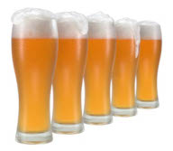

# Batches

|   | Batch # | Recipe | Status | ABV | IBU | EBC | OG | FG | BJCP Style | Type |
|---|---------|--------|--------|-----|-----|-----|----|----|------------|------|
|  | 21 | [32 Never Give Up! v3](batch_21/README.md)| Completed | 8.0 | 29 | 7.3 | 1.060 | 1.002 | 25C Belgian Golden Strong Ale | All Grain |
|  | 22 | [74 Wet Hops Blonde Ale (Bramling-X)](batch_22/README.md) | Completed | 4.6 | 31 | 9.5 | 1.041 | 1.008 | 12A British Golden Ale | All Grain |
|  | 23 | [74 Wet Hops Blonde Ale (Willamette)](batch_23/README.md) | Completed | 4.6 | 20 | 8.5 | 1.032 | 1.000 | 12A British Golden Ale | All Grain |
|   | 24 | [77 Five Pints of Best Fuggles](batch_24/README.md) | Completed | 4.3 | 29 | 15 | 1.042 | 1.011 | 11B Best Bitter | All Grain |
|  | 25 | [68 Two Pints and a Packet of Hops (Fuggle and East Kent Goldings)](batch_25/README.md)| Completed | 3.7 | 29 | 12.8 | 1.042 | 1.011 | 11B Best Bitter | All Grain |
|  | 26 | [73 Two Pints and a Packet of Hops (Fuggle and Progress)](batch_26/README.md)| Completed | 3.4 | 29 | 12.8 | 1.042 | 1.013 | 11B Best Bitter | All Grain |
|  | 27 | [03 SMaSH Godiva v2](batch_27/README.md)| Conditioning | 5.5 | 32 | 8.7 | 1.038 | 1.000 | 12A British Golden Ale | All Grain |
|  | 28 | [69 Two Pints and a Packet of Hops (Godiva and Progress)](batch_28/README.md)| Conditioning | 5.3 | 32 | 6.9 | 1.038 | 1.000 | 12A British Golden Ale | All Grain |
|  | 29 | [83 Two Pints and a Packet of Hops (Godiva and East Kent Goldings)](batch_29/README.md)| Conditioning | 5.3 | 32 | 6.9 | 1.038 | 1.000 | 12A British Golden Ale | All Grain |
|  | 30 | [A2 Bodgington Bitter]()| Planned | | | | | | 11A Ordinary Bitter | All Grain |
