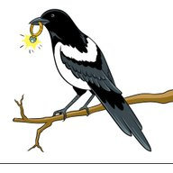

# Batches

|  | Batch # | Recipe | Status | ABV | IBU | EBC | OG | FG | BJCP Style | Type |
|---|---------|--------|--------|-----|-----|-----|----|----|------------|------|
|  |  1 | [Brouwpunt - Witbier](batch_1/README.md) | Archived | 5.0 | 15 | 9.1 | 1.060 | 1.022 | 24A Witbier | All Grain brew kit |
|  |  2 | [Brouwpunt - Kruidig Wit](batch_2/README.md) | Archived | 6.8 | 12 | 7.9 | 1.064 | 1.012 | 24A Witbier | All Grain brew kit |
|  |  3 | [03 SMaSH Godiva](batch_3/README.md) | Archived | 5.1 | 37 | 8.7 | 1.041 | 1.002 | 12A British Golden Ale | All Grain |
|  |  4 | [04 SMaSH Fuggle](batch_4/README.md) | Archived | 4.5 | 25 | 5.1 | 1.041 | 1.007 | 12A British Golden Ale | All Grain |
|  |  5 | [05 SMaSH Centennial](batch_5/README.md) | Archived | 5.3 | 43 | 9.7 | 1.042 | 1.002 | 18B American Pale Ale | All Grain |
|  |  6 | [Brouwpunt - Sinterklaas Special](batch_6/README.md) | Completed | 5.5 | 18 | 13.4 | 1.046 | 1.004 | 30B Autumn Seasonal Beer | All Grain brew kit |
|  |  7 | [06 SMaSH Citra](batch_7/README.md) | Completed | 7.5 | 44 | 10 | 1.060 | 1.006 | 18B American Pale Ale | All Grain |
|  |  8 | [07 SMaSH Simcoe](batch_8/README.md) | Completed | 6.8 | 36 | 9.3 | 1.054 | 1.002 | 18B American Pale Ale | All Grain |
|  |  9 | [07 SMaSH Simcoe v2](batch_9/README.md) | Archived | 6.7 | 36 | 12.8 | 1.054 | 1.002 | 18B American Pale Ale | All Grain |
|  | 10 | [61 Three Hops Blonde](batch_10/README.md) | Completed | 5.0 | 20 | 7.9 | 1.038 | 1.000 | 18A Blonde Ale | All Grain |
|  | 11 | [08 SMaSH Magnum](batch_11/README.md) | Archived | 5.0 | 20 | 7.9 | 1.038 | 1.000 | 18A Blonde Ale | All Grain |
|  | 12 | [48 AnOtter Apple Cider](batch_12/README.md) | Completed | 6.0 | 0 | 8.3 | 1.040 | 0.994 | C1B English Cider | Extract |
|  | 13 | [49 AnOtter Perry Cider](batch_13/README.md) | Completed | 5.9 | 0 | 7.3 | 1.044 | 1.002 | C1D New World Perry | Extract |
|  | 14 | [09 SMaSH Sabro](batch_14/README.md) | Completed | 7.6 | 66 | 9.1 | 1.060 | 1.005 | 21B Specialty IPA | All Grain |
|  | 15 | [74 Wet Hops Blonde Ale (Chinook)](batch_15/README.md) | Completed | 5.1 | 22 | 6.7 | 1.036 | 1.000 | 18A Blonde Ale | All Grain |
|  | 16 | [75 Shameless Magpied Summer Ale](batch_16/README.md) | Fermenting | | 29 | 9.1 | 1.042 | | 18A Blonde Ale | All Grain |
|  | 17 | [61 Three Hops Blonde v2](batch_17/README.md) | Fermenting | | 29 | 9.1 | 1.042 | | 18A Blonde Ale | All Grain |
|  | 18 | [61 Three Hops Blonde v3](batch_18/README.md) | Fermenting | | 29 | 9.1 | 1.042 | | 18A Blonde Ale | All Grain |
|  | 19 | [77 Five Pints of Best Fuggles](batch_19/README.md) | Planned | | | | | | 11B Best Bitter | All Grain |
|  | 20 | [68 Two Pints and a Packet of Hops (Fuggle and East Kent Goldings)](batch_20/README.md)| Planned | | | | | | 11B Best Bitter | All Grain |
|  | 21 | [73 Two Pints and a Packet of Hops (Fuggle and Progress)]()| Planned | | | | | | 11B Best Bitter | All Grain |
|  | 22 | [32 Never Give Up!]()| Planned | | | | | | 25C Belgian Golden Strong Ale | All Grain |
|  | 23 | [32 Never Give Up! v2]()| Planned | | | | | | 25C Belgian Golden Strong Ale | All Grain |
|  | 24 | [03 SMaSH Godiva v2]()| Planned | | | | | | 12A British Golden Ale | All Grain |
|  | 25 | [69 Two Pints and a Packet of Hops (Godiva and Progress)]()| Planned | | | | | | 12A British Golden Ale | All Grain |
|  | 26 | [65 Juniper Ascending]()| Planned | | | | | | Kornøl | All Grain |
|  | 27 | [66 Kornøl]()| Planned | | | | | | Kornøl | All Grain |
|  | 28 | [04 SMaSH Fuggle v2]()| Planned | | | | | | 12A British Golden Ale | All Grain |
|  | 29 | [73 Two Pints and a Packet of Hops (Fuggle and Progress) v2]()| Planned | | | | | | 12A British Golden Ale | All Grain |
|  | 30 | [11 SMaSH Progress]()| Planned | | | | | | 12A British Golden Ale | All Grain |
|  | 31 | [11 SMaSH Progress v2]()| Planned | | | | | | 12A British Golden Ale | All Grain |
|  | 32 | [22 SMaSH Palisade]()| Planned | | | | | | 18A Blonde Ale | All Grain |
|  | 33 | [22 SMaSH Palisade v2]()| Planned | | | | | | 18A Blonde Ale | All Grain |
|  | 34 | [19 SMaSH Mosaic]()| Planned | | | | | | 01D American Wheat Beer | All Grain |
|  | 35 | [19 SMaSH Mosaic v2]()| Planned | | | | | | 01D American Wheat Beer | All Grain |
|  | 36 | [33 Marvin - HHG2 the Galaxy]()| Planned | | | | | | 01D American Wheat Beer | All Grain |
|  | 37 | [33 Marvin - HHG2 the Galaxy and beyond]()| Planned | | | | | | 01D American Wheat Beer | All Grain |
|  | 38 | [35 American Wheat Beer]()| Planned | | | | | | 01D American Wheat Beer | All Grain |
|  | 39 | [35 American Wheat Beer v2]()| Planned | | | | | | 01D American Wheat Beer | All Grain |

## Original Gravity vs Final Gravity

## Original Gravity to Final Gravity

## Milestones

