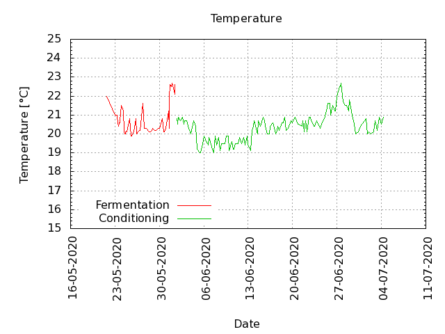
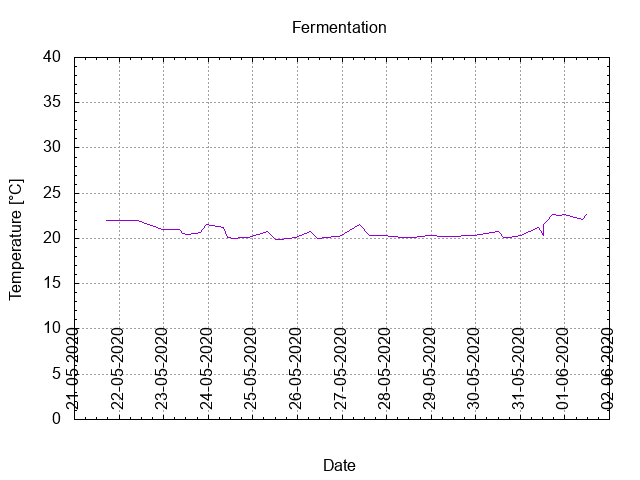
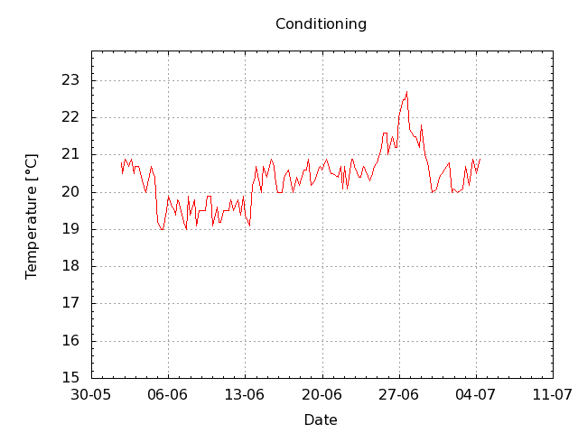

# Batch #1 - 01 Brouwpunt - Witbier

## Milestones

21-05-2020 11:00 Start brewing

21-05-2020 17:01 Start fermenting

01-06-2020 12:27 Start conditioning

16-07-2020 21:05 Completed conditioning

Archived

## Preparation

[Brew day sheet](./Batch_1_01_Brouwpunt_Witbier_brew_day_sheet.pdf)

[Checklist](./Batch_1_01_Brouwpunt_Witbier_checklist.pdf)

## Process

[Results](./Batch_1_01_Brouwpunt_Witbier_results.pdf)

### Evaluation

|                         | Recipe | Batch  | Diff   | Unit |
|-------------------------|--------|--------|--------|------|
| Pre-Boil Volume:        | 7.76   |  5.0   | -2.76  | L    |
| Post-Boil Volume (HOT): | 5.96   |  4.5   | -1.46  | L    |
| Boil Off per Hour:      | 1.8    |  0.5?  | -1.3   | L    |
| Batch Volume:           | 5.6    |  4.5   | -1.1   | L    |
| Trub/Chiller Loss:      | 0.12   | -0.18  | -0.3   | L    |
| Bottling Volume:        | 5.0    |  4.2   | -0.8   | L    |
| Pre-Boil Gravity:       | 1.040  |  1.036 | -0.004 |      |
| Post-Boil Gravity:      | 1.052  |        |        |      |
| Original Gravity:       | 1.054  |  1.060 | +0.006 |      |
| Final Gravity:          | 1.016  |  1.022 | +0.006 |      |
| Alcohol By Volume:      | 5.0    |  5.0   |  0     | %    |
| Apparent Attenuation:   | 69.4   | 62.1   | -7.3   | %    |
| Mash Efficiency:        | 73     | 43     | -30    | %    |
| Brewhouse Efficiency:   | 72     | 58     | -14    | %    |
| IBU:                    | 20     | 28     | +8     |      |
| BU/GU Ratio:            | 0.38   | 0.47   | +0.09  |      |
| RB Ratio:               | 0.35   | 0.4    | +0.05  |      |
| Color                   | 7.5    | 9.1    | +1.6   | EBC  |
| Mash pH:                | 6.02   |        |        |      |

### Tasting notes

27-05-2020 20:05 A bit sour, still cloudy and fruity. Day 6 of fermenting. Gravity from 1.060 to 1.024. Just a couple of days before bottling.

14-06-2020 16:25 opened a half filled bottle, gave a small puff, poured hazy with some small bubbles and no foamy head, no lagging, slightly darker color than expected, tasted sour and boozy, very light carbonation.

05-07-2020 15:10 light foam which dissolves quickly, very light carbonation, little hint of orange, sour.

18-07-2020 cooled and served @ 7 C, light carbonation, no foam, sour taste.

07-08-2020 16:46 cooled and served @ 7 C, light carbonation, no foam, sour taste.

03-09-2020 18:xx cooled and served @ 7 C, light carbonation, light foam which dissolved quickly, sour taste.

## Batch notes

### Brew day

21-05-2020 11:00 5L water to 72 C. 

21-05-2020 11:05 Start mashing @ 63 ... 68 C. 

21-05-2020 12:05 Start sparging with 1.7 L water @ 72 C.

21-05-2020 12:07 Added 0.5 L make up water @ 25 C.

21-05-2020 12:07 Total added 2.2 L water. 

21-05-2020 12:35 Start boil. Specific Gravity = 1.036 @ ~60 C. 

21-05-2020 12:55 Rolling boil. 

21-05-2020 13:25 Added hop pellets in a bag. Refreshed wort in hop bag 5x.  

21-05-2020 13:50 Added Orange peel. 

21-05-2020 13:55 Hop out, brewpot in the cooler (sink filled with tapwater). 

21-05-2020 14:25 Wort transferred to fermenter, and strained the orange peel out. 

21-05-2020 15:59 Specific Gravity = 1.060 @ 35 C.

21-05-2020 17:00 Wort @ 22 C, added yeast.

### Fermentation

#### Day 1 in fermentation

22-05-2020 10:00 lots of bubbles and fermenting activity.

22-05-2020 23:30 no bubbles, +10 mm delta height (pressure) in water lock, a little bit of condensate in leg leading from fermenter. Tamb = 21 C.

#### Day 2 in fermentation

23-05-2020 08:26 No bubbles @ 21 c, dp = 3 mm H2O.

23-05-2020 09:55 No bubbles @ 20.5 C, dp = 3 mm H2O.

23-05-2020 10:26 No bubbles @ 20.6 C, dp = 3 mm H2O.

23-05-2020 13:03 No bubbles @ 20.4 C, dp = 3 mm H2O.

23-05-2020 14:00 No bubbles @ 20.4 C, dp = 3 mm H2O.

23-05-2020 16:04 No bubbles @ 20.6 C, dp = 3 mm H2O.

23-05-2020 17:28 No bubbles @ 20.6 C, dp = 3 mm H2O.

23-05-2020 19:55 No bubbles @ 20.7 C, dp = 0 mm H2O.

23-05-2020 22:52 No bubbles @ 21.5 C, dp = 10 mm H2O.

#### Day 3 in fermentation

24-05-2020 08:09 No bubbles @ 21.2 C, dp = 3 mm H2O.

24-05-2020 10:17 No bubbles @ 20.1 C, dp = 2 mm H2O.

24-05-2020 14:03 No bubbles @ 20.0 C, dp = 2 mm H2O.

24-05-2020 15:26 No bubbles @ 20.0 C, dp = 2 mm H2O.

24-05-2020 16:57 No bubbles @ 20.1 C, dp = 3 mm H2O.

24-05-2020 21:31 No bubbles @ 20.1 C, dp = 2 mm H2O.

#### Day 4 in fermentation

25-05-2020 07:54 No bubbles @ 20.8 C, dp = 3 mm H2O.

25-05-2020 12:02 No bubbles @ 19.9 C, dp = 2 mm H2O.

25-05-2020 15:05 No bubbles @ 19.9 C, dp= 2 mm H2O.

25-05-2020 22:55 No bubbles @ 20.1 C, dp = 2 mm H2O.

#### Day 5 in fermentation

26-05-2020 06:54 No bubbles @ 20.8 C, dp = 2 mm H2O.

26-05-2020 11:01 No bubbles @ 20.0 C, dp = 3 mm H2O.

26-05-2020 16:08 No bubbles @ 20.1 C, dp = 2 mm H2O.

26-05-2020 20:12 No bubbles @ 20.2 C, dp = 3 mm H2O.

26-05-2020 22:45 No bubbles @ 20.2 C, dp = 2 mm H2O.

#### Day 6 in fermentation

27-05-2020 09:30 No bubbles @ 21.6 C, dp = 0 mm H2O.

27-05-2020 14:53 No bubbles @ 20.3 C, dp = 0 mm H2O.

27-05-2020 19:34 No bubbles. Cloudy, Witbier taste, a bit sour, no bubbles @ 20.3 C, dp = 0 mm H2O, Specific Gravity = 1.024.

27-05-2020 22:09 No bubbles @ 20.3 C, dp = 10 mm.

#### Day 7 in fermentation

28-05-2020 08:33 No bubbles @ 20.1 C, dp = 0 mm H2O.

28-05-2020 14:36 No bubbles @ 20.1 C, dp = 1 mm H2O.

28-05-2020 19:01 No bubbles @ 20.2 C, dp = 1 mm H2O.

28-05-2020 22:58 No bubbles @ 20.3 C, dp = 1 mm H2O.

#### Day 8 in fermentation

29-05-2020 07:19 No bubbles @ 20.2 C, dp = 1 mm H2O.

29-05-2020 12:24 No bubbles @ 20.2 C, dp = 1 mm H2O.

29-05-2020 19:56 No bubbles @ 20.3 C, dp = 1 mm H2O.

29-05-2020 23:28 No bubbles @ 20.3 C, dp = 1 mm H2O.

#### Day 9 in fermentation

30-05-2020 12:06 No bubbles @ 20.8 C, dp = 1 mm H2O.

30-05-2020 15:08 No bubbles @ 20.1 C, dp = 2 mm H2O.

30-05-2020 18:19 No bubbles @ 20.1 C, dp = 1 mm H2O.

#### Day 10 in fermentation

31-05-2020 00:14 No bubbles @ 20.3 C, dp = 1 mm H2O.

31-05-2020 09:49 No bubbles @ 21.2 C, dp = 1 mm H2O.

31-05-2020 12:33 No bubbles @ 20.3 C, dp = 1 mm H2O.

31-05-2020 12:43: Moved from box to shelve @ 21.6 C, dp = 0 mm H2O.

31-05-2020 14:15 No bubbles @ 21.9 C, dp = 0 mm H2O.

31-05-2020 17:06 No bubbles @ 22.6 C, dp = 0 mm H2O.

31-05-2020 21:05 No bubbles @ 22.5 C, dp = 1 mm H2O.

31-05-2020 23:36 No bubbles @ 22.7 C, dp = 1 mm H2O.

### Bottling day

01-06-2030 09:26 No bubbles @ 22.1 C, dp = 1 mm H2O.

01-06-2020 11:31 @ 22.6 C, Specific Gravity = 1.024 after fermenting.

01-06-2020 11:45 added 0.6 L water with 30 g sugar dissolved.

01-06-2020 12:15 Specific Gravity = 1.022 after adding sugar for carbonation and before bottling.

01-06-2020 12:30 finished bottling, filled 12 Steinie bottles (33 cl),  stored in cardboard box in the cellar.

01-06-2020 17:53 @ 20.8 C.

01-06-2020 19:47 @ 20.5 C.

### Conditioning

#### Day 1 in conditioning

02-06-2020 00:21 @ 20.9 C.

02-06-2020 08:21 @ 20.7 C.

02-06-2020 14:58 @ 20.9 C.

02-06-2020 20:01 @ 20.5 C.

02-06-2020 22:58 @ 20.7C.

#### Day 2 in conditioning

03-06-2020 07:33 @ 20.7 C.

03-06-2020 14:06 @ 20.3 C.

03-06-2020 22:14 @ 20.0 C.

#### Day 3 in conditioning

04-06-2020 09:16 @ 20.7 C.

04-06-2020 14:45 @ 20.5 C.

04-06-2020 18:33 @ 20.4 C.

04-06-2020 23:14 @ 19.2 C.

#### Day 4 in conditioning

05-06-2020 08:08 @ 19.0 C.

05-06-2020 11:57 @ 19.0 C.

05-06-2020 19;02 @ 19.5 C.

#### Day 5 in conditioning

06-06-2020 00:28 @ 19.9 C.

06-06-2020 08:16 @ 19.6 C.

06-06-2020 13:11 @ 19.5 C.

06-06-2020 15:36 @ 19.4 C.

06-06-2020 18:57 @ 19.8 C.

06-06-2020 23:13 @ 19.7 C.

#### Day 6 in conditioning

07-06-2020 09:41 @ 19.2 C.

07-06-2020 14:51 @ 19.0 C.

07-06-2020 19:51 @ 19.9 C.

07-06-2020 23:37 @ 19.4 C.

#### Day 7 in conditioning

08-06-2020 08:55 @ 19.8 C.

08-06-2020 13:41 @ 19.1 C.

08-06-2020 18:55 @ 19.5 C.

08-06-2020 22:23 @ 19.5 C.

#### Day 8 in conditioning

09-06-2020 07:46 @ 19.5 C.

09-06-2020 12:41 @ 19.9 C.

09-06-2020 20:30 @ 19.9 C.

09-06-2020 23:54 @ 19.1 C.

#### Day 9 in conditioning

10-06-2020 09:50 @ 19.6 C.

10-06-2020 15:00 @ 19.2 C.

10-06-2020 17:27 @ 19.2 C.

10-06-2020 23:07 @ 19.5 C.

#### Day 10 in conditioning

11-06-2020 11:00 @ 19.5 C.

11-06-2020 15:04 @ 19.8 C.

11-06-2020 22:16 @ 19.5 C.

#### Day 11 in conditioning

12-06-2020 07:31 @ 19.8 C.

12-06-2020 13:11 @ 19.4 C.

12-06-2020 19:21 @ 19.9 C.

12-06-2020 22:27 @ 19.4 C.

#### Day 12 in conditioning

13-06-2020 09:02 @ 19.1 C

13-06-2020 14:12 @ 20.2 C.

13-06-2020 20:07 @ 20.4 C.

13-06-2020 23:13 @ 20.7 C.

#### Day 13 in conditioning

14-06-2020 10:12 @ 20.0 C.

14-06-2020 14:52 @ 20.7 C.

14-06-2020 16:25 opened a half filled bottle, gave a small puff, poured hazy with some small bubbles and no foamy head, no lagging, slightly darker color than expected, tasted sour and boozy, very light carbonation.

14-06-2020 22:21 @ 20.4 C.

#### Day 14 in conditioning

15-06-2020 08:41 @ 20.9 C.

15-06-2020 13:32 @ 20.7 C.

15-06-2020 16:45 @ 20.4 C.

15-06-2020 23:07 @ 20.0 C.

#### Day 15 in conditioning

16-06-2020 08:42 @ 20.0 C.

16-06-2020 11:42 @ 20.4 C.

16-06-2020 21:14 @ 20.6 C.

#### Day 16 in conditioning

17-06-2020 08:26 @ 20.0 C.

17-06-2020 12:23 @ 20.2 C.

17-06-2020 15:48 @ 20.4 C.

17-06-2020 21:34 @ 20.2 C.

#### Day 17 in conditioning

18-06-2020 07:54 @ 20.6 C.

18-06-2020 13:11 @ 20.6 C.

18-06-2020 18:08 @ 20.9 C.

18-06-2020 22:51 @ 20.2 C.

#### Day 18 in conditioning

19-06-2020 07:33 @ 20.3 C.

19-06-2020 15:25 @ 20.6 C.

19-06-2020 18:36 @ 20.7 C.

19-06-2020 23:03 @ 20.6 C.

#### Day 19 in conditioning

20-06-2020 08:26 @ 20.9 C.

20-06-2020 19:16 @ 20.5 C.

20-06-2020 22:17 @ 20.5 C.

#### Day 20 in conditioning

21-06-2020 10:35 @ 20.4 C.

21-06-2020 15:41 @ 20.7 C.

21-06-2020 20:47 @ 20.1 C.

#### Day 21 in conditioning

22-06-2020 00:08 @ 20.7 C.

22-06-2020 06:45 @ 20.1 C.

22-06-2020 15:24 @ 20.9 C.

22-06-2020 18:09 @ 20.9 C.

22-06-2020 22:02 @ 20.7 C.

#### Day 22 in conditioning

23-06-2020 08:09 @ 20.4 C.

23-06-2020 12:02 @ 20.4 C.

23-06-2020 17:54 @ 20.7 C.

23-06-2020 22:09 @ 20.6 C.

#### Day 23 in conditioning

24-06-2020 08:11 @ 20.3 C.

24-06-2020 12:47 @ 20.5 C.

24-06-2020 18:12 @ 20.7 C.

24-06-2020 23:07 @ 20.8 C.

#### Day 24 in conditioning

25-06-2020 09:05 @ 21.2 C.

25-06-2020 12:26 @ 21.6 C.

25-06-2020 20:42 @ 21.6 C.

25-05-2020 23:11 @ 21.0 C.

#### Day 25 in conditioning

26-06-2020 08:27 @ 21.5 C.

26-06-2020 14:14 @ 21.2 C.

26-06-2020 18:58 @ 21.2 C.

26-06-2020 22:37 @ 22.0 C.

#### Day 26 in conditioning

27-06-2020 09:15 @ 22.5 C.

27-06-2020 13:11 @ 22.5 C.

27-06-2020 16:24 @ 22.7 C.

27-06-2020 22:09 @ 21.7 C.

#### Day 27 in conditioning

28-06-2020 07:37 @ 21.5 C.

28-06-2020 11:20 @ 21.5 C.

28-06-2020 19:40 @ 21.2 C.

28-06-2020 23:12 @ 21.8 C.

#### Day 28 in conditioning

29-06-2020 08:25 @ 21.0 C.

29-06-2020 12:51 @ 20.8 C.

29-06-2020 18:17 @ 20.5 C.

29-06-2020 22:59 @ 20.0 C.

#### Day 29 in conditioning

30-06-2020 08:33 @ 20.1 C.

30-06-2020 15:32 @ 20.4 C.

30-06-2020 21:25 @ 20.5 C.

#### Day 30 in conditioning

01-07-2020 07:46 @ 20.7 C.

01-07-2020 12:47 @ 20.8 C.

01-07-2020 20:00 @ 20.0 C.

01-07-2020 23:21 @ 20.1 C.

#### Day 31 in conditioning

02-07-2020 07:43 @ 20.0 C.

02-07-2020 18:30 @ 20.1 C.

02-07-2020 23:49 @ 20.7 C.

#### Day 32 in conditioning

03-07-2020 07:54 @ 20.2 C.

03-07-2020 15:59 @ 20.9 C.

03-07-2020 23:22 @ 20.5 C.

#### Day 33 in conditioning

04-07-2020 08:47 @ 20.9 C.

04-07-2020 14:43 @ 20.2 C.

04-07-2020 17:25 @ 21.5 C.

04-07-2020 11:16 @ 21.6 C.

#### Day 34 in conditioning

05-07-2020 07:41 @ 21.9 C.

05-07-2020 15:10 very light carbonation, little hint of orange, sour, 

05-07-2020 15:23 @ 22.2 C.

#### Day 35 in conditioning

06-07-2020 16:24 @ 18.8 C.

#### Day 36 in conditioning

07-07-2020 13:17 @ 17.6 C.

#### Day 37 in conditioning

08-07-2020 22:15 @ 17.9 C.

#### Day 38 in conditioning

09-07-2020 21:44 @ 19.0 C.

#### Day 41 in conditioning

12-07-2020 17:03 @ 18.3 C.

#### Day 43 in conditioning

14-07-2020 19:44 @ 20.0 C.

#### Day 44 in conditioning

15-07-2020 12:30 @ 18.0 C.

15-07-2020 16:28 @ 18.4 C.

15-07-2020 21:14 @ 19.7 C.

#### Day 45 in conditioning

16-07-2020 12:52 @ 19.2 C.

16-07-2020 16:43 @ 19.4 C.

