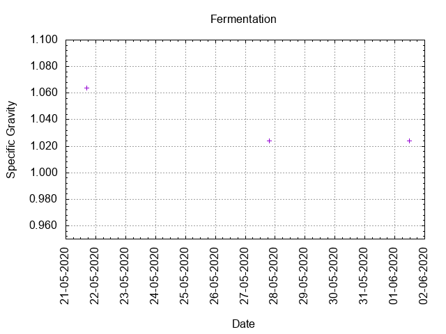
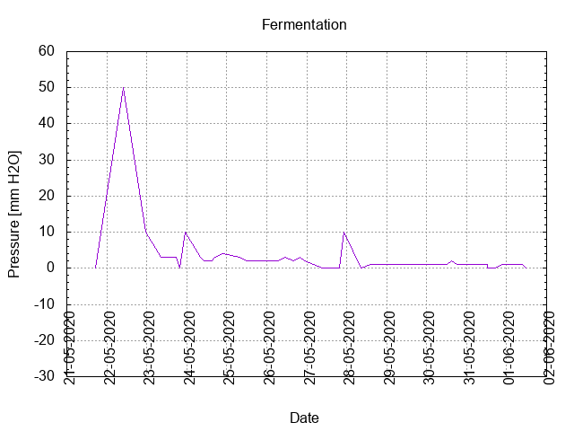

# Batch #1 - Brouwpunt - Witbier

## Milestones

21-05-2020 11:00 Start brewing

21-05-2020 17:01 Start fermenting

01-06-2020 12:27 Start conditioning

16-07-2020 21:05 Completed conditioning

Archived

## Process data

[Results](./Batch_1_Brouwpunt_Witbier_results.pdf)

### Evaluation

|                         | Recipe | Batch  | Diff   | Unit |
|-------------------------|--------|--------|--------|------|
| Pre-Boil Volume:        | 7.76   |  5.0   | -2.76  | L    |
| Post-Boil Volume (HOT): | 5.96   |  4.5   | -1.46  | L    |
| Boil Off per Hour:      | 1.8    |  0.5?  | -1.3   | L    |
| Batch Volume:           | 5.6    |  4.5   | -1.1   | L    |
| Trub/Chiller Loss:      | 0.12   | -0.18  | -0.3   | L    |
| Bottling Volume:        | 5.0    |  4.2   | -0.8   | L    |
| Pre-Boil Gravity:       | 1.040  |  1.036 | -0.004 |      |
| Post-Boil Gravity:      | 1.052  |        |        |      |
| Original Gravity:       | 1.054  |  1.060 | +0.006 |      |
| Final Gravity:          | 1.016  |  1.022 | +0.006 |      |
| Alcohol By Volume:      | 5.0    |  5.0   |  0     | %    |
| Apparent Attenuation:   | 69.4   | 62.1   | -7.3   | %    |
| Mash Efficiency:        | 73     | 43     | -30    | %    |
| Brewhouse Efficiency:   | 72     | 58     | -14    | %    |
| IBU:                    | 20     | 28     | +8     |      |
| BU/GU Ratio:            | 0.38   | 0.47   | +0.09  |      |
| RB Ratio:               | 0.35   | 0.4    | +0.05  |      |
| Color                   | 7.5    | 9.1    | +1.6   | EBC  |
| Mash pH:                | 6.02   |        |        |      |
