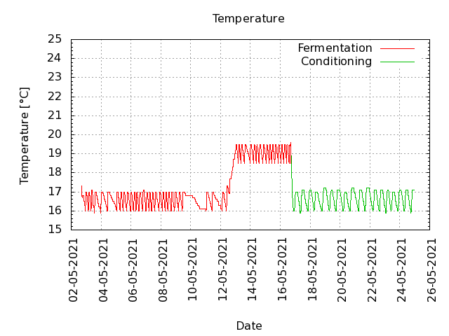
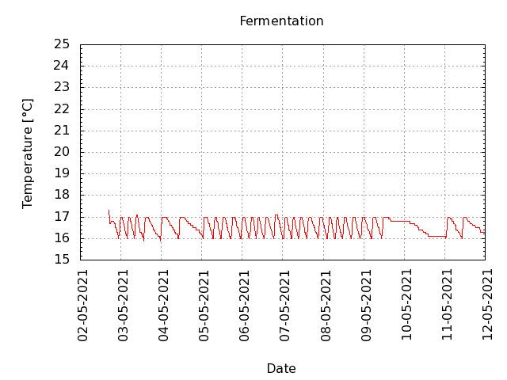
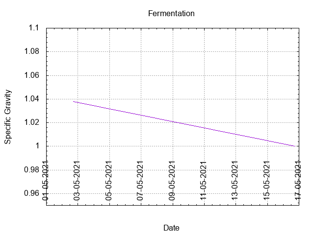
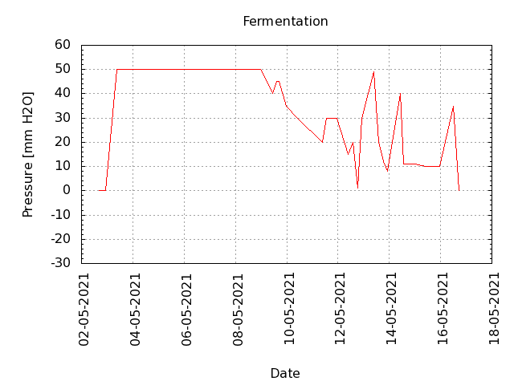
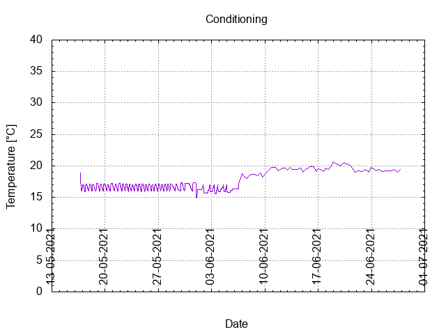

# Batch #10 - 08 SMaSH Magnum

## Milestones

02-05-2021 08:47 Start brewing.

02-05-2021 16:54 Start fermentation.

Start conditioning.

Completed conditioning.

Archived.

## Process

[Results](./Batch_10_08_SMaSH_Magnum_results.pdf)

### Evaluation

|                         | Recipe | Batch | Diff   | Unit |
|-------------------------|--------|-------|--------|------|
| Pre-Boil Volume:        | 7.76   | 8.5   | +0.74  | L    |
| Post-Boil Volume (HOT): | 5.96   | 6.7   | +0.74  | L    |
| Boil Off per Hour:      | 1.8    | 1.8   |  0     | L    |
| Batch Volume:           | 5.6    | 5.6   |  0     | L    |
| Trub/Chiller Loss:      | 0.12   | 0.83  | +0.71  | L    |
| Bottling Volume:        | 5.0    |       |        | L    |
| Pre-Boil Gravity:       | 1.034  | 1.035 | +0.001 |      |
| Post-Boil Gravity:      | 1.045  | 1.038 | -0.007 |      |
| Original Gravity:       | 1.045  | 1.038 | -0.007 |      |
| Total Gravity           | 1.047  | 1.040 | -0.007 |      |
| Final Gravity:          | 1.011  |       |        |      |
| Alcohol By Volume:      | 4.7    |       |        | %    |
| Apparent Attenuation:   | 75.9   |       |        | %    |
| Mash Efficiency:        | 73     |       |        | %    |
| Brewhouse Efficiency:   | 72     |       |        | %    |
| IBU:                    | 23     | 20    | -2     |      |
| BU/GU Ratio:            | 0.49   | 0.50  | +0.01  |      |
| RB Ratio:               | 0.49   | 0.50  | +0.01  |      |
| Color                   | 8.7    | 8.1   | -0.6   | EBC  |
| Mash pH:                | 5.38   | 5.5   | +0.12  |      |
