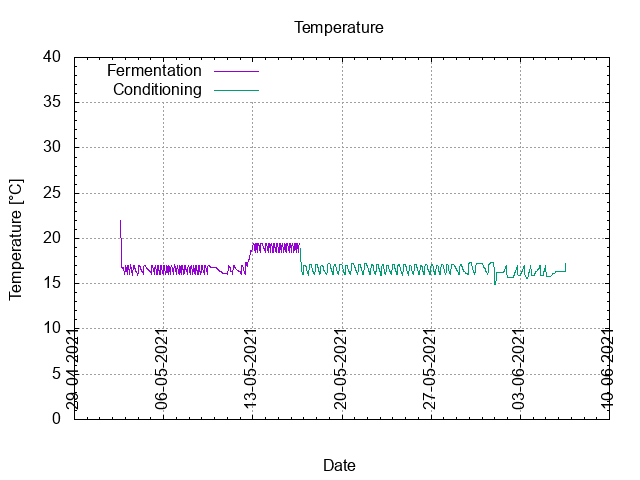
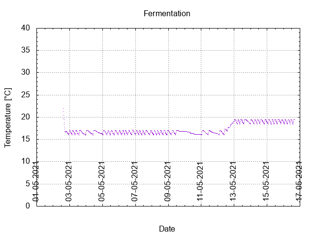
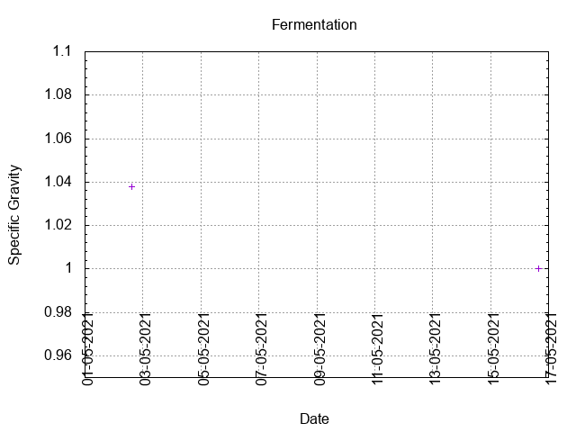
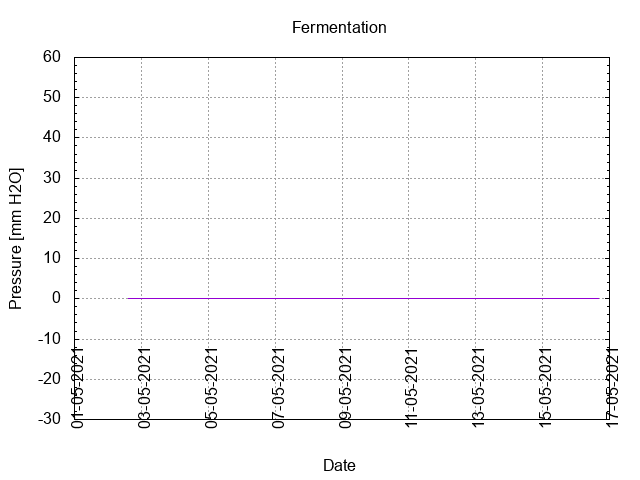
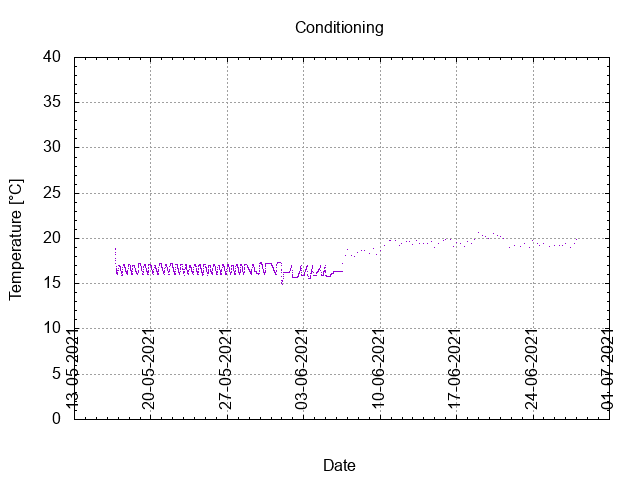

# Batch #11 - 08 SMaSH Magnum

## Milestones

02-05-2021 08:47 Start brewing.

02-05-2021 15:05 Start fermentation.

16-05-2021 15:55 Start conditioning.

27-06-2021 23:07 Completed conditioning.

Archived.

## Process

[Results](./Batch_11_08_SMaSH_Magnum_results.pdf)

## Evaluation

|                         | Recipe | Batch | Diff   | Unit |
|-------------------------|--------|-------|--------|------|
| Pre-Boil Volume:        |        |       |        | L    |
| Post-Boil Volume (HOT): |        |       |        | L    |
| Boil Off per Hour:      | 1.8    | 1.8   |  0     | L    |
| Batch Volume:           | 1.2    | 1.2   |  0     | L    |
| Trub/Chiller Loss:      | 0.6    | 0.54  | -0.06  | L    |
| Bottling Volume:        | 0.66   | 0.66  |  0     | L    |
| Pre-Boil Gravity:       | 1.023  | 1.035 | +0.012 |      |
| Post-Boil Gravity:      | 1.046  | 1.038 | -0.008 |      |
| Original Gravity:       | 1.046  | 1.038 | -0.008 |      |
| Final Gravity:          | 1.008  | 1.000 | -0.008 |      |
| Alcohol By Volume:      | 5.1    | 5.0   | -0.1   | %    |
| Apparent Attenuation:   | 82.4   | 100   | +18    | %    |
| Mash Efficiency:        | 73.3   |       |        | %    |
| Brewhouse Efficiency:   | 71.8   |       |        | %    |
| IBU:                    | 23     |       |        |      |
| BU/GU Ratio:            | 0.49   |       |        |      |
| RB Ratio:               | 0.52   |       |        |      |
| Color                   | 8.3    |       |        | EBC  |
| Mash pH:                | 5.38   | 5.5   | +0.12 |      |

## Tasting notes

| No. | Date       | Age | Score | Notes |
|-----|------------|-----|-------|-------|
|     | 02-05-2021 |   0 |       | Brew day. |
|     | 16-05-2021 |  14 |       | Bottling day. |
|   1 | 27-06-2021 |  56 |  2.75 | Served at 11 C. |
|   2 |            |     |       |  |
