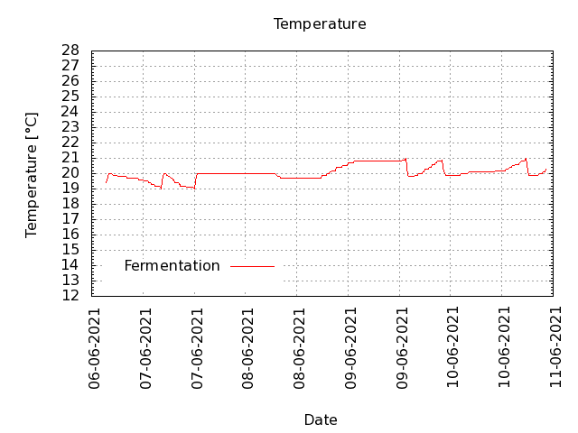
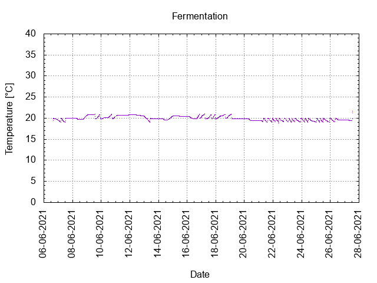
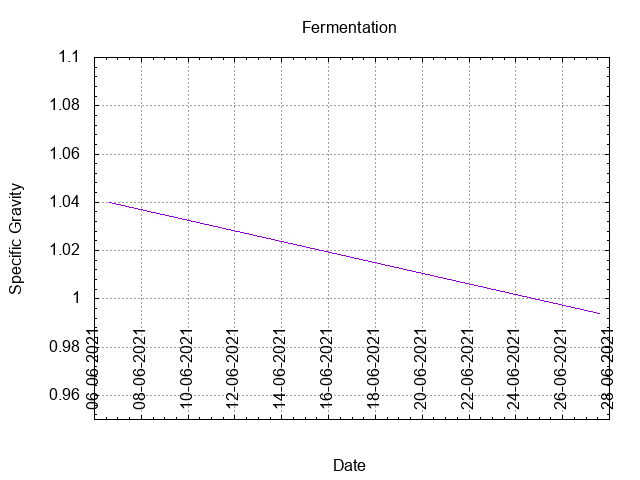
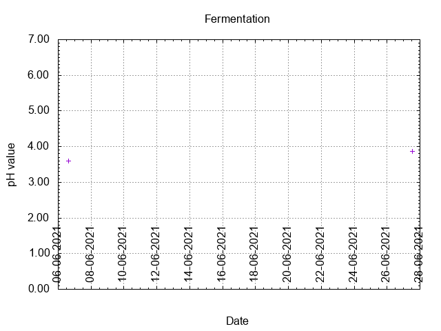
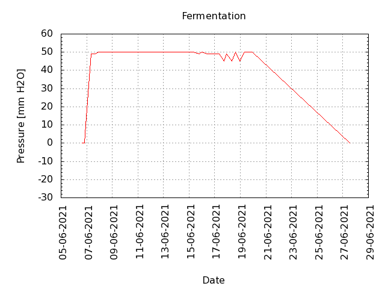
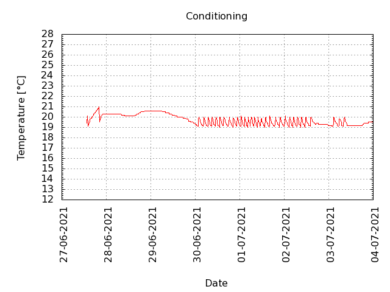
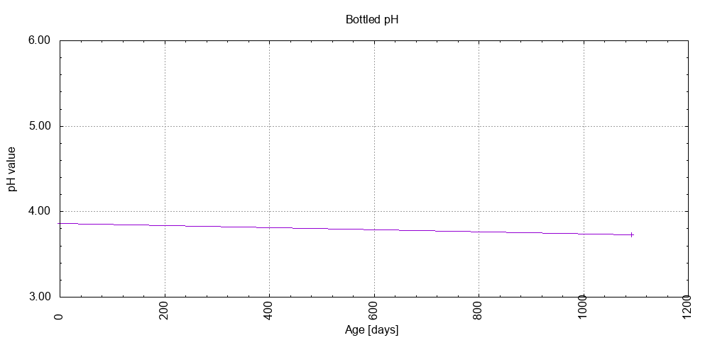

# Batch #12 - AnOtter Apple Cider

## Milestones

06-06-2021 14:27 Start brewing.

06-06-2021 15:29 Start fermentation.

27-06-2021 13:28 Start conditioning.

22-08-2021 23:44 Completed conditioning.

Archived.

## Process

[Results](./Batch_12_AnOtter_Apple_Cider_results.pdf)

## Evaluation

|                         | Recipe | Batch | Diff   | Unit |
|-------------------------|--------|-------|--------|------|
| Pre-Boil Volume:        | 5.83   | 5.5   | -0.33  | L    |
| Post-Boil Volume (HOT): | 5.83   | 5.5   | -0.33  | L    |
| Boil Off per Hour:      | N/A    | N/A   | N/A    | L    |
| Batch Volume:           | 5.6    | 5.5   | -0.1   | L    |
| Trub/Chiller Loss:      | 0.6    | 0     | -0.6   | L    |
| Bottling Volume:        | 5.0    | 5.28  | +0.28  | L    |
| Pre-Boil Gravity:       | N/A    | N/A   | N/A    |      |
| Post-Boil Gravity:      | N/A    | N/A   | N/A    |      |
| Original Gravity:       | 1.047  | 1.040 | -0.007 |      |
| Final Gravity:          | 1.012  | 0.994 | -0.018 |      |
| Alcohol By Volume:      | 4.6    | 6.0   | +1.4   | %    |
| Apparent Attenuation:   | 83.6   | 115.5 | +41.8  | %    |
| Mash Efficiency:        | N/A    | N/A   | N/A    | %    |
| Brewhouse Efficiency:   | 100    | 84    | -16    | %    |
| IBU:                    | 0      | 0     | 0      |      |
| BU/GU Ratio:            | 0.00   | 0.00  | 0      |      |
| RB Ratio:               | 0.00   | 0.00  | 0      |      |
| Color                   | 7.9    | 8.3   | +0.4   | EBC  |
| Mash pH:                |        | 3.59  |        |      |

## Tasting notes

| No. | Date       | Age | Score | Notes |
|-----|------------|-----|-------|-------|
|     | 06-06-2021 |   0 |       | Brew day. |
|     | 27-06-2021 |  21 |       | Bottling day. |
|   1 | 04-09-2021 |  90 |  2.5  | Served at 11 C. Cloudy. Opened with a small puff. Light carbonation. Still very green, needs more time to mellow out ... if it will. |
|   2 | 04-06-2022 | 363 |  2.75 | Served at 12 C. Cloudy. Opened with a small puff. Light carbonation. Dry, tart, apple flavour. Hazy. |
|   3 | 01-06-2024 |1091 |  3.0  | Served at 10.8 C. Cloudy. Opened with a small puff. Light carbonation. Dry, tart, apple flavour. Hazy. |
|   4 |            |     |       |  |
|   5 |            |     |       |  |
|   6 |            |     |       |  |
|   7 |            |     |       |  |
|   8 |            |     |       |  |
|   9 |            |     |       |  |
|  10 |            |     |       |  |
|  11 |            |     |       |  |
|  12 |            |     |       |  |
|  13 |            |     |       |  |
|  14 |            |     |       |  |
|  15 |            |     |       |  |
|  16 |            |     |       |  |
