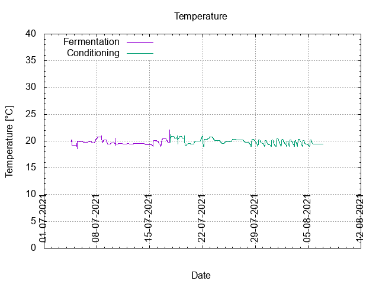
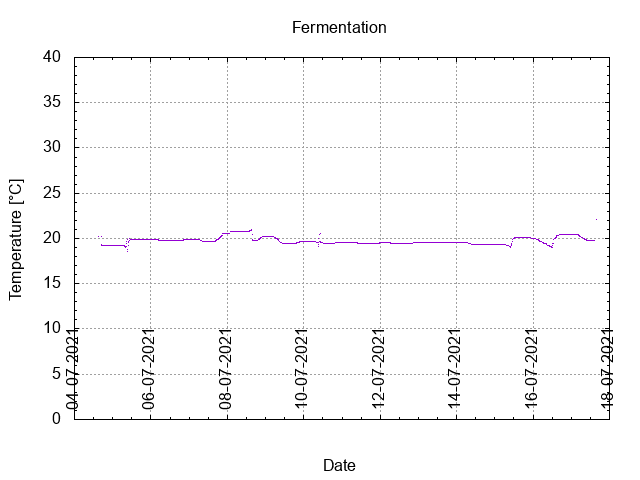
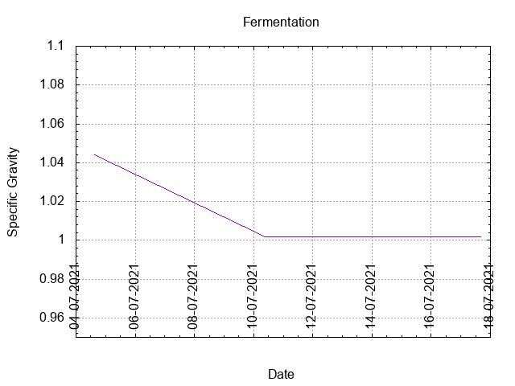
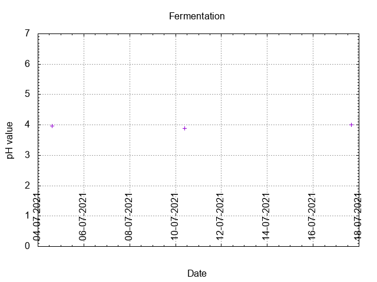
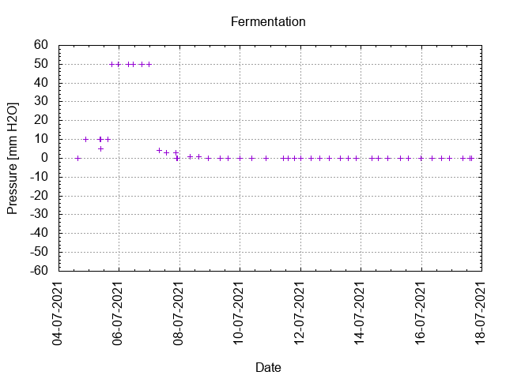
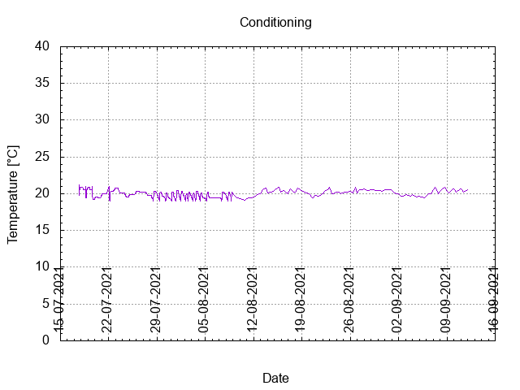

# Batch #13 - 49 AnOtter Perry Cider

## Milestones

04-07-2021 14:51 Start brewing.

04-07-2021 16:46 Start fermentation.

17-07-2021 16:16 Start conditioning.

11-09-2021 23:27 Completed conditioning.

Archived.

## Process

[Results](./Batch_13_49_AnOtter_Perry_Cider_results.pdf)

## Evaluation

|                         | Recipe | Batch | Diff   | Unit |
|-------------------------|--------|-------|--------|------|
| Pre-Boil Volume:        | 5.83   | 5.0   | -0.83  | L    |
| Post-Boil Volume (HOT): | 5.83   | 5.0   | -0.83  | L    |
| Boil Off per Hour:      | 0      | 0     |  0     | L    |
| Batch Volume:           | 5.6    | 5.8   | +0.2   | L    |
| Fermenter Volume:       | 5.6    | 5.0   | -0.6   | L    |
| Fermenter Top-up:       | 0.0    | 0.8   | +0.8   | L    |
| Trub/Chiller Loss:      | 0.6    | 0.0   | -0.6   | L    |
| Bottling Volume:        | 5.0    | 4.29  | -0.71  | L    |
| Pre-Boil Gravity:       | 1.009  | 1.044 | +0.035 |      |
| Post-Boil Gravity:      | 1.045  | 1.044 | +0.001 |      |
| Original Gravity:       | 1.045  | 1.044 | +0.001 |      |
| Final Gravity:          | 1.011  | 1.002 | -0.009 |      |
| Alcohol By Volume:      | 4.9    | 5.9   | +1.0   | %    |
| Apparent Attenuation:   | 83.6   | 95.6  | +19.2  | %    |
| Mash Efficiency:        | -      | -     |  -     | %    |
| Brewhouse Efficiency:   | 100    | 100   |  0     | %    |
| IBU:                    | 0      | 0     |  0     |      |
| BU/GU Ratio:            | 0.00   | 0.00  |  0     |      |
| RB Ratio:               | 0.00   | 0.00  |  0     |      |
| Color                   | 7.9    | 7.3   | -0.6   | EBC  |
| Mash pH:                | 5.40   | 3.97  | -1.43  |      |

## Tasting notes

| No. | Date       | Age | Score | Notes |
|-----|------------|-----|-------|-------|
|     | 04-07-2021 |   0 |       | Brew day. |
|     | 17-07-2021 |  21 |       | Bottling day. |
|   1 | 23-09-2021 |  81 | 2.5   | Served at 11 C. Very sour, needs a sweetener or two. |
|   2 |            |     |       |  |
|   3 |            |     |       |  |
|   4 |            |     |       |  |
|   5 |            |     |       |  |
|   6 |            |     |       |  |
|   7 |            |     |       |  |
|   8 |            |     |       |  |
|   9 |            |     |       |  |
|  10 |            |     |       |  |
|  11 |            |     |       |  |
|  12 |            |     |       |  |
|  13 |            |     |       |  |
