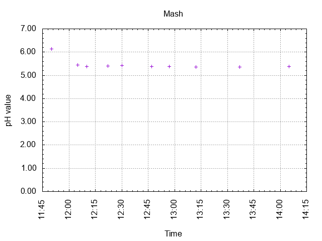
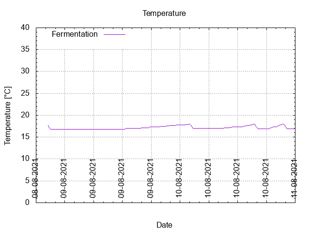
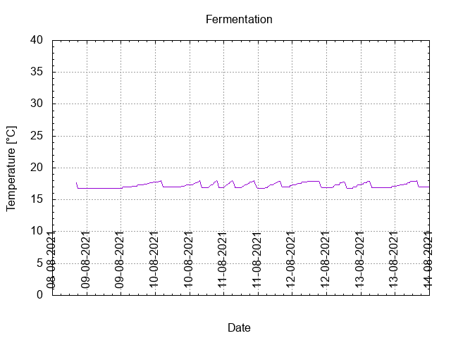
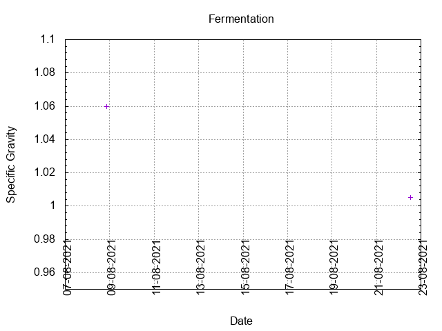
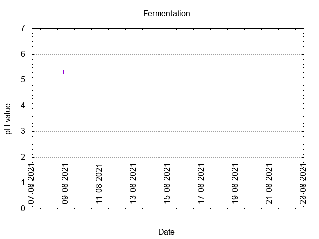
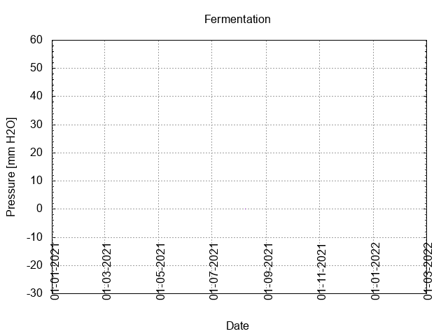
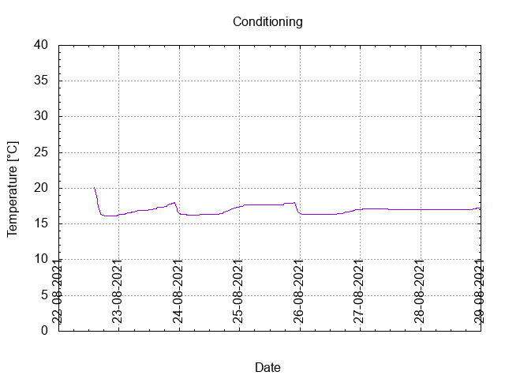

# Batch #14 - 09 SMaSH Sabro

## Milestones

08-08-2021 11:59 Start brewing.

08-08-2021 20:30 Start fermentation.

22-08-2021 14:15 Start conditioning.

03-10-2021 23:03 Completed conditioning.

Archived.

## Process

[Results](./Batch_14_09_SMaSH_Sabro_results.pdf)

## Evaluation

|                         | Recipe | Batch | Diff   | Unit |
|-------------------------|--------|-------|--------|------|
| Pre-Boil Volume:        | 7.76   | 8.0   | +0.24  | L    |
| Post-Boil Volume (HOT): | 5.96   | 6.51  | +0.55  | L    |
| Boil Off per Hour:      | 1.8    | 1.49  | -0.31  | L    |
| Batch Volume:           | 5.6    | 5.5   | -0.1   | L    |
| Trub/Chiller Loss:      | 0.12   | 0.75  | +0.63  | L    |
| Bottling Volume:        | 5      | 4.33  | -0.67  | L    |
| Pre-Boil Gravity:       | 1.047  | 1.043 | -0.004 |      |
| Post-Boil Gravity:      | 1.061  | 1.060 | -0.001 |      |
| Original Gravity:       | 1.061  | 1.060 | -0.001 |      |
| Total Gravity:          | 1.063  | 1.063 |  0     |      |
| Final Gravity:          | 1.013  | 1.005 | -0.008 |      |
| Alcohol By Volume:      | 6.6    | 7.6   | +1.0   | %    |
| Apparent Attenuation:   | 78.5   | 91.7  | +13.2  | %    |
| Mash Efficiency:        | 73     | 69    | -4     | %    |
| Brewhouse Efficiency:   | 72     | 70    | -2     | %    |
| IBU:                    | 69     | 66    | -3     |      |
| BU/GU Ratio:            | 1.10   | 1.06  | -0.04  |      |
| RB Ratio:               | 1.12   | 1.08  | -0.04  |      |
| Color                   | 9.7    | 9.1   | -0.6   | EBC  |
| Mash pH:                | 5.41   | 5.38  | -0.03  |      |

## Tasting notes

| No. | Date       | Age | Score | Notes |
|-----|------------|-----|-------|-------|
|     | 08-08-2021 |   0 |       | Brew day. |
|     | 22-08-2021 |  14 |       | Bottling day. |
|   1 | 16-09-2021 |  39 |  3.25 | Served at 11 C. Good head of white foam, good lacing. Sweet, hoppy, grapefruity, vegetal, grassy. |
|   2 | 25-09-2021 |  48 |  3.25 | Served at 11 C. Good head of white foam, good lacing. Sweet, hoppy, grapefruity, vegetal, grassy. |
|   3 | 22-01-2022 | 167 |  3.00 | Served at 11 C. Good head of white foam, good lacing. Sweet, hoppy, grapefruity, vegetal, grassy. |
|   4 |            |     |       |  |
|   5 |            |     |       |  |
|   6 |            |     |       |  |
|   7 |            |     |       |  |
|   8 |            |     |       |  |
|   9 |            |     |       |  |
|  10 |            |     |       |  |
|  11 |            |     |       |  |
|  12 |            |     |       |  |
|  13 |            |     |       |  |

