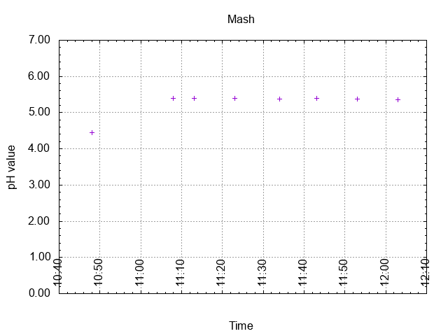
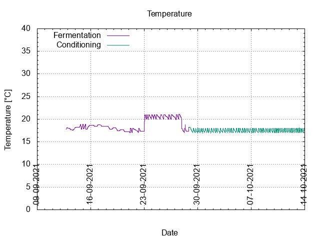
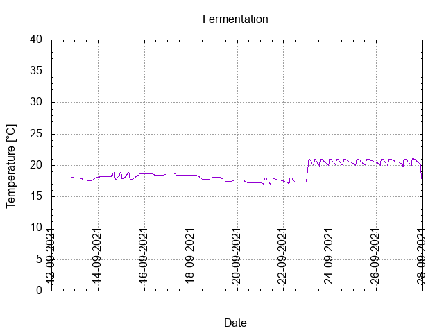
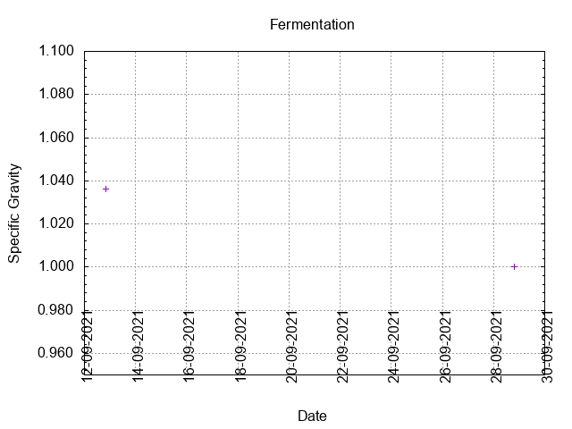
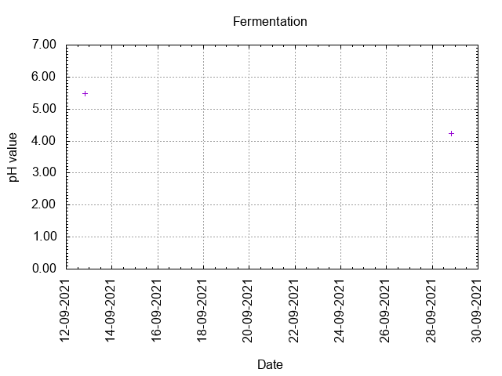
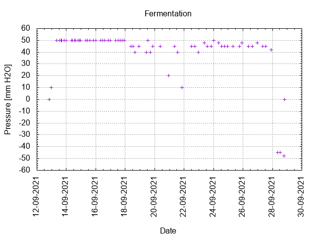
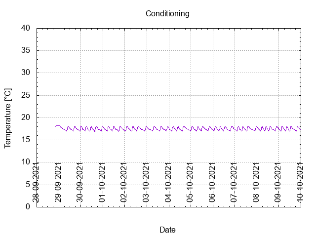

# Batch #15 - 74 Wet Hops Blonde Ale (Chinook)

## Milestones

12-09-2021 10:32 Start brewing.

12-09-2021 19:47 Start fermentation.

28-09-2021 20:27 Start conditioning.

09-11-2021 22:25 Completed conditioning.

Archived.

## Process

[Results](./Batch_15_results.pdf)

## Evaluation

|                         | Recipe | Batch | Diff   | Unit |
|-------------------------|--------|-------|--------|------|
| Pre-Boil Volume:        | 7.76   | 8.15  | +0.39  | L    |
| Post-Boil Volume (HOT): | 5.96   | 6.25  | +0.29  | L    |
| Boil Off per Hour:      | 1.8    | 2.4   | +0.1   | L    |
| Batch Volume:           | 5.6    | 5.3   | -0.3   | L    |
| Trub/Chiller Loss:      | 0.12   | 0.7   | +0.58  | L    |
| Bottling Volume:        | 5      | 4.62  | -0.38  | L    |
| Pre-Boil Gravity:       | 1.031  | 1.028 | -0.003 |      |
| Post-Boil Gravity:      | 1.040  | 1.036 | -0.004 |      |
| Original Gravity:       | 1.040  | 1.036 | -0.004 |      |
| Total Gravity:          | 1.042  | 1.039 | -0.003 |      |
| Final Gravity:          | 1.009  | 1.000 | -0.009 |      |
| Alcohol By Volume:      | 4.3    | 5.1   | +0.8   | %    |
| Apparent Attenuation:   | 78     | 100   | +22    | %    |
| Mash Efficiency:        | 73     | 70    | -3     | %    |
| Brewhouse Efficiency:   | 72     | 61    | -11    | %    |
| IBU:                    | 22     | 22    | 0      |      |
| BU/GU Ratio:            | 0.53   | 0.57  | +0.04  |      |
| RB Ratio:               | 0.54   | 0.70  | +0.16  |      |
| Color                   | 6.9    | 6.7   | -0.2   | EBC  |
| Mash pH:                | 5.36   | 5.39  | +0.03  |      |

## Tasting notes

| No. | Date       | Age | Score | Notes |
|-----|------------|-----|-------|-------|
|     | 12-09-2021 |   0 |       | Brew day. |
|     | 28-09-2021 |  16 |       | Bottling day. |
|   1 | 14-10-2021 |  32 |  2.50 | Served @ 12 C. Light, thin and malty, slight hints of hops, hardly any carbonation, two weeks after bottling, not fully cleared and a little bit hazy. |
|   2 | 20-11-2021 |  69 |  2.50 | Served @ 12 C. Light, thin and malty, slight hints of hops, hardly any carbonation |
|   3 | 05-12-2021 |  84 |  2.50 | Served @ 12 C. Light, thin and malty, slight hints of hops, hardly any carbonation |
|   4 |            |     |       |  |
|   5 |            |     |       |  |
|   6 |            |     |       |  |
|   7 |            |     |       |  |
|   8 |            |     |       |  |
|   9 |            |     |       |  |
|  10 |            |     |       |  |
|  11 |            |     |       |  |
|  12 |            |     |       |  |
|  13 |            |     |       |  |
|  14 |            |     |       |  |
|  15 |            |     |       |  |
|  16 |            |     |       |  |

