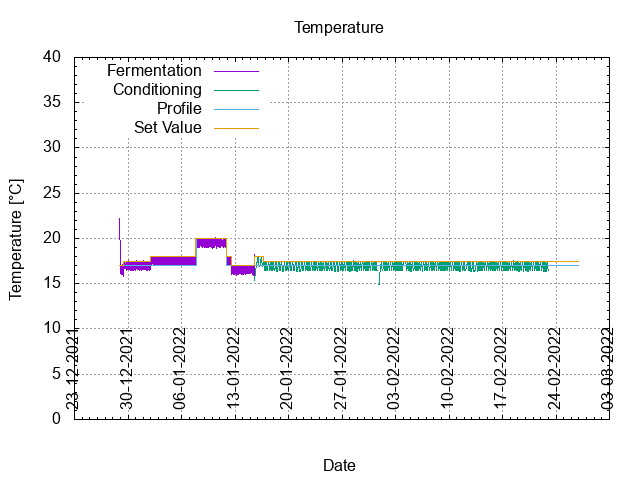
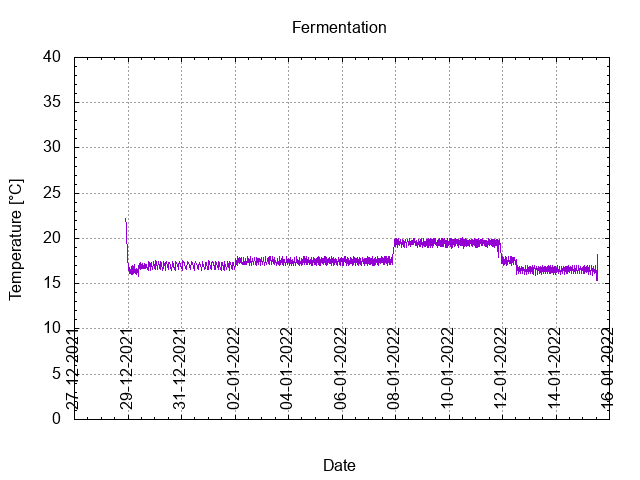
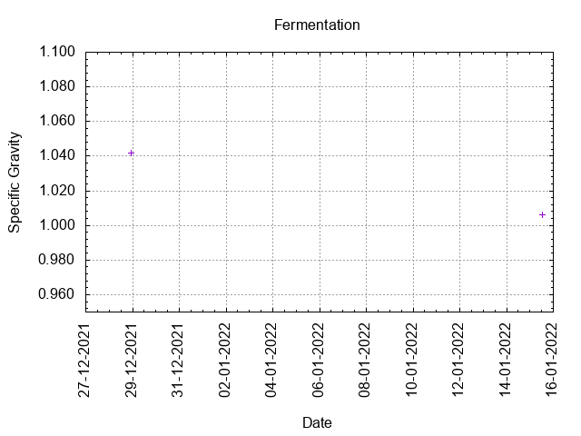
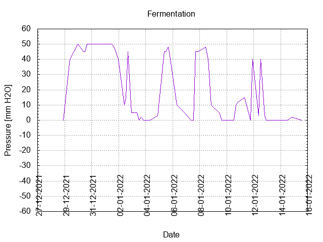
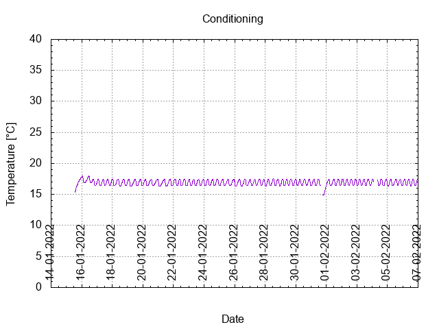

# Batch #16 - 75 Shameless Magpied Summer Ale 

## Milestones

28-12-2021 11:00 Start brewing.

28-12-2021 22:10 Start fermentation.

15-01-2022 13:14 Start conditioning.

26-02-2022 19:07 Completed conditioning.

Archived.

## Process

[Results](./Batch_16_75_Shameless_Magpied_Summer_Ale_results.pdf)

## Evaluation

|                         | Recipe | Batch | Diff   | Unit |
|-------------------------|--------|-------|--------|------|
| Pre-Boil Volume:        | 5.05   |       |        | L    |
| Post-Boil Volume (HOT): | 3.25   |       |        | L    |
| Boil Off per Hour:      | 1.8    |       |        | L    |
| Batch Volume:           | 3.0    | 3.0   |        | L    |
| Trub/Chiller Loss:      | 0.12   | 0     | -0.12  | L    |
| Bottling Volume:        | 2.4    | 2.31  | -0.09  | L    |
| Pre-Boil Gravity:       | 1.025  | 1.025 |        |      |
| Post-Boil Gravity:      | 1.039  | 1.042 | +0.003 |      |
| Original Gravity:       | 1.039  | 1.042 | +0.003 |      |
| Total Gravity:          | 1.042  | 1.045 | +0.003 |      |
| Final Gravity:          | 1.007  | 1.006 | -0.001 |      |
| Alcohol By Volume:      | 4.6    | 5.1   | +0.5   | %    |
| Apparent Attenuation:   | 82.8   | 86.2  | +3.4   | %    |
| Mash Efficiency:        | 75     | 75    |        | %    |
| Brewhouse Efficiency:   | 72     | 76    | +4     | %    |
| IBU:                    | 24     | 15    | -9     |      |
| BU/GU Ratio:            | 0.56   | 0.53  | -0.03  |      |
| RB Ratio:               | 0.60   | 0.58  | -0.02  |      |
| Color                   | 7.9    | 7.9   |        | EBC  |
| Mash pH:                | 5.1    | 5.33  | +0.23  |      |

## Tasting notes

| No. | Date       | Age | Score | Notes |
|-----|------------|-----|-------|-------|
|     | 28-12-2021 |   0 |       | Brew day. |
|     | 15-01-2022 |  18 |       | Bottling day. |
|   1 |            |     |       |  |
|   2 |            |     |       |  |
|   3 |            |     |       |  |
|   4 |            |     |       |  |
|   5 |            |     |       |  |
|   6 |            |     |       |  |
|   7 |            |     |       |  |
