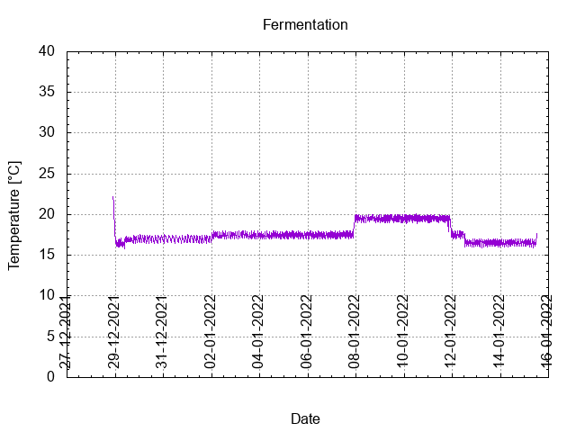
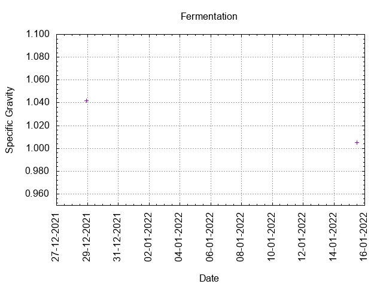
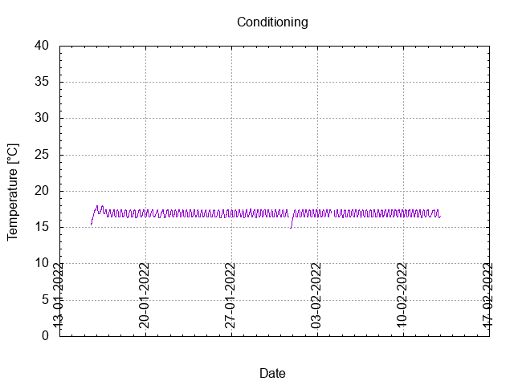
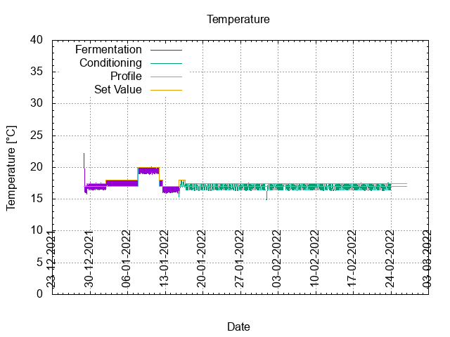
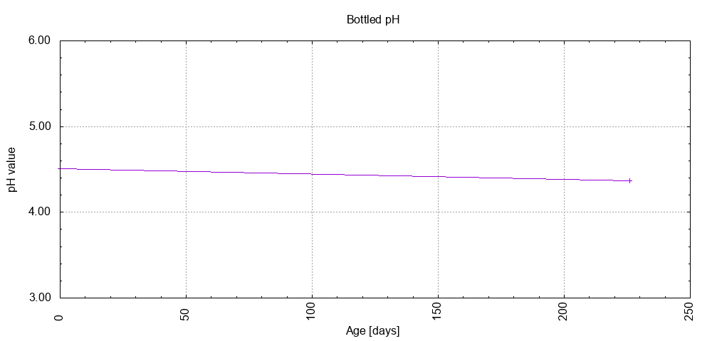

# Batch #17 - 61 Three Hops Blonde v2

## Milestones

28-12-2021 11:00 Start brewing.

28-12-2021 22:00 Start fermentation.

15-01-2022 12:03 Start conditioning.

26-02-2022 19:07 Completed conditioning.

11-08-2022 21:58 Archived.

## Process

[Results](./Batch_17_61_Three_Hops_Blonde_v2_results.pdf)

## Evaluation

|                         | Recipe | Batch | Diff   | Unit |
|-------------------------|--------|-------|--------|------|
| Pre-Boil Volume:        |        |       |        | L    |
| Post-Boil Volume (HOT): |        |       |        | L    |
| Boil Off per Hour:      |        |       |        | L    |
| Batch Volume:           | 1.2    | 1.0   | -0.2   | L    |
| Trub/Chiller Loss:      |        |       |        | L    |
| Bottling Volume:        | 1.2    | 0.66  | -0.54  | L    |
| Pre-Boil Gravity:       |        |       |        |      |
| Post-Boil Gravity:      |        |       |        |      |
| Original Gravity:       | 1.040  | 1.042 | +0.002 |      |
| Total Gravity:          | 1.042  | 1.046 | +0.002 |      |
| Final Gravity:          | 1.008  | 1.005 | -0.003 |      |
| Alcohol By Volume:      | 4.5    | 5.4   | +0.9   | %    |
| Apparent Attenuation:   | 80.4   | 88.7  | +8.3   | %    |
| Mash Efficiency:        |        |       |        | %    |
| Brewhouse Efficiency:   |        |       |        | %    |
| IBU:                    | 24     | 22    | -2     |      |
| BU/GU Ratio:            | 0.56   | 0.49  | -0.07  |      |
| RB Ratio:               | 0.58   | 0.53  | -0.05  |      |
| Color                   | 7.7    | 7.7   |  0     | EBC  |
| Mash pH:                | 4.62   | 5.33  | +0.71  |      |

## Tasting notes

| No. | Date       | Age | Score | Notes |
|-----|------------|-----|-------|-------|
|     | 15-01-2022 |   0 |       | Bottling day. |
|   1 | 25-03-2022 |  69 |  0.00 | Gusher. |
|   2 | 11-08-2022 | 208 |  2.50 | A clear Blonde ale with a small foam layer which dissolves at a nmedium rate. Normal carbonation. Mild on hops, sweet. Clear crisp mouthfeel |
