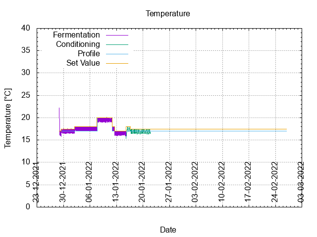
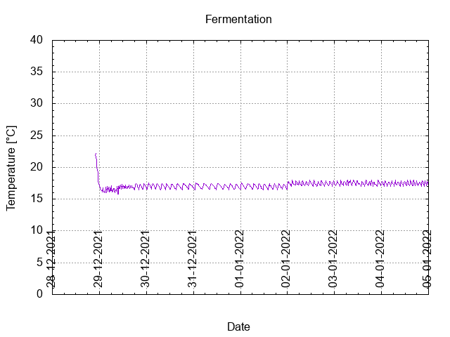
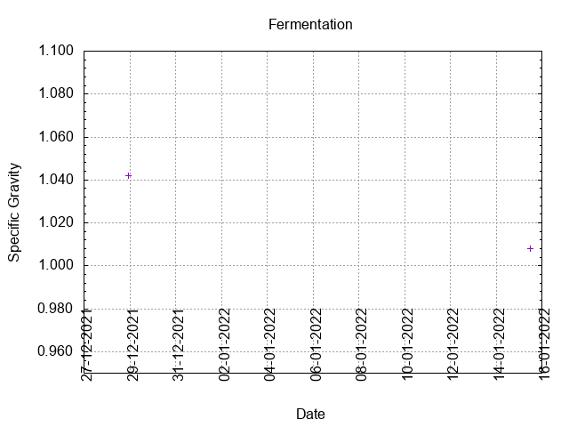
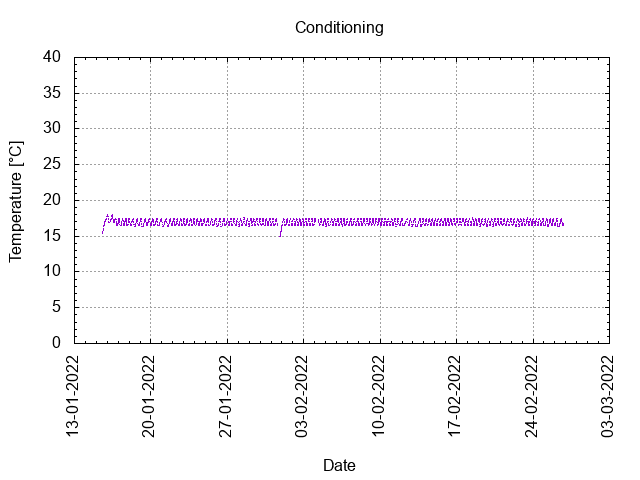

# Batch # - 61 Three Hops Blonde v3

## Milestones

28-12-2021 11:00 Start brewing.

28-12-2021 22:00 Start fermentation.

Start conditioning.

Completed conditioning.

Archived.

## Process

[Results](./Batch__results.pdf)

### Evaluation

|                         | Recipe | Batch | Diff   | Unit |
|-------------------------|--------|-------|--------|------|
| Pre-Boil Volume:        |        |       |        | L    |
| Post-Boil Volume (HOT): |        |       |        | L    |
| Boil Off per Hour:      |        |       |        | L    |
| Batch Volume:           | 1.2    | 1.0   | -0.2   | L    |
| Trub/Chiller Loss:      |        |       |        | L    |
| Bottling Volume:        | 1.2    |       |        | L    |
| Pre-Boil Gravity:       |        |       |        |      |
| Post-Boil Gravity:      |        |       |        |      |
| Original Gravity:       | 1.040  | 1.042 | +0.002 |      |
| Total Gravity:          | 1.042  | 1.044 | +0.002 |      |
| Final Gravity:          | 1.008  |       |        |      |
| Alcohol By Volume:      | 4.6    |       |        | %    |
| Apparent Attenuation:   | 82.8   |       |        | %    |
| Mash Efficiency:        |        |       |        | %    |
| Brewhouse Efficiency:   |        |       |        | %    |
| IBU:                    | 24     | 22    | -2     |      |
| BU/GU Ratio:            | 0.56   | 0.50  | -0.06  |      |
| RB Ratio:               | 0.60   | 0.54  | -0.06  |      |
| Color                   | 7.7    | 7.7   |  0     | EBC  |
| Mash pH:                | 4.62   | 5.33  | +0.71  |      |

## Tasting notes

| No. | Date       | Age | Score | Notes |
|-----|------------|-----|-------|-------|
|     | 28-12-2021 |   0 |       | Brew day. |
|     |            |     |       | Bottling day. |
|   1 |            |     |       |  |
|   2 |            |     |       |  |
|   3 |            |     |       |  |
|   4 |            |     |       |  |
|   5 |            |     |       |  |
|   6 |            |     |       |  |
|   7 |            |     |       |  |
|   8 |            |     |       |  |
|   9 |            |     |       |  |
|  10 |            |     |       |  |
|  11 |            |     |       |  |
|  12 |            |     |       |  |
|  13 |            |     |       |  |
|  14 |            |     |       |  |
|  15 |            |     |       |  |
|  16 |            |     |       |  |
