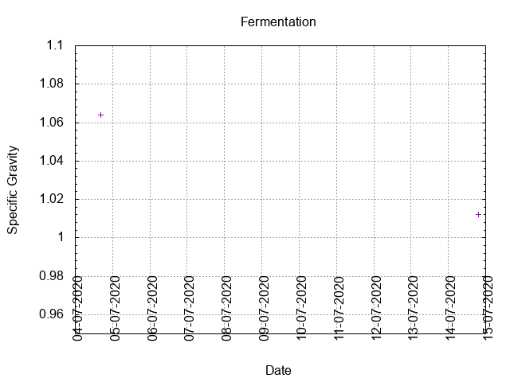
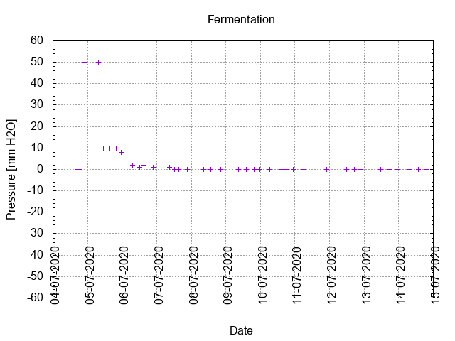

# Batch #2 - Brouwpunt - Kruidig Wit

## Milestones

04-07-2020 10:35 Start Brewing.

04-07-2020 16:34 Start Fermentation.

14-07-2020 20:30 Start conditioning.

28-08-2020 23:40 Completed conditioning.

 Archived.

## Process

[Results](./Batch_2_Brouwpunt_Kruidig_Wit_results.pdf)

### Evaluation

|                         | Recipe | Batch | Diff   | Unit |
|-------------------------|--------|-------|--------|------|
| Pre-Boil Volume:        | 7.76   | 6.3   | -1.46  | L    |
| Post-Boil Volume (HOT): | 5.96   | 4.5   | -1.46  | L    |
| Boil Off per Hour:      | 1.8    | 1.8   |  0     | L    |
| Batch Volume:           | 5.6    | 4.5   | -1.1   | L    |
| Trub/Chiller Loss:      | 0.12   | -0.82 | +0.70  | L    |
| Bottling Volume:        | 5.0    | 4.2   | -0.8   | L    |
| Pre-Boil Gravity:       | 1.040  | 1.035 | -0.005 |      |
| Post-Boil Gravity:      | 1.052  | 1.064 | +0.012 |      |
| Original Gravity:       | 1.054  | 1.064 | +0.010 |      |
| Final Gravity:          | 1.016  | 1.012 | -0.004 |      |
| Alcohol By Volume:      | 5.0    | 6.8   | +1.8   | %    |
| Apparent Attenuation:   | 69.4   | 80.4  | +11    | %    |
| Mash Efficiency:        | 73     | 52    | -21    | %    |
| Brewhouse Efficiency:   | 72     | 72    | 0      | %    |
| IBU:                    | 19     | 22    | +3     |      |
| BU/GU Ratio:            | 0.35   | 0.34  | -0.01  |      |
| RB Ratio:               | 0.32   | 0.35  | +0.03  |      |
| Color                   | 7.5    | 7.9   | +0.4   | EBC  |
| Mash pH:                | 6.01   |       |        |      |
