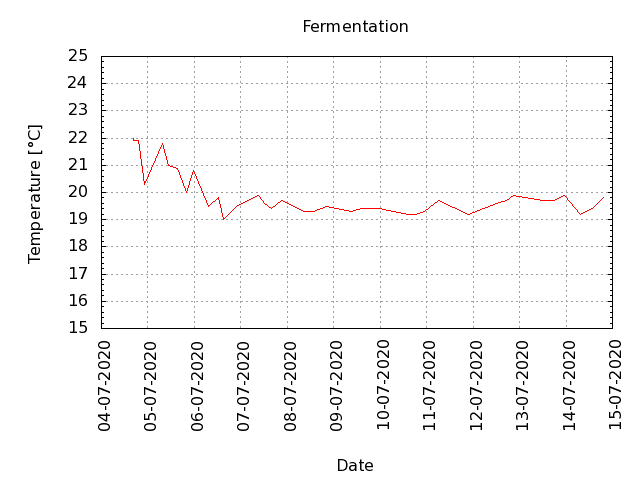
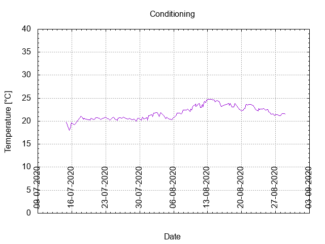

# Batch #2 - 02 Brouwpunt - Kruidig Wit

## Milestones

04-07-2020 10:35 Start Brewing.

04-07-2020 16:34 Start Fermentation.

14-07-2020 20:30 Start conditioning.

 Completed conditioning.

 Archived.

## Preparation

[Brew day sheet](./Batch_2_02_Brouwpunt_Kruidig_Wit_brew_day_sheet.pdf)

[Checklist](./Batch_2_02_Brouwpunt_Kruidig_Wit_checklist.pdf)

## Process

[Results](./Batch_2_02_Brouwpunt_Kruidig_Wit_results.pdf)

[Evaluation]()

### Tasting notes

## Batch notes

### Brew day

04-07-2020 10:35 5L water to 72 C.

04-07-2020 10:39 Start mashing @ 63 ... 68 C.

04-07-2020 11:40 Start sparging with 2.5 L water @ 72 C.

04-07-2020 12:00 Start boil. Specific Gravity = 1.035 @ ~30 C.

04-07-2020 12:30 Added hop (whole) in a bag. Refreshed wort in hop bag 5x.

04-07-2020 12:55 Added Orange Peel and Coriander Seeds.

04-07-2020 13:00 Hop out, brewpot in the cooler (sink filled with tapwater).

04-07-2020 14:00 Wort transferred to fermenter, and strained the Orange Peel and Coriander Seeds out.

04-07-2020 14:15 Specific Gravity = 1.060 @ 35 C, normalized to 1.064 @ 20 C.

04-07-2020 16:34 Wort @ 22 C, added 5 grams yeast.

04-07-2020 16:35 @ 21.9 C.

04-07-2020 18:52 @ 21.9 C.

04-07-2020 22:14 @ 20.3 C, fermentation has started.

### Fermentation

#### Day 1 in fermentation

05-07-2020 07:38 @ 21.8 C, lots of bubbles, very active fermentation.

05-07-2020 10:49 @ 21.0 C, lots of bubbles, very active fermentation.

05-07-2020 15:24 @ 20.9 C, dp = 10 mm H2O, no bubbles.

05-07-2020 20:03 @ 20.0 C, dp = 10 mm H2O, no bubbles.

05-07-2020 23:24 @ 20.8 C, dp = 8 mm H2O, no bubbles.

#### Day 2 in fermentation

06-07-2020 07:21 @ 19.5 C, dp = 2 mm H2O, no bubbles.

06-07-2020 12:24 @ 19.8 C, dp= 1 mm H2O, no bubbles.

06-07-2020 14:55 @ 19.0 C, dp = 2 mm H2O, no bubbles.

06-07-2020 21:38 @ 19.5 C, dp = 1 mm H2O, no bubbles.

#### Day 3 in fermentation

07.07.2020 09.00: @ 19.9 C, dp = 1 mm H2O, no bubbles.

07.07.2020 12.26: @ 19.6 C, dp = 0 mm H2O, no bubbles.

07.07.2020 15.35: @ 19.4 C, dp = 0 mm H2O, no bubbles.

07.07.2020 21.14: @ 19.7 C, dp = 0 mm H2O, no bubbles.

#### Day 4 in fermentation

08.07.2020 08.38: @ 19.3 C, dp = 0 mm H2O, no bubbles.

08.07.2020 13.24: @ 19.3 C, dp = 0 mm H2O, no bubbles.

08.07.2020 20.13: @ 19.5 C, dp = 0 mm H2O, no bubbles.

#### Day 5 in fermentation

09.07.2020 08.55: @ 19.3 C, dp = 0 mm H2O, no bubbles.

09.07.2020 14.15: @ 19.4 C, dp = 0 mm H2O, no bubbles.

09.07.2020 19.51: @ 19.4 C, dp = 0 mm H2O, no bubbles.

09.07.2020 23.32: @ 19.4 C, dp = 0 mm H2O, no bubbles.

#### Day 6 in fermentation

10.07.2020 06.36: @ 19.3 C, dp - 0 mm H2O, no bubbles.

10.07.2020 14.50: @ 19.2 C, dp = 0 mm H2O, no bubbles.

10.07.2020 18.28: @ 19.2 C, dp = 0 mm H2O, no bubbles.

10.07.2020 22.41: @ 19.3 C, dp = 0 mm H2O, no bubbles.

#### Day 7 in fermentation

11.07.2020 06.05: @ 19.7 C, dp = 0 mm H2O, no bubbles.

11.07.2020 21.50: @ 19.2, C, dp = 0 mm H2O, no bubbles.

#### Day 8 in fermentation

12.07.2020 12.01: @ 19.6 C, dp = 0 mm H2O, no bubbles.

12.07.2020 17.09: @ 19.7 C, dp = 0 mm H2O, no bubbles.

12.07.2020 21.02: @ 19.9 C, dp = 0 mm H2O, no bubbles.

#### Day 9 in fermentation

13.07.2020 11.35: @ 19.7 C, dp = 0 mm H2O, no bubbles.

13.07.2020 18.00: @ 19.7 C, dp = 0 mm H2O, no bubbles.

13.07.2020 23.02: @ 19.9 C, dp = 0 mm H2O, no bubbles.

#### Day 10 in fermentation

14.07.2020 07.18: @ 19.2 C, dp = 0 mm H2O, no bubbles.

14.07.2020 13.28: @ 19.4 C, dp = 0 mm H2O, no bubbles.

14.07.2020 19.35: @ 19.8 C, dp = 0 mm H2O, no bubbles.

### Bottling Day

14.07.2020 19.35:FG = 1.012.

14.07.2020 19.51: @ 19.8 C,  added 30 gram sugar in 1 L boiled water. 

14.07.2020 20.30: Bottled 12 Steinies (33 cl) with FG = 1.010. Very pale yellow (straw) and boozy taste, a little sweeter than the fiirst batch, slight hint of carbonation.

### Conditioning

#### Day 1 in conditioning

15.07.2020 12.30: @ 18.0 C.

15.07.2020 16.28: @ 18.4 C.

15.07.2020 21.14: @ 19.7 C.

#### Day 2 in conditioning

16.07.2020 12.52: @ 19.2 C.

16.07.2020 16.43: @ 19.4 C.

#### Day 3 in conditioning

17.07.2020 20.40: @ 21.1 C.

#### Day 4 in conditioning

18.07.2020 10.30: @ 20.4 C.

18.07.2020 11.28: @ 20.7 C.

18.07.2020 12.25: @ 20.5 C.

18.07.2020 15.43: @ 20.5 C.
