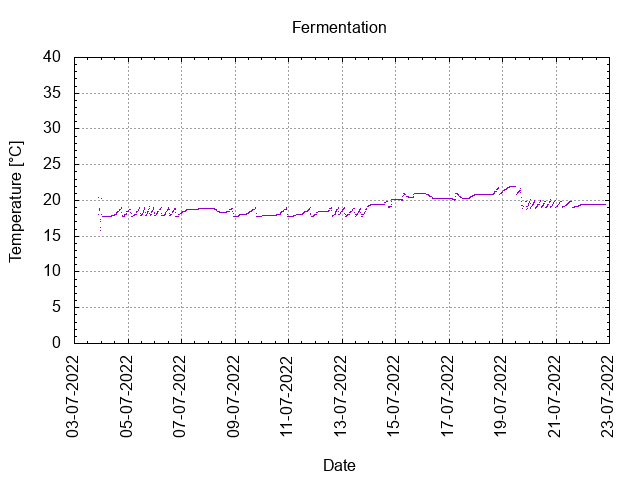
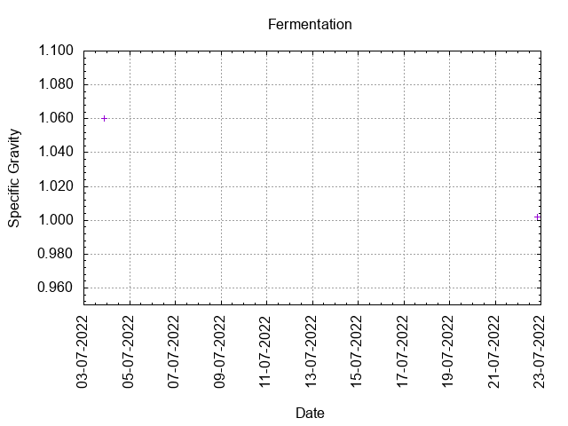
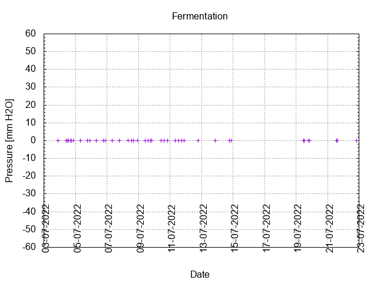
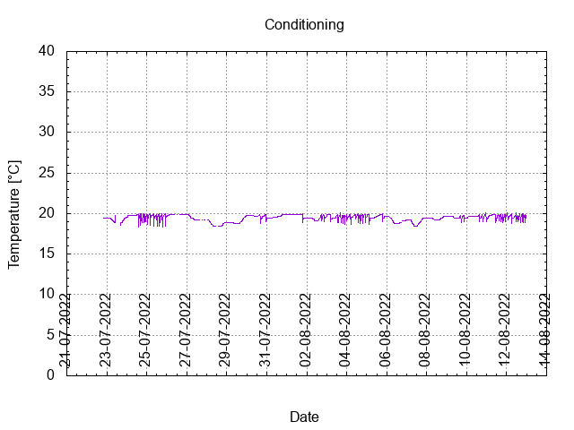

# Batch #20 - 32 Never Give Up! v2

## Milestones

03-07-2022 10:29 Start brewing.

03-07-2022 21:30 Start fermentation.

Start conditioning.

Completed conditioning.

Archived.

## Process

[Results](./Batch_19_results.pdf)

### Evaluation

|                         | Recipe | Batch | Diff   | Unit |
|-------------------------|--------|-------|--------|------|
| Pre-Boil Volume:        |        |       |        | L    |
| Post-Boil Volume (HOT): |        |       |        | L    |
| Boil Off per Hour:      | 1.5    | 1.5   | 0      | L    |
| Batch Volume:           | 0.75   | 0.75  | 0      | L    |
| Trub/Chiller Loss:      |        |       |        | L    |
| Bottling Volume:        |        |       |        | L    |
| Pre-Boil Gravity:       |        |       |        |      |
| Post-Boil Gravity:      | 1.070  | 1.061 | -0.009 |      |
| Original Gravity:       | 1.070  | 1.060 | -0.010 |      |
| Total Gravity:          | 1.073  |       |        |      |
| Final Gravity:          | 1.007  |       |        |      |
| Alcohol By Volume:      | 8.7    |       |        | %    |
| Apparent Attenuation:   | 89.9   |       |        | %    |
| Mash Efficiency:        |        |       |        | %    |
| Brewhouse Efficiency:   | 95     |       |        | %    |
| IBU:                    | 28     | 28    | 0      |      |
| BU/GU Ratio:            | 0.39   | 0.45  | +0.06  |      |
| RB Ratio:               | 0.44   | 0.52  | +0.08  |      |
| Color                   | 6.7    | 6.7   | 0      | EBC  |
| Mash pH:                |        |       |        |      |

## Tasting notes

| No. | Date       | Age | Score | Notes |
|-----|------------|-----|-------|-------|
|     | 03-07-2022 |   0 |       | Brew day. |
|     |            |     |       | Bottling day. |
|   1 |            |     |       |  |
|   2 |            |     |       |  |
|   3 |            |     |       |  |
|   4 |            |     |       |  |
|   5 |            |     |       |  |
|   6 |            |     |       |  |
|   7 |            |     |       |  |
|   8 |            |     |       |  |
|   9 |            |     |       |  |
|  10 |            |     |       |  |
|  11 |            |     |       |  |
|  12 |            |     |       |  |
|  13 |            |     |       |  |
|  14 |            |     |       |  |
|  15 |            |     |       |  |
|  16 |            |     |       |  |
