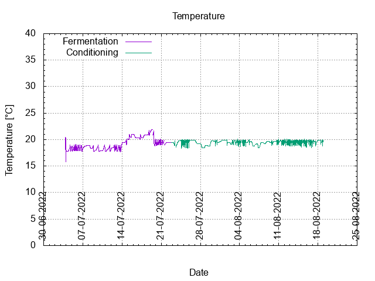
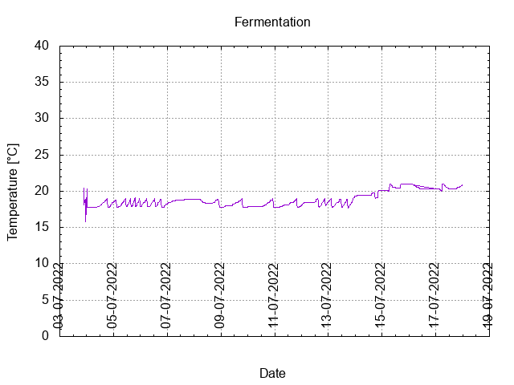
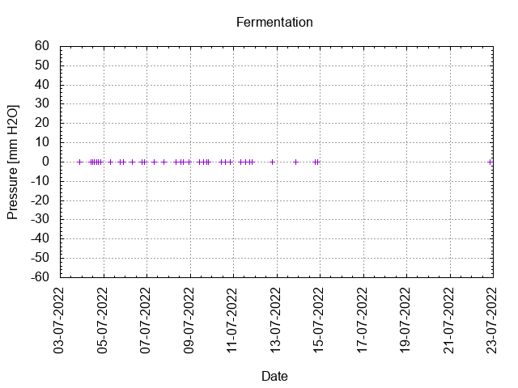
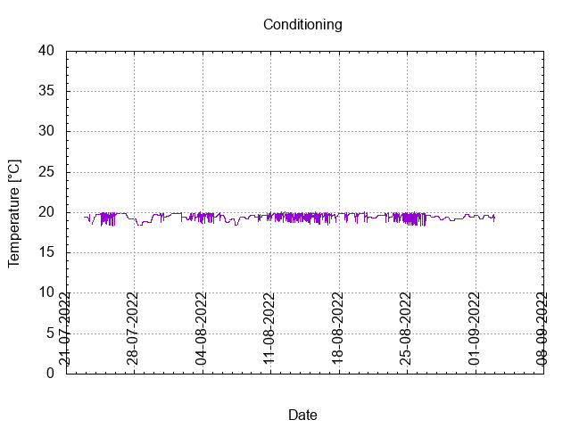

# Batch #21 - 32 Never Give Up! v3

## Milestones

03-07-2022 10:29 Start brewing.

03-07-2022 21:30 Start fermentation.

22-07-2022 20:15 Start conditioning.

Completed conditioning.

Archived.

## Process

[Results](./Batch_21_32_Never_Give_Up_v3_results.pdf)

### Evaluation

|                         | Recipe | Batch | Diff   | Unit |
|-------------------------|--------|-------|--------|------|
| Batch Volume:           | 0.75   | 0.75  | 0      | L    |
| Bottling Volume:        | 0.75   | 0.66  | -0.09  | L    |
| Post-Boil Gravity:      | 1.070  | 1.061 | -0.009 |      |
| Original Gravity:       | 1.070  | 1.060 | -0.010 |      |
| Total Gravity:          | 1.073  | 1.063 | -0.010 |      |
| Final Gravity:          | 1.007  | 1.002 | -0.005 |      |
| Alcohol By Volume:      | 8.7    | 8.0   | -0.7   | %    |
| Apparent Attenuation:   | 89.9   | 96.6  | +6.7   | %    |
| Brewhouse Efficiency:   | 95     | 81    | -14    | %    |
| IBU:                    | 28     | 28    | 0      |      |
| BU/GU Ratio:            | 0.39   | 0.45  | +0.06  |      |
| RB Ratio:               | 0.44   | 0.54  | +0.10  |      |
| Color                   | 6.7    | 6.7   | 0      | EBC  |

## Tasting notes

| No. | Date       | Age | Score | Notes |
|-----|------------|-----|-------|-------|
|     | 03-07-2022 |   0 |       | Brew day. |
|     | 22-07-2022 |  19 |       | Bottling day. |
|   1 |            |     |       |  |
|   2 |            |     |       |  |
