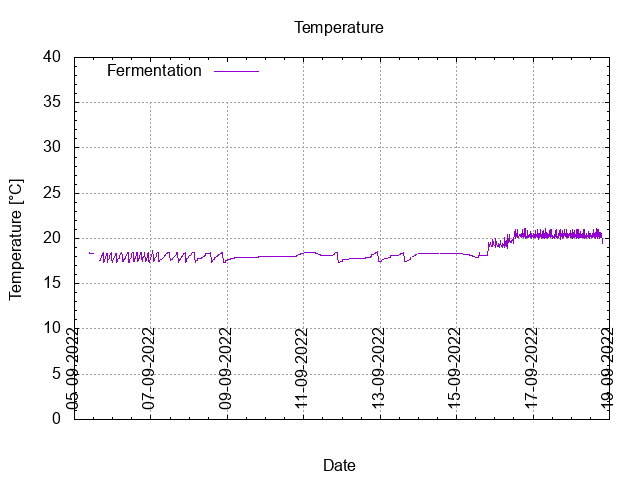
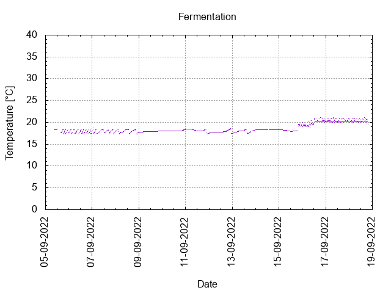
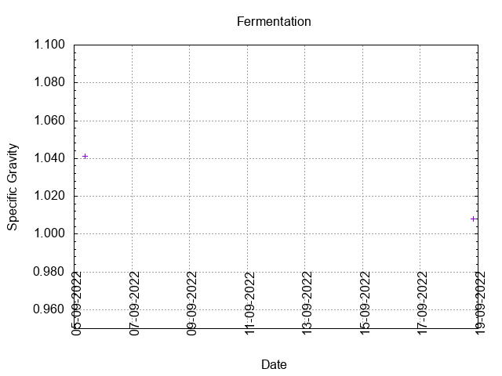
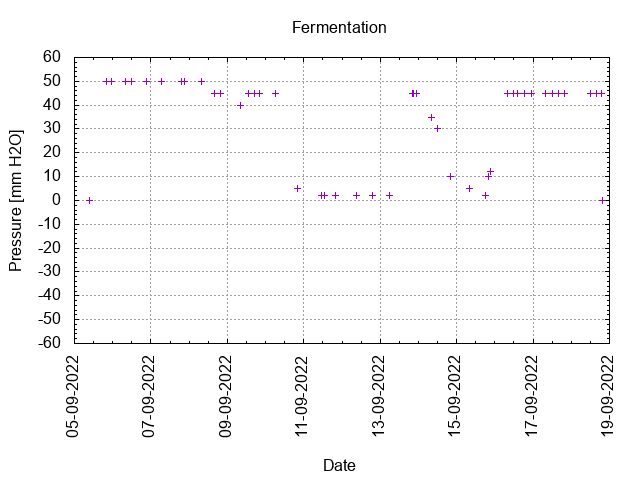
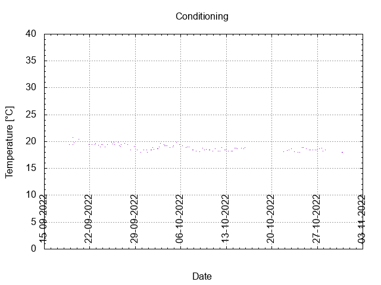

# Batch #22 - Wet Hops Blonde (Bramling-X)

## Milestones

04-09-2022 08:59 Start brewing.

05-09-2022 09:08 Start fermentation.

18-09-2022 19:50 Start conditioning.

30-10-2022 23:59 Completed conditioning.

Archived.

## Process

[Results](./Batch_22_Wet_Hops_Blonde_Ale_Bramling-X_results.pdf)

### Evaluation

|                         | Recipe | Batch | Diff   | Unit |
|-------------------------|--------|-------|--------|------|
| Pre-Boil Volume:        | 7.76   | 7.9   | +0.14  | L    |
| Post-Boil Volume (HOT): | 5.96   | 6.0   | +0.04  | L    |
| Boil Off per Hour:      | 1.8    | 1.9   | +0.1   | L    |
| Batch Volume:           | 5.6    | 4.5   | -1.1   | L    |
| Trub/Chiller Loss:      | 0.12   | 1.26  | +1.14  | L    |
| Bottling Volume:        | 5.0    | 3.5   | -1.5   | L    |
| Pre-Boil Gravity:       | 1.031  | 1.027 | -0.004 |      |
| Post-Boil Gravity:      | 1.041  | 1.041 |  0     |      |
| Original Gravity:       | 1.041  | 1.041 |  0     |      |
| Total Gravity:          | 1.042  | 1.042 | +0.001 |      |
| Final Gravity:          | 1.010  | 1.008 | -0.002 |      |
| Alcohol By Volume:      | 4.2    | 4.6   | +0.4   | %    |
| Apparent Attenuation:   | 75.5   | 80.8  | +5.3   | %    |
| Mash Efficiency:        | 73     | 65    | -8     | %    |
| Brewhouse Efficiency:   | 72     | 58    | -14    | %    |
| IBU:                    | 30     | 31    | +1     |      |
| BU/GU Ratio:            | 0.71   | 0.71  |  0     |      |
| RB Ratio:               | 0.70   | 0.74  | +0.04  |      |
| Color                   | 9.5    | 9.5   |  0     | EBC  |
| Mash pH:                | 5.38   | 5.25  | -0.13  |      |

## Tasting notes

| No. | Date       | Age | Score | Notes |
|-----|------------|-----|-------|-------|
|     | 04-09-2022 |   0 |       | Brew day. |
|     | 18-09-2022 |  13 |       | Bottling day. |
|   1 | 01-12-2022 |  88 | 3.25  | Served at 16.7 C. Malty, yeasty, fruity. Nice white head that dissolves quickly. |
|   2 | 14-01-2023 | 132 | 3.25  | Served at 16.9 C. Malty, yeasty, fruity. Nice white head that lingers. |
|   3 |            |     |       |  |
|   4 |            |     |       |  |
|   5 |            |     |       |  |
|   6 |            |     |       |  |
|   7 |            |     |       |  |
|   8 |            |     |       |  |
|   9 |            |     |       |  |
|  10 |            |     |       |  |
|  11 |            |     |       |  |
|  12 |            |     |       |  |
