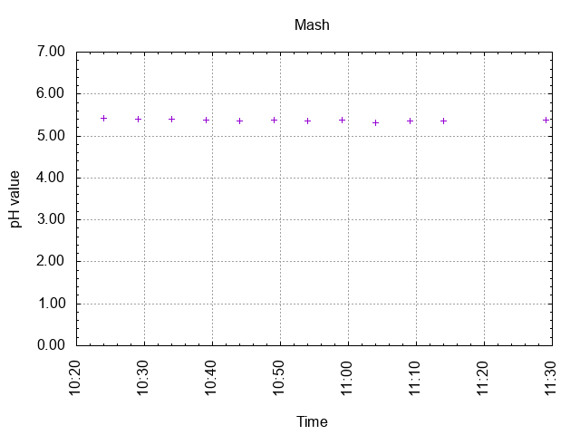
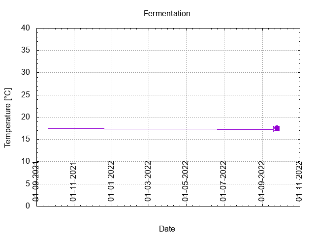
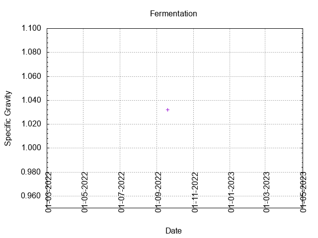
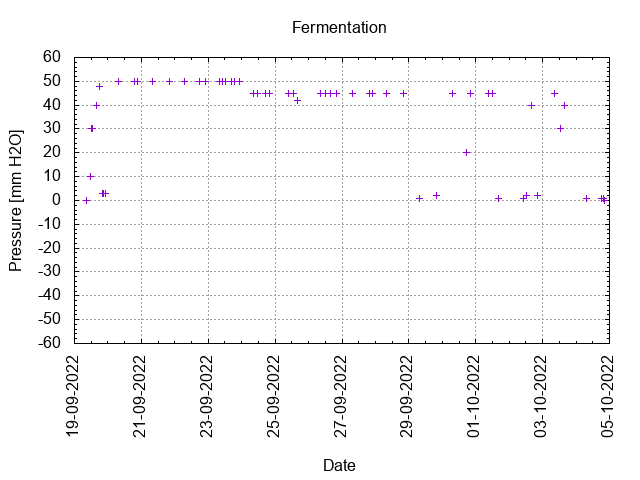
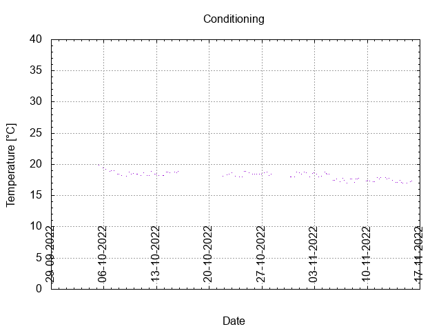

# Batch #23 - Wet Hops Blonde (Willamette)

## Milestones

18-09-2022 09:45 Start brewing.

19-09-2022 08:35 Start fermentation.

04-10-2022 20:30 Start conditioning.

15-11-2022 22:40 Completed conditioning.

Archived.

## Process

[Results](./Batch_23_Wet_Hops_Blonde_Ale_Willamette_results.pdf)

### Evaluation

|                         | Recipe | Batch | Diff   | Unit |
|-------------------------|--------|-------|--------|------|
| Pre-Boil Volume:        | 7.76   | 8.3   | +0.54  | L    |
| Post-Boil Volume (HOT): | 5.96   | 6.9   | +0.94  | L    |
| Boil Off per Hour:      | 1.8    | 1.4   | -0.4   | L    |
| Batch Volume:           | 5.6    | 5.5   | -0.1   | L    |
| Trub/Chiller Loss:      | 0.12   | 1.12  | +1.00  | L    |
| Bottling Volume:        | 5.0    | 4.46  | -0.54  | L    |
| Pre-Boil Gravity:       | 1.031  | 1.024 | -0.007 |      |
| Post-Boil Gravity:      | 1.041  | 1.032 | -0.009 |      |
| Original Gravity:       | 1.041  | 1.032 | -0.009 |      |
| Final Gravity:          | 1.010  | 1.000 | -0.010 |      |
| Alcohol By Volume:      | 4.3    | 4.6   | +0.3   | %    |
| Apparent Attenuation:   | 76.1   | 100.0 | +23.9  | %    |
| Mash Efficiency:        | 73     | 61    | -12    | %    |
| Brewhouse Efficiency:   | 72     | 56    | -16    | %    |
| IBU:                    | 22     | 20    | -2     |      |
| BU/GU Ratio:            | 0.50   | 0.57  | +0.07  |      |
| RB Ratio:               | 0.50   | 0.70  | +0.20  |      |
| Color                   | 9.5    | 8.5   | -1.0   | EBC  |
| Mash pH:                | 5.38   | 5.37  | -0.01  |      |

## Tasting notes

| No. | Date       | Age | Score | Notes |
|-----|------------|-----|-------|-------|
|     | 18-09-2022 |   0 |       | Brew day. |
|     | 04-10-2022 |  16 |       | Bottling day. |
|   1 | 24-11-2022 |  67 | 3.0   | Served at 17.3 C. Malty, yeasty, fruity, biscuit. Nice white head that dissolves quickly. |
|   2 | 13-01-2023 | 117 | 3.0   | Served at 16.8 C. Malty, yeasty. Nice white head that dissoleves quickly. |
|   3 | 12-02-2023 | 147 | 3.0   | Served at 15.8 C. Malty, yeasty. Nice white head that dissoleves quickly. Light carbonic acid taste. |
|   4 |            |     |       |  |
|   5 |            |     |       |  |
|   6 |            |     |       |  |
|   7 |            |     |       |  |
|   8 |            |     |       |  |
|   9 |            |     |       |  |
|  10 |            |     |       |  |
|  11 |            |     |       |  |
|  12 |            |     |       |  |
|  13 |            |     |       |  |
|  14 |            |     |       |  |
