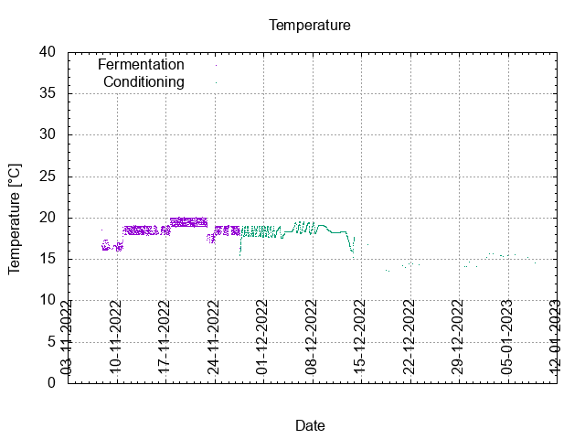
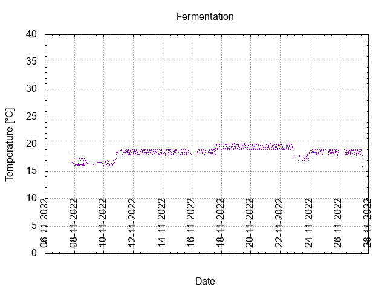
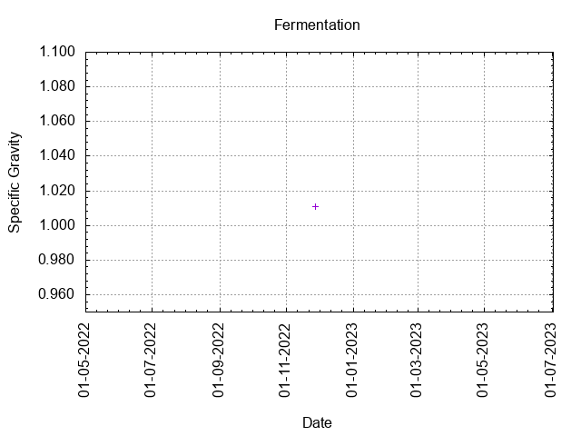
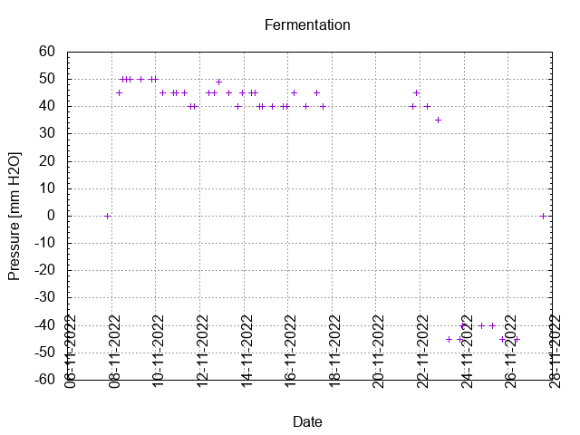
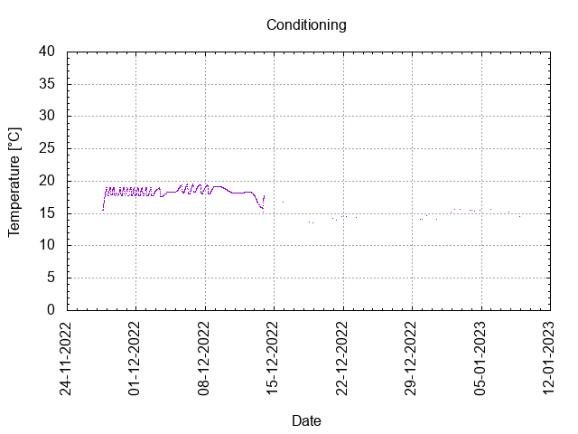

# Batch #24 - Five Pints of Best Fuggles

## Milestones

06-11-2022 09:40 Start brewing.

07-11-2022 19:30 Start fermentation.

27-11-2022 14:00 Start conditioning.

08-01-2023 23:59 Completed conditioning.

Archived.

## Process

[Results](./Batch_24_Five_Pints_of_Best_Fuggles_results.pdf)

### Evaluation

|                         | Recipe | Batch | Diff   | Unit |
|-------------------------|--------|-------|--------|------|
| Pre-Boil Volume:        | 7.76   | 7.8   | +0.04  | L    |
| Post-Boil Volume (HOT): | 5.96   | 6.0   | +0.04  | L    |
| Boil Off per Hour:      | 1.8    | 1.8   |  0     | L    |
| Batch Volume:           | 5.6    | 4.5   | -1.1   | L    |
| Trub/Chiller Loss:      | 0.12   | 1.26  | +1.14  | L    |
| Bottling Volume:        | 5.0    | 2.9   | -2.1   | L    |
| Pre-Boil Gravity:       | 1.032  | 1.031 | -0.001 |      |
| Post-Boil Gravity:      | 1.042  | 1.042 |  0     |      |
| Original Gravity:       | 1.042  | 1.042 |  0     |      |
| Total Gravity:          | 1.043  | 1.044 | +0.001 |      |
| Final Gravity:          | 1.012  | 1.011 | -0.001 |      |
| Alcohol By Volume:      | 4.1    | 4.3   | +0.2   | %    |
| Apparent Attenuation:   | 71.4   | 74.3  | +2.9   | %    |
| Mash Efficiency:        | 73     | 71    | -2     | %    |
| Brewhouse Efficiency:   | 72     | 58    | -14    | %    |
| IBU:                    | 29     | 29    |  0     |      |
| BU/GU Ratio:            | 0.67   | 0.66  | -0.01  |      |
| RB Ratio:               | 0.64   | 0.65  | +0.01  |      |
| Color                   | 15.2   | 15.0  | -0.2   | EBC  |
| Mash pH:                | 5.38   | 5.27  | -0.11  |      |

## Tasting notes

| No. | Date       | Age | Score | Notes |
|-----|------------|-----|-------|-------|
|     | 06-11-2022 |   0 |       | Brew day. |
|     | 27-11-2022 |  21 |       | Bottling day. |
|   1 | 15-12-2022 |  39 | 3.25  | Served @ 16.8 C. Sweet, Malty, Strong. Mild on hops. Good retention. |
|   2 | 02-03-2023 | 116 |       | Tasting by Clibit pending |
|   3 | 02-03-2023 | 116 |       | Tasting by Clibit pending |
|   4 |            |     |       |  |
|   5 |            |     |       |  |
|   6 |            |     |       |  |
|   7 |            |     |       |  |
|   8 |            |     |       |  |
|   9 |            |     |       |  |
