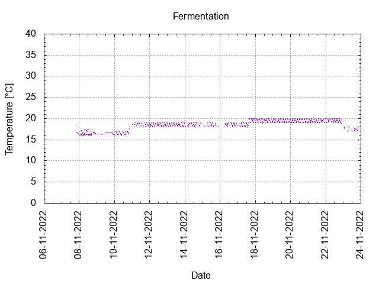
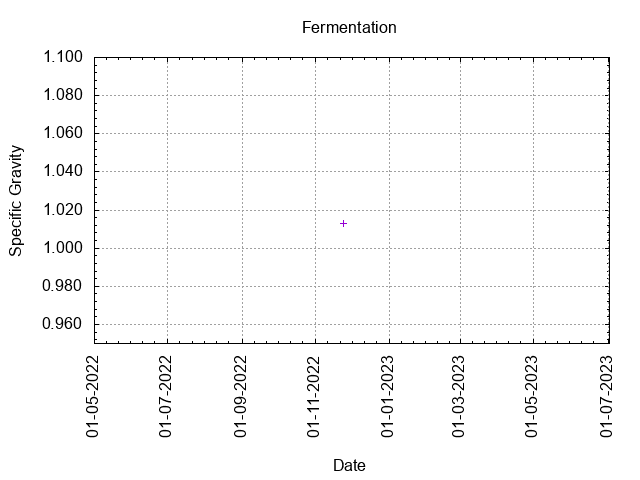
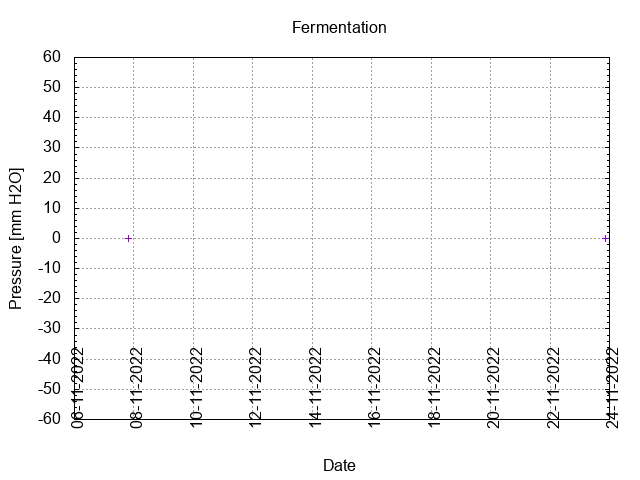
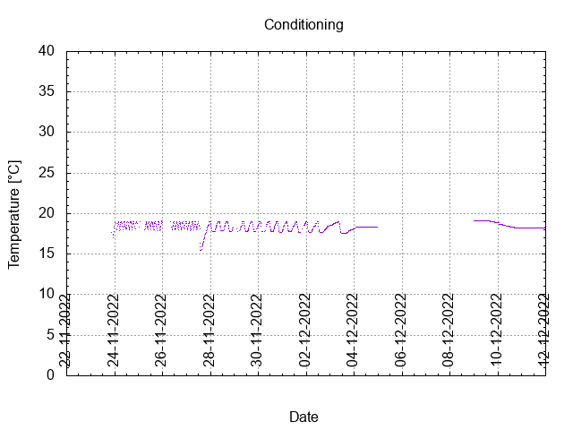

# Batch #26 - Two Pints and a Packet of Hops (Fuggle and Progress)

## Milestones

06-11-2022 Start brewing.

07-11-2022 Start fermentation.

23-11-2022 Start conditioning.

04-01-2023 Completed conditioning.

Archived.

## Process

[Results](./Batch_26_Two_Pints_and_a_Packet_of_Hops_Fuggle_and_Progress_results.pdf)

### Evaluation

|                         | Recipe | Batch | Diff   | Unit |
|-------------------------|--------|-------|--------|------|
| Batch Volume:           |        |       |        | L    |
| Trub/Chiller Loss:      |        |       |        | L    |
| Bottling Volume:        |        |       |        | L    |
| Pre-Boil Gravity:       |        |       |        |      |
| Post-Boil Gravity:      |        |       |        |      |
| Original Gravity:       |        |       |        |      |
| Final Gravity:          |        |       |        |      |
| Alcohol By Volume:      |        |       |        | %    |
| Apparent Attenuation:   |        |       |        | %    |
| Mash Efficiency:        |        |       |        | %    |
| Brewhouse Efficiency:   |        |       |        | %    |
| IBU:                    |        |       |        |      |
| BU/GU Ratio:            |        |       |        |      |
| RB Ratio:               |        |       |        |      |
| Color                   |        |       |        | EBC  |
| Mash pH:                |        |       |        |      |

## Tasting notes

| No. | Date       | Age | Score | Notes |
|-----|------------|-----|-------|-------|
|     | 06-11-2022 |   0 |       | Brew day. |
|     | 23-11-2022 |  17 |       | Bottling day. |
|   1 | 12-01-2023 |  67 | 3.25  | Served at 18.6 C. Has a nice body, malty, yeasty, warm mouthfeel, no off flavours. |
|   2 |            |     |       |  |
