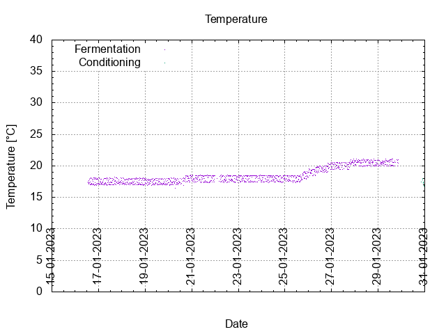
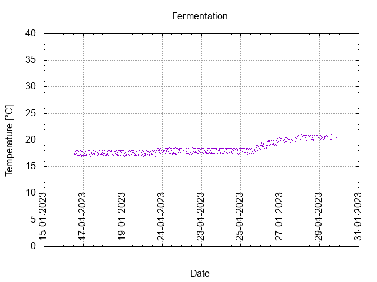
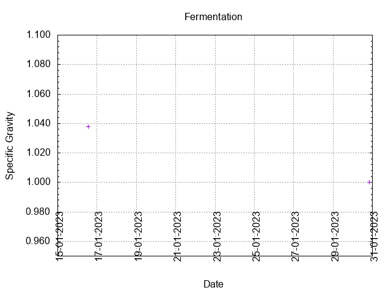
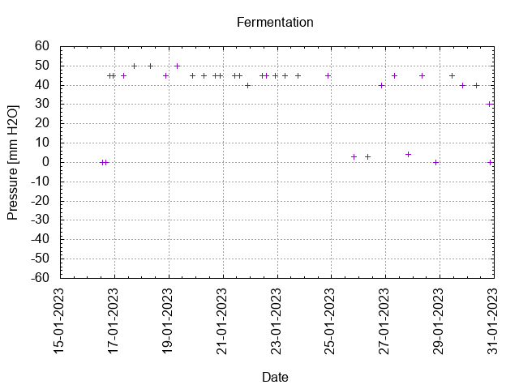
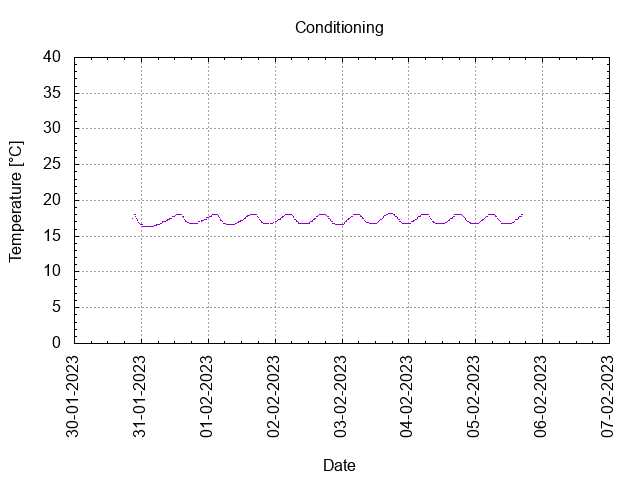

# Batch #27 - 03 SMaSH Godiva v2

## Milestones

15-01-2023 10:20 Start brewing.

16-01-2023 13:25 Start fermentation.

Start conditioning.

Completed conditioning.

Archived.

## Process

[Results](./Batch_27_results.pdf)

### Evaluation

|                         | Recipe | Batch | Diff   | Unit |
|-------------------------|--------|-------|--------|------|
| Pre-Boil Volume:        | 7.76   | 7.9   | +0.14  | L    |
| Post-Boil Volume (HOT): | 5.96   | 6.52  | +0.56  | L    |
| Boil Off per Hour:      | 1.8    | 1.38  | -0.42  | L    |
| Batch Volume:           | 5.6    | 3.75  | -0.1   | L    |
| Trub/Chiller Loss:      | 0.12   | 0     | -0.12  | L    |
| Bottling Volume:        | 5      |       |        | L    |
| Pre-Boil Gravity:       | 1.030  | 1.021 | -0.009 |      |
| Post-Boil Gravity:      | 1.039  | 1.038 | -0.001 |      |
| Original Gravity:       | 1.039  | 1.038 | -0.001 |      |
| Total Gravity:          | 1.041  | 1.042 | +0.001 |      |
| Final Gravity:          | 1.009  |       |        |      |
| Alcohol By Volume:      | 4.2    |       |        | %    |
| Apparent Attenuation:   | 77.4   |       |        | %    |
| Mash Efficiency:        | 73     | 52    | -21    | %    |
| Brewhouse Efficiency:   | 72     | 47    | -25    | %    |
| IBU:                    | 27     | 32    |  0     |      |
| BU/GU Ratio:            | 0.66   | 0.77  | +0.11  |      |
| RB Ratio:               | 0.67   | 0.78  | +0.11  |      |
| Color                   | 8.3    | 8.7   | +0.4   | EBC  |
| Mash pH:                | 5.38   | 5.42  | +0.04  |      |

## Tasting notes

| No. | Date       | Age | Score | Notes |
|-----|------------|-----|-------|-------|
|     | 15-01-2023 |     |       | Brew day. |
|     | 30-01-2023 |   0 |       | Bottling day. |
|   1 | 15-02-2023 |  16 | 3.25  | Served @ 15.9 C. Sweet, smooth, strong, hoppy. Needs more carbonation. |
|   2 | 26-02-2023 |  27 | 3.25  | Served @ 16.7 C. Sweet, smooth, strong, hoppy. Needs more carbonation. |
|   3 |            |     |       |  |
|   4 |            |     |       |  |
|   5 |            |     |       |  |
|   6 |            |     |       |  |
|   7 |            |     |       |  |
|   8 |            |     |       |  |
|   9 |            |     |       |  |
