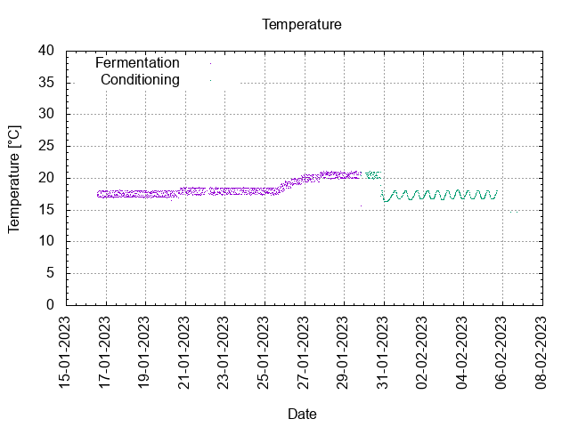
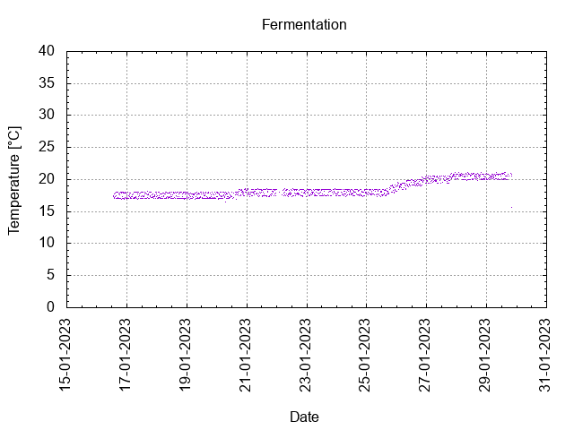
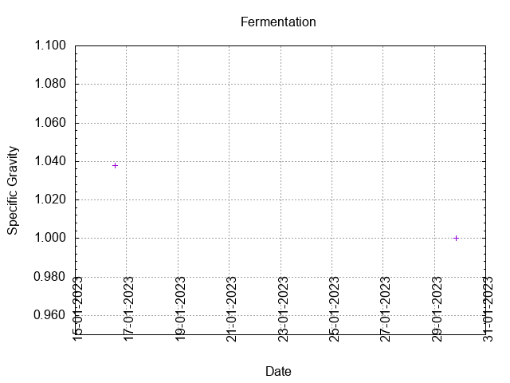
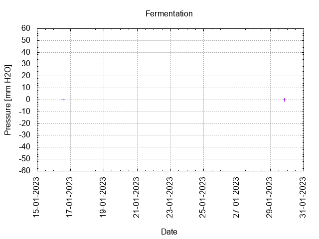
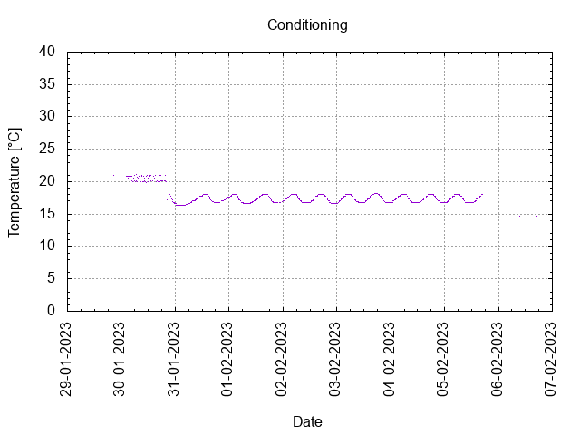
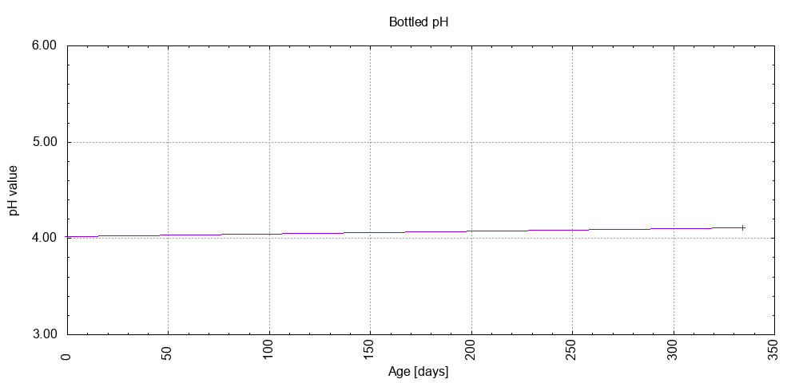

# Batch #28 - 69 Two Pints and a Packet of Hops (Godiva and Progress)

## Milestones

15-01-2023 10:20 Start brewing.

16-01-2023 13:00 Start fermentation.

29-01-2023 20:15 Start conditioning.

12-03-2023 23:00 Completed conditioning.

29-12-2023 16:37 Archived.

## Process

[Results](./Batch__results.pdf)

### Evaluation

|                         | Recipe | Batch | Diff   | Unit |
|-------------------------|--------|-------|--------|------|
| Pre-Boil Volume:        |        |       |        | L    |
| Post-Boil Volume (HOT): |        |       |        | L    |
| Boil Off per Hour:      |        |       |        | L    |
| Batch Volume:           |        |       |        | L    |
| Trub/Chiller Loss:      |        |       |        | L    |
| Bottling Volume:        |        |       |        | L    |
| Pre-Boil Gravity:       |        |       |        |      |
| Post-Boil Gravity:      |        |       |        |      |
| Original Gravity:       |        |       |        |      |
| Final Gravity:          |        |       |        |      |
| Alcohol By Volume:      |        |       |        | %    |
| Apparent Attenuation:   |        |       |        | %    |
| Mash Efficiency:        |        |       |        | %    |
| Brewhouse Efficiency:   |        |       |        | %    |
| IBU:                    |        |       |        |      |
| BU/GU Ratio:            |        |       |        |      |
| RB Ratio:               |        |       |        |      |
| Color                   |        |       |        | EBC  |
| Mash pH:                |        |       |        |      |

## Tasting notes

| No. | Date       | Age | Score | Notes |
|-----|------------|-----|-------|-------|
|     | 15-01-2023 |     |       | Brew day. |
|     | 29-01-2023 |   0 |       | Bottling day. |
|   1 | 23-03-2023 |  53 |  0.5  | Served @ 18.8 C. Gusher, acidic, gunks of hop. Not a good one. Plonk beer. |
|   2 | 29-12-2023 | 334 |  0.5  | Served @ 16.7 C. Gusher, acidic, gunks of hop. Not a good one. Plonk beer. |
