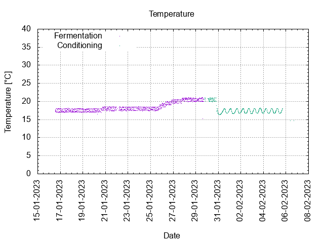
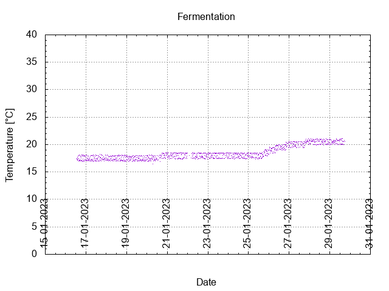
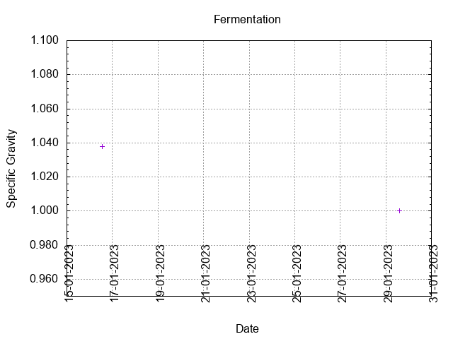
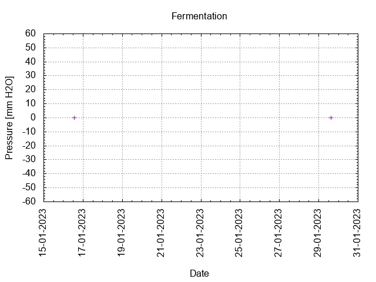
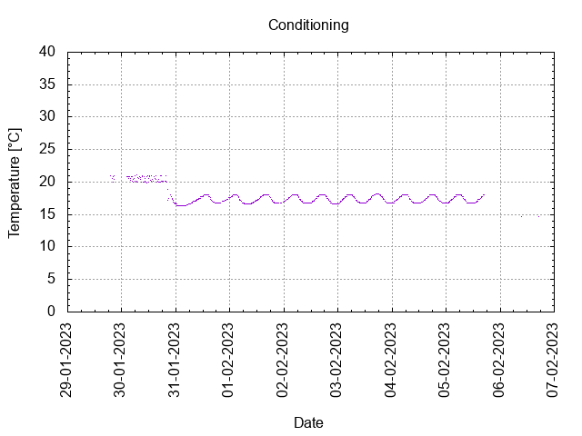

# Batch #29 - Two Pints and a Packet of Hops (Godiva and East Kent Goldings)

## Milestones

15-01-2023 10:20 Start brewing.

16-01-2023 Start fermentation.

29-01-2023 Start conditioning.

12-03-2023 Completed conditioning.

Archived.

## Process

[Results](./Batch_29_Two_Pints_and_a_Packet_of_Hops_Godiva_and_East_Kent_Goldings_results.pdf)

### Evaluation

|                         | Recipe | Batch | Diff   | Unit |
|-------------------------|--------|-------|--------|------|
| Pre-Boil Volume:        |        |       |        | L    |
| Post-Boil Volume (HOT): |        |       |        | L    |
| Boil Off per Hour:      |        |       |        | L    |
| Batch Volume:           |        |       |        | L    |
| Trub/Chiller Loss:      |        |       |        | L    |
| Bottling Volume:        |        |       |        | L    |
| Pre-Boil Gravity:       |        |       |        |      |
| Post-Boil Gravity:      |        |       |        |      |
| Original Gravity:       |        |       |        |      |
| Final Gravity:          |        |       |        |      |
| Alcohol By Volume:      |        |       |        | %    |
| Apparent Attenuation:   |        |       |        | %    |
| Mash Efficiency:        |        |       |        | %    |
| Brewhouse Efficiency:   |        |       |        | %    |
| IBU:                    |        |       |        |      |
| BU/GU Ratio:            |        |       |        |      |
| RB Ratio:               |        |       |        |      |
| Color                   |        |       |        | EBC  |
| Mash pH:                |        |       |        |      |
