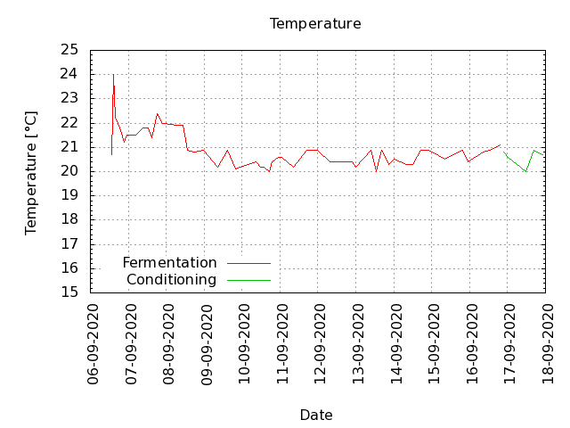
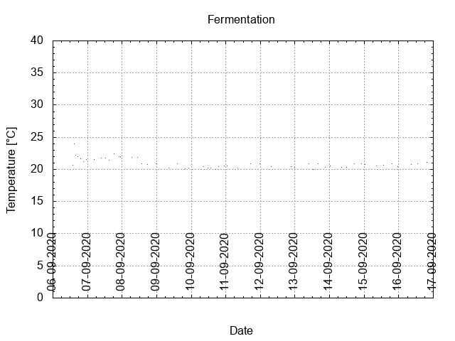
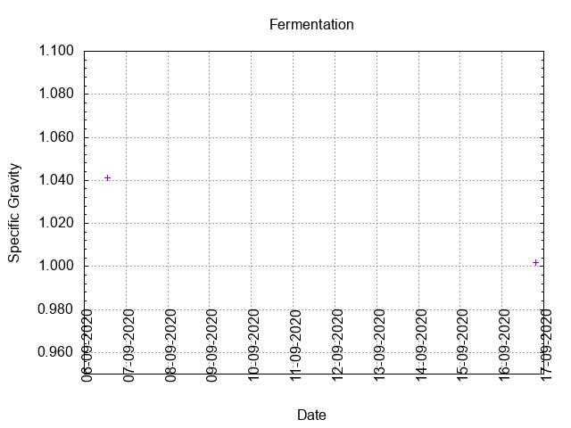
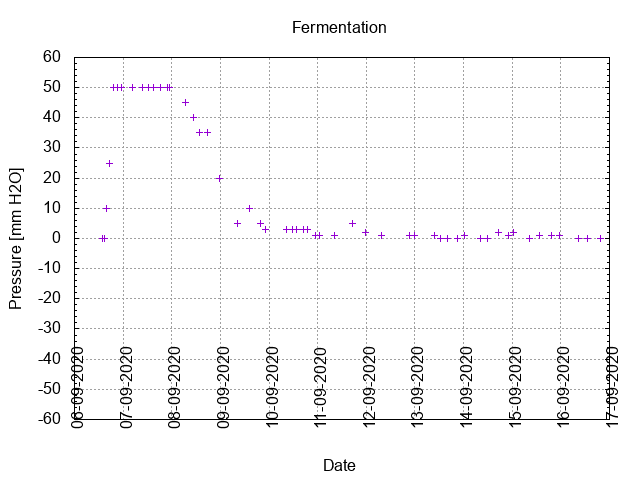
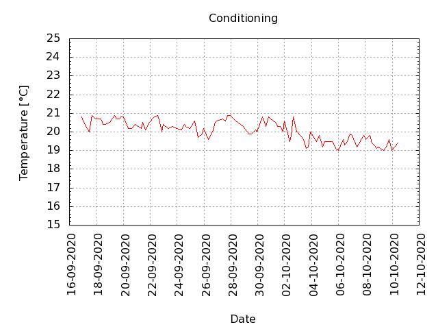

# Batch #3 - 03 SMaSH Godiva

## Milestones

06-09-2020 09:30 Start brewing.

06-09-2020 13:25 Start fermentation.

16-09-2020 21:17 Start conditioning.

31-10-2020 23:46 Completed conditioning.

06-06-2021 17:04 Archived.

## Process data

[Results](./Batch_3_03_SMaSH_Godiva_results.pdf)

### Evaluation

|                         | Recipe | Batch | Diff   | Unit |
|-------------------------|--------|-------|--------|------|
| Pre-Boil Volume:        | 7.76   | 7.1   | -0.66  | L    |
| Post-Boil Volume (HOT): | 5.96   | 5.3   | -0.66  | L    |
| Boil Off per Hour:      | 1.8    | 1.8   |  0.0   | L    |
| Batch Volume:           | 5.6    | 5.3   | -0.3   | L    |
| Trub/Chiller Loss:      | 0.12   | -0.51 | -0.39  | L    |
| Bottling Volume:        | 5.0    | 4.13  | -0.87  | L    |
| Pre-Boil Gravity:       | 1.034  | 1.028 | -0.006 |      |
| Post-Boil Gravity:      | 1.045  | 1.041 | -0.004 |      |
| Original Gravity:       | 1.047  | 1.041 | -0.006 |      |
| Final Gravity:          | 1.011  | 1.002 | -0.009 |      |
| Alcohol By Volume:      | 4.7    | 5.1   | +0.4   | %    |
| Apparent Attenuation:   | 75.9   | 94.9  | +19.0  | %    |
| Mash Efficiency:        | 73     | 55    | -18    | %    |
| Brewhouse Efficiency:   | 72     | 62    | -10    | %    |
| IBU:                    | 36     | 37    | +1     |      |
| BU/GU Ratio:            | 0.76   | 0.91  | +0.15  |      |
| RB Ratio:               | 0.76   | 1.08  | +0.32  |      |
| Color                   | 8.7    | 8.7   |  0.0   | EBC  |
| Mash pH:                | 5.42   | 5.5   | +0.08  |      |
