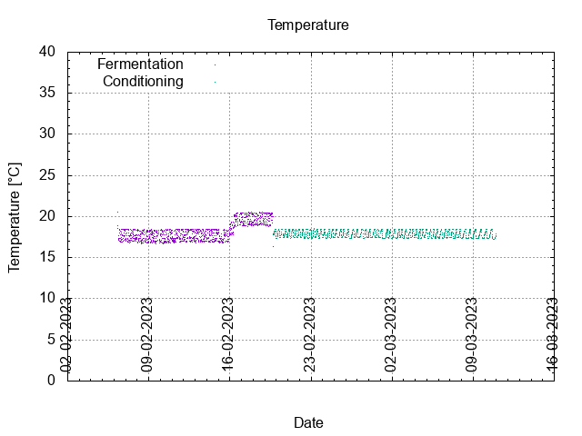
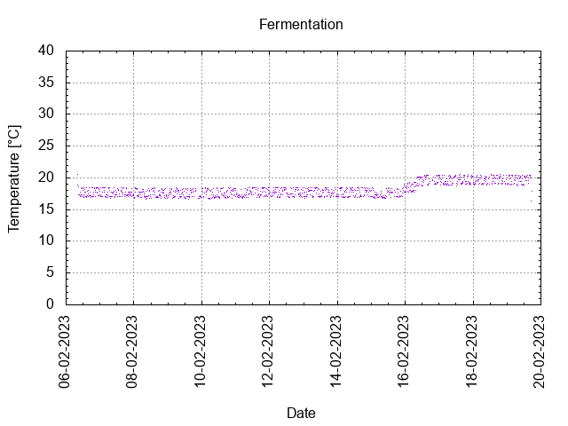
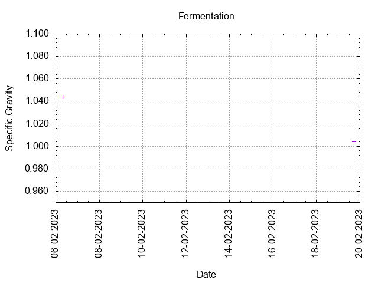
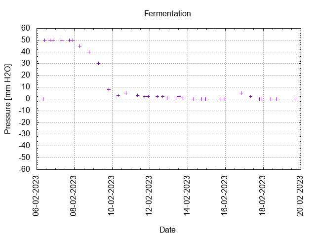
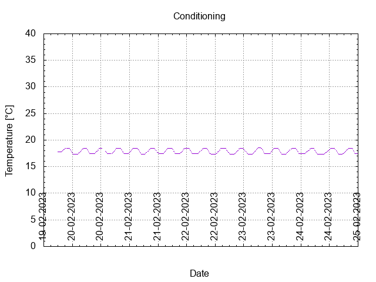
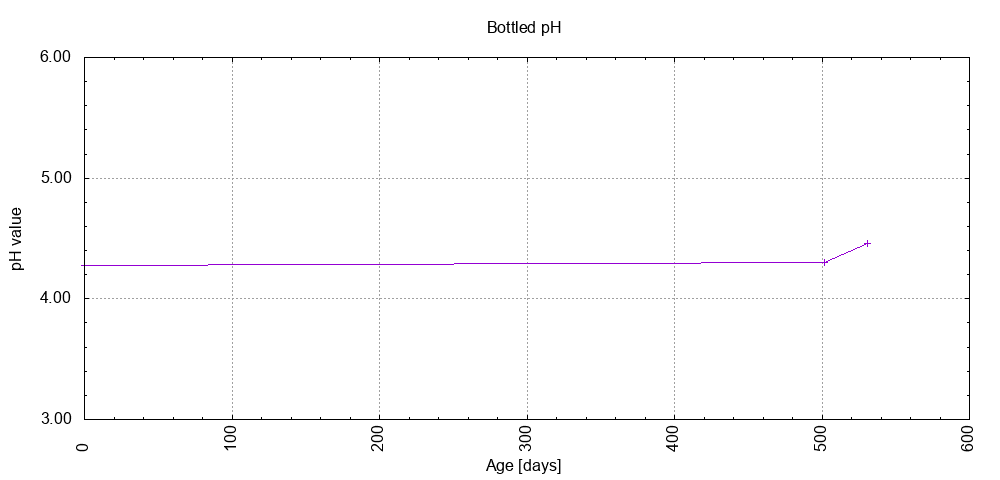

# Batch #30 - AnOtter Bodged Bitter

## Milestones

05-02-2023 10:00 Start brewing.

06-02-2023 08:00 Start fermentation.

19-02-2023 17:25 Start conditioning.

02-04-2023 Completed conditioning.

Archived.

## Process

[Results](./Batch_30_AnOtter Bodged Bitter_results.pdf)

### Evaluation

|                         | Recipe | Batch | Diff   | Unit |
|-------------------------|--------|-------|--------|------|
| Pre-Boil Volume:        |        |       |        | L    |
| Post-Boil Volume (HOT): |        |       |        | L    |
| Boil Off per Hour:      |        |       |        | L    |
| Batch Volume:           |        |       |        | L    |
| Trub/Chiller Loss:      |        |       |        | L    |
| Bottling Volume:        |        |       |        | L    |
| Pre-Boil Gravity:       |        |       |        |      |
| Post-Boil Gravity:      |        |       |        |      |
| Original Gravity:       |        |       |        |      |
| Final Gravity:          |        |       |        |      |
| Alcohol By Volume:      |        |       |        | %    |
| Apparent Attenuation:   |        |       |        | %    |
| Mash Efficiency:        |        |       |        | %    |
| Brewhouse Efficiency:   |        |       |        | %    |
| IBU:                    |        |       |        |      |
| BU/GU Ratio:            |        |       |        |      |
| RB Ratio:               |        |       |        |      |
| Color                   |        |       |        | EBC  |
| Mash pH:                |        |       |        |      |

## Tasting notes

| No. | Date       | Age | Score | Notes |
|-----|------------|-----|-------|-------|
|     | 05-02-2023 |     |       | Brew day. |
|     | 19-02-2023 |   0 |       | Bottling day. |
|   1 | 02-03-2023 |  11 |       | 11th Home Brewing UK Competition entry. |
|   2 | 02-03-2023 |  11 |       | 11th Home Brewing UK Competition entry. |
|   3 | 11-03-2023 |  20 | 2.50  | Served @ 17.4 C. Dry, malty, hoppy, berries. Low carbonation. |
|   4 | 05-07-2024 | 502 | 3.00  | Served @ 17.4 C. Dry, malty, hoppy, berries. Good foamy lasting head. Low carbonation. |
|   5 | 03-08-2024 | 531 | 0     | Gusher. |
|   6 |            |     |       |  |
|   7 |            |     |       |  |
