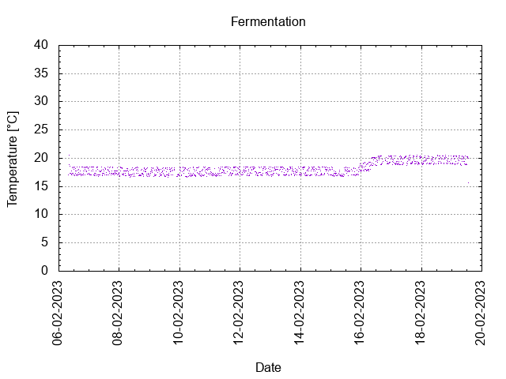
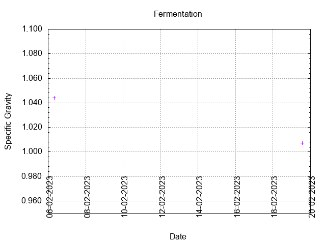
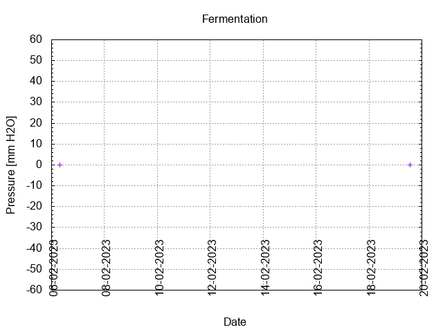
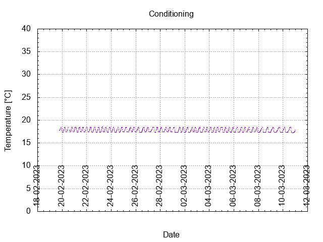
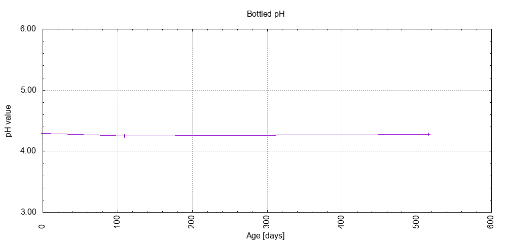

# Batch #31 - AnOtter Bodged Bitter v2

## Milestones

05-02-2023 Start brewing.

06-02-2023 Start fermentation.

19-02-2023 Start conditioning.

02-04-2023 Completed conditioning.

Archived.

## Process

[Results](./Batch_31_AnOtter_Bodged_Bitter_v2_results.pdf)

### Evaluation

|                         | Recipe | Batch | Diff   | Unit |
|-------------------------|--------|-------|--------|------|
| Pre-Boil Volume:        |        |       |        | L    |
| Post-Boil Volume (HOT): |        |       |        | L    |
| Boil Off per Hour:      |        |       |        | L    |
| Batch Volume:           |        |       |        | L    |
| Trub/Chiller Loss:      |        |       |        | L    |
| Bottling Volume:        |        |       |        | L    |
| Pre-Boil Gravity:       |        |       |        |      |
| Post-Boil Gravity:      |        |       |        |      |
| Original Gravity:       |        |       |        |      |
| Final Gravity:          |        |       |        |      |
| Alcohol By Volume:      |        |       |        | %    |
| Apparent Attenuation:   |        |       |        | %    |
| Mash Efficiency:        |        |       |        | %    |
| Brewhouse Efficiency:   |        |       |        | %    |
| IBU:                    |        |       |        |      |
| BU/GU Ratio:            |        |       |        |      |
| RB Ratio:               |        |       |        |      |
| Color                   |        |       |        | EBC  |
| Mash pH:                |        |       |        |      |

## Tasting notes

| No. | Date       | Age | Score | Notes |
|-----|------------|-----|-------|-------|
|     | 05-02-2023 |     |       | Brew day. |
|     | 19-02-2023 |   0 |       | Bottling day. |
|   1 | 08-06-2023 | 109 | 3.0   | Served @ 13.4 C. Clear, foamy head, good lacing, hints of berries, malty, moderate mouthfeel. |
|   2 | 19-07-2024 | 516 | 3.0   | Served @ 16.5 C. Clear, small foamy head, poor lacing, sweet, malty, bitter, hoppy, moderate mouthfeel. |
