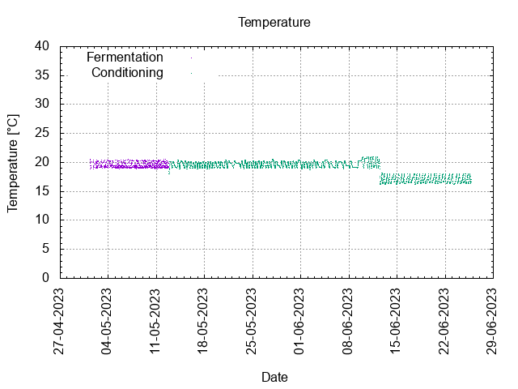
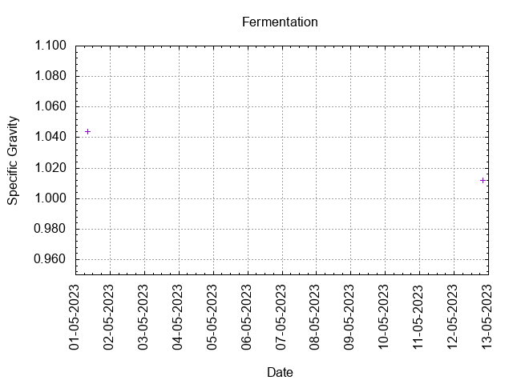
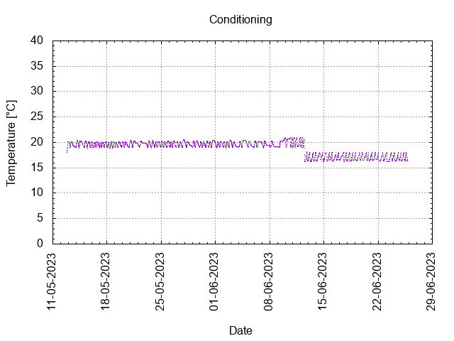
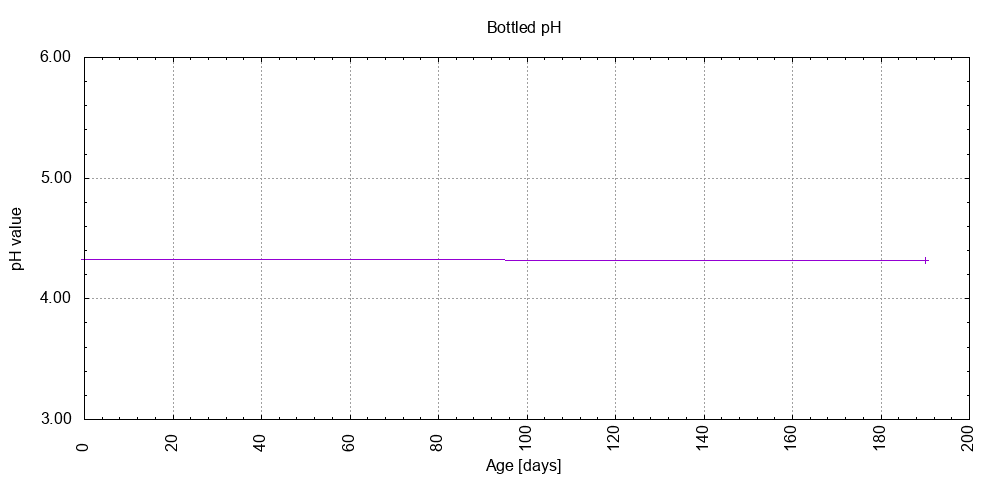

# Batch #35 - Two Pints and a Packet of Hops (Fuggle and East Kent Goldings) v2

## Milestones

30-04-2023 09:00 Start brewing.

01-05-2023 08:26 Start fermentation.

12-05-2023 19:20 Start conditioning.

26-06-2023 23:59 Completed conditioning.

Archived.

## Process

[Results](./Batch_35_Two_Pints_and_a_Packet_of Hops _Fuggle_and_East_Kent_Goldings_v2_results.pdf)

### Evaluation

|                         | Recipe | Batch | Diff   | Unit |
|-------------------------|--------|-------|--------|------|
| Pre-Boil Volume:        | 3.68   |  3.68 |  0     | L    |
| Post-Boil Volume (HOT): | 1.87   |  0.75 | -1.12  | L    |
| Boil Off per Hour:      | 1.8    |  2.93 | +1.13  | L    |
| Batch Volume:           | 1.2    |  0.75 | -0.45  | L    |
| Trub/Chiller Loss:      | 0.6    | -0.03 | -0.63  | L    |
| Bottling Volume:        |        |       |        | L    |
| Pre-Boil Gravity:       |        |       |        |      |
| Post-Boil Gravity:      |        |       |        |      |
| Original Gravity:       |        |       |        |      |
| Final Gravity:          |        |       |        |      |
| Alcohol By Volume:      |        |       |        | %    |
| Apparent Attenuation:   |        |       |        | %    |
| Mash Efficiency:        |        |       |        | %    |
| Brewhouse Efficiency:   |        |       |        | %    |
| IBU:                    |        |       |        |      |
| BU/GU Ratio:            |        |       |        |      |
| RB Ratio:               |        |       |        |      |
| Color                   |        |       |        | EBC  |
| Mash pH:                |        |       |        |      |

## Tasting notes

| No. | Date       | Age | Score | Notes |
|-----|------------|-----|-------|-------|
|     | 30-04-2023 |     |       | Brew day. |
|     | 12-05-2023 |   0 |       | Bottling day. |
|   1 | 18-11-2023 | 190 |  3.0  | Served @ 17.1 C. Clear, no foamy head, no moderate lacing. Clean, fruity, hoppy. |
|   2 |            |     |       |  |
