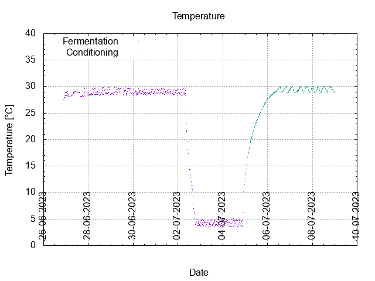
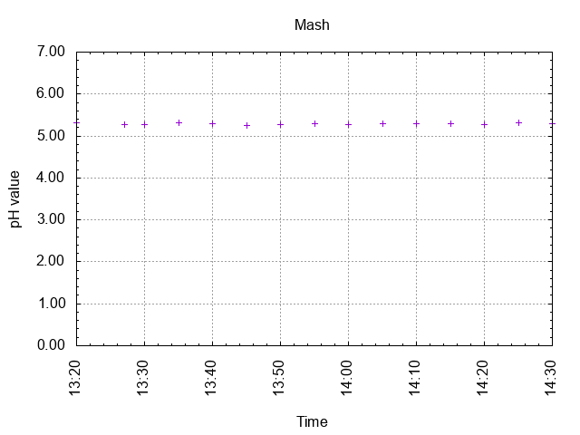
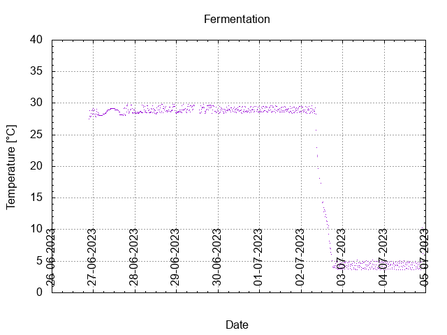
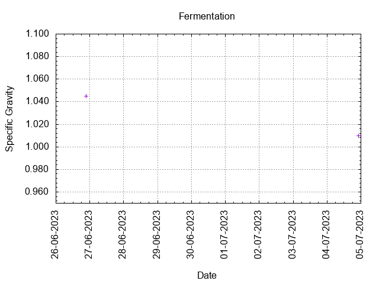
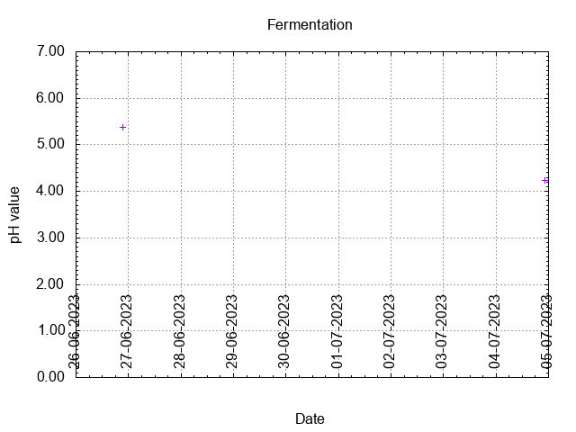
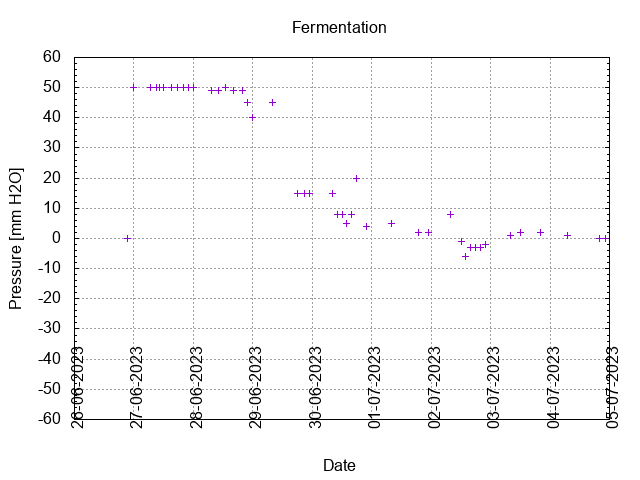
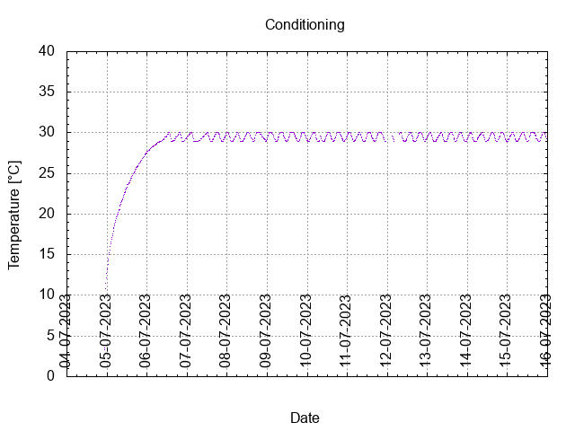
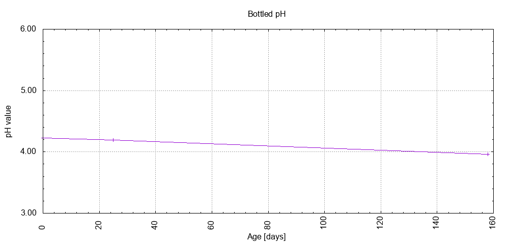

# Batch #36 - 65 Juniper Ascending

## Milestones

25-06-2023 12:00 Start brewing.

26-06-2023 21:20 Start fermentation.

04-07-2023 22:15 Start conditioning.

18-07-2023 23:59 Completed conditioning.

Archived.

## Process

[Results](./Batch__results.pdf)

### Evaluation

|                         | Recipe | Batch | Diff   | Unit |
|-------------------------|--------|-------|--------|------|
| Pre-Boil Volume:        | 5.96   | 6.5   | +0.54  | L    |
| Post-Boil Volume (HOT): | 5.96   | 6.5   | +0.54  | L    |
| Boil Off per Hour:      | 0.0    | 0.0   |  0     | L    |
| Batch Volume:           | 5.6    | 4.5   | -1.1   | L    |
| Trub/Chiller Loss:      | 0.12   | 1.74  | +1.62  | L    |
| Bottling Volume:        | 5.0    | 3.3   | -1.7   | L    |
| Pre-Boil Gravity:       | 1.061  | 1.045 | -0.016 |      |
| Post-Boil Gravity:      | 1.061  | 1.045 | -0.016 |      |
| Original Gravity:       | 1.061  | 1.045 | -0.016 |      |
| Total Gravity:          | 1.063  | 1.047 | -0.016 |      |
| Final Gravity:          | 1.014  | 1.010 | -0.004 |      |
| Alcohol By Volume:      | 6.4    | 4.9   | -1.5   | %    |
| Apparent Attenuation:   | 76.8   | 78    | +1.2   | %    |
| Mash Efficiency:        | 73     | 59    | -14    | %    |
| Brewhouse Efficiency:   | 72     | 42    | -30    | %    |
| IBU:                    | 7      | 7     |  0     |      |
| BU/GU Ratio:            | 0.1    | 0.15  | +0.05  |      |
| RB Ratio:               | 0.1    | 0.15  | +0.05  |      |
| Color                   | 13.8   | 13    | -0.8   | EBC  |
| Mash pH:                | 5.35   | 5.29  | -0.06  |      |

## Tasting notes

| No. | Date       | Age | Score | Notes |
|-----|------------|-----|-------|-------|
|     | 26-06-2023 |     |       | Brew day. |
|     | 04-07-2023 |   0 |       | Bottling day. |
|   1 | 29-07-2023 |  25 | 3.00  | Served @ 20.1 C. Cloudy, small foamy head, good lacing, malty, tart, Juniper flavor. |
|   2 | 09-12-2023 | 158 | 3.00  | Served @ 19.6 C. Cloudy, small foamy head, good lacing, malty, tart, Juniper flavor. |
|   3 |            |     |       |  |
|   4 |            |     |       |  |
|   5 |            |     |       |  |
|   6 |            |     |       |  |
|   7 |            |     |       |  |
|   8 |            |     |       |  |
|   9 |            |     |       |  |
|  10 |            |     |       |  |
