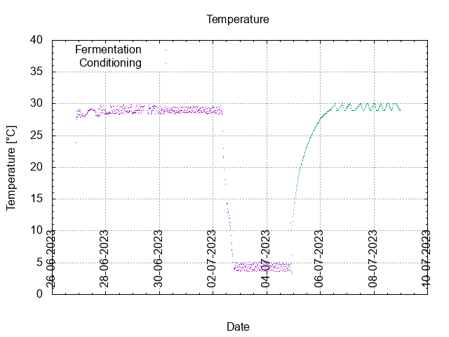
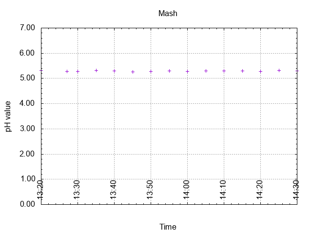
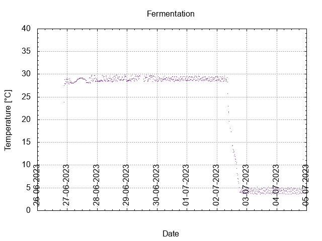
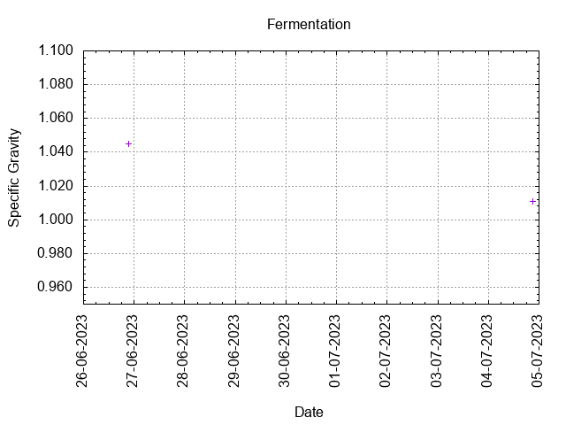
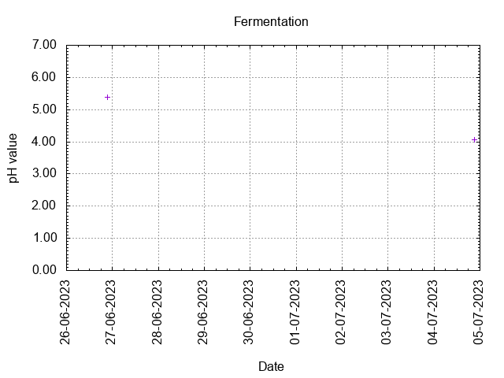
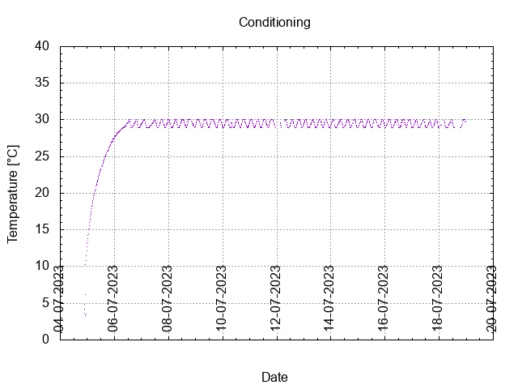

# Batch #37 - 65 Juniper Ascending v2

## Milestones

25-06-2023 12:00 Start brewing.

26-06-2023 21:10 Start fermentation.

04-07-2023 21:15 Start conditioning.

Completed conditioning.

Archived.

## Process

[Results](./Batch__results.pdf)

### Evaluation

|                         | Recipe | Batch | Diff   | Unit |
|-------------------------|--------|-------|--------|------|
| Pre-Boil Volume:        | 1.88   | 1.88  |  0     | L    |
| Post-Boil Volume (HOT): | 1.87   | 1.87  |  0     | L    |
| Boil Off per Hour:      | 0.0    | 0.0   |  0     | L    |
| Batch Volume:           | 1.2    | 1.15  | +0.05  | L    |
| Trub/Chiller Loss:      | 0.6    | 0.65  |  0     | L    |
| Bottling Volume:        | 1.2    | 1.0   | -0.2   | L    |
| Pre-Boil Gravity:       | 1.061  | 1.045 | -0.016 |      |
| Post-Boil Gravity:      | 1.062  | 1.045 | -0.017 |      |
| Original Gravity:       | 1.062  | 1.045 | -0.017 |      |
| Total Gravity:          | 1.063  | 1.047 | -0.016 |      |
| Final Gravity:          | 1.014  | 1.011 | -0.003 |      |
| Alcohol By Volume:      | 6.4    | 4.7   | -1.7   | %    |
| Apparent Attenuation:   | 76.8   | 75.9  | -0.9   | %    |
| Mash Efficiency:        | 79     | 58    | -21    | %    |
| Brewhouse Efficiency:   | 53     | 37    | -16    | %    |
| IBU:                    | 6      | 7     | +1     |      |
| BU/GU Ratio:            | 0.10   | 0.16  | +0.06  |      |
| RB Ratio:               | 0.10   | 0.16  | +0.06  |      |
| Color                   | 13     | 13    |  0     | EBC  |
| Mash pH:                | 4.64 ? | 5.29  | +0.65  |      |

## Tasting notes

| No. | Date       | Age | Score | Notes |
|-----|------------|-----|-------|-------|
|     | 26-06-2023 |     |       | Brew day. |
|     | 04-07-2023 |   0 |       | Bottling day. |
|   1 |            |     |       |  |
|   2 |            |     |       |  |
|   3 |            |     |       |  |
