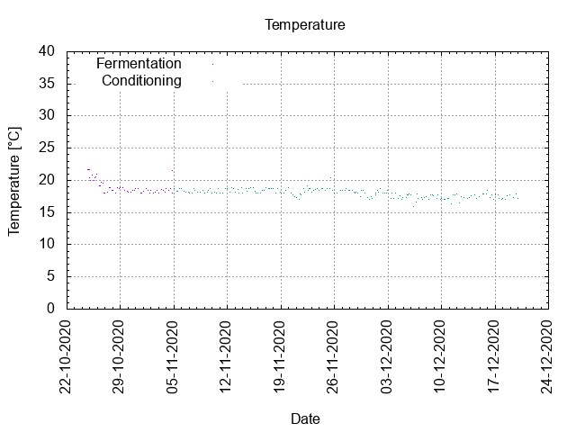
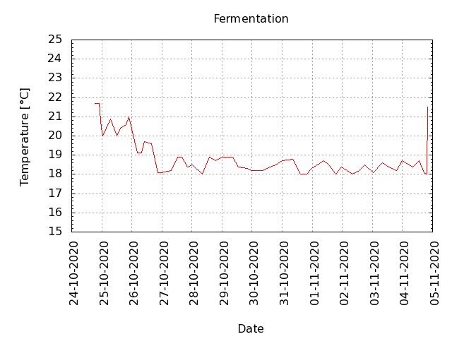
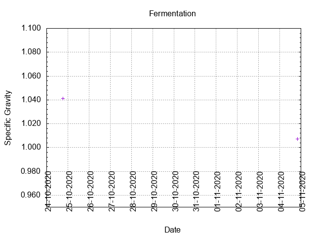
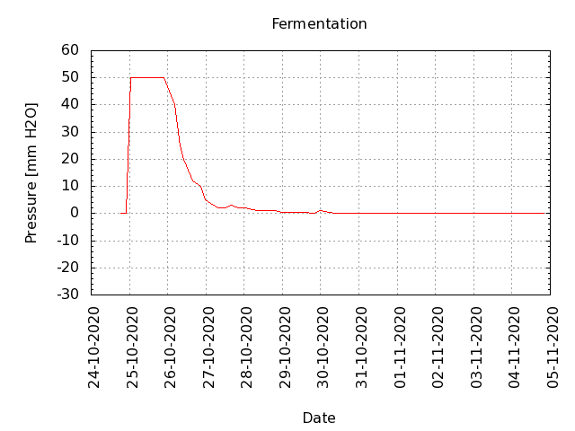
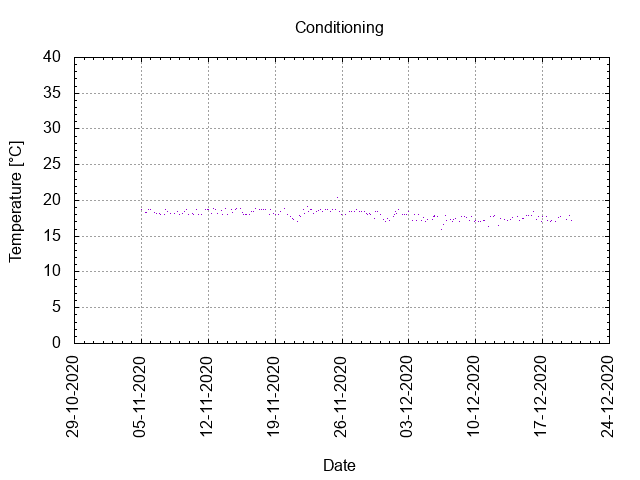

# Batch #4 - 04 SMaSH Fuggle

## Milestones

24-10-2020 12:00 Start brewing.

24-10-2020 18:24 Start fermentation.

04-11-2020 20:15 Start conditioning.

19-12-2020 23:58 Completed conditioning.

21-08-2021 20:58 Archived.

## Process data

[Results](./Batch_4_04_SMaSH_Fuggle_results.pdf)

## Evaluation

|                         | Recipe | Batch | Diff   | Unit |
|-------------------------|--------|-------|--------|------|
| Pre-Boil Volume:        | 7.76   | 7.35  | -0.41  | L    |
| Post-Boil Volume (HOT): | 5.96   | 6.0   | +0.04  | L    |
| Boil Off per Hour:      | 1.8    | 1.35  | -0.45  | L    |
| Batch Volume:           | 5.6    | 5.6   |  0     | L    |
| Trub/Chiller Loss:      | 0.12   | 0.16  | +0.04  | L    |
| Bottling Volume:        | 5.0    | 4.0   | -1.0   | L    |
| Pre-Boil Gravity:       | 1.031  | 1.031 |  0.000 |      |
| Post-Boil Gravity:      | 1.041  | 1.039 | -0.002 |      |
| Original Gravity:       | 1.043  | 1.041 | -0.002 |      |
| Final Gravity:          | 1.010  | 1.007 | -0.003 |      |
| Alcohol By Volume:      | 4.3    | 4.5   | +0.2   | %    |
| Apparent Attenuation:   | 76.1   | 82.4  | +6.3   | %    |
| Mash Efficiency:        | 73     | 69    | -4     | %    |
| Brewhouse Efficiency:   | 72     | 69    | -3     | %    |
| IBU:                    | 27     | 27    |  0     |      |
| BU/GU Ratio:            | 0.62   | 0.65  | +0.03  |      |
| RB Ratio:               | 0.62   | 0.69  | +0.07  |      |
| Color                   | 5.3    | 5.3   |  0     | EBC  |
| Mash pH:                | 5.43   | 5.5   | +0.07  |      |

## [Tasting notes](./Batch_4_04_SMaSH_Fuggle_BJCP_Scoresheet.pdf)

| No. | Date       | Age | Score | Notes |
|-----|------------|-----|-------|-------|
|     | 24-10-2020 |   0 |       | Brew day. |
|     | 04-11-2020 |  11 |       | Bottling day. |
|   1 | 20-11-2020 |  27 |  3.00 | Cooled and served @ 10 C. Opening the swing-top gave a puff. Poured clear with a little foam. Moderate carbonation. Light haze due to yeast not fully deposited. Light body, crisp and hoppy and a mild grassy taste and a dry mouthfeel. |
|   2 | 29-11-2020 |  36 |  3.00 | Cooled and served @ 10 C. Opening the swing-top gave a small puff. Poured clear with a little foam. Moderate carbonation. Light haze due to yeast not fully deposited. Light body, crisp and hoppy and a mild grassy/vegetal taste and a dry mouthfeel. |
|   3 | 04-12-2020 |  41 |  3.00 | Cooled and served @ 12 C. Opening the swing-top gave a small puff. Poured clear with a little foam. Moderate carbonation. Light haze due to yeast not fully deposited. Light body, crisp and hoppy and a mild grassy/vegetal taste and a dry mouthfeel. |
|   4 | 05-12-2020 |  42 |  3.00 | Cooled and served @ 12 C. Opening the swing-top gave a very small puff. Poured clear with a little foam. Light carbonation. Very light haze due to yeast not fully deposited. Light body, crisp and hoppy and a mild grassy/vegetal taste and a dry mouthfeel. |
|   5 | 31-01-2021 |  99 |  3.00 | Cooled and served @ 10 C. Opening the swing-top gave a very small puff. Poured clear with a nice foam head. Light carbonation. Light body, crisp and hoppy and a mild grassy/vegetal taste and a dry mouthfeel. |
|   6 | 21-03-2021 | 148 |  3.00 | Served @ 15 C. Opening the swing-top gave a loud pop and beer pouring out. Poured hazy with a nice foam head. High carbonation. Light body, crisp and mellowed hoppy taste and a dry mouthfeel. |
|   7 | 10-04-2021 | 168 |  3.00 | Served @ 10 C. Opening the swing-top gave a loud pop and beer pouring out. Poured hazy with a nice foam head. High carbonation. Light body, crisp and mellowed hoppy taste and a dry mouthfeel. |
|   8 | 23-04-2021 | 181 |  2.75 | Served @ 10 C. Opening the swing-top gave a loud pop and beer pouring out. Poured hazy with a nice foam head. High carbonation. Light body, crisp and mellowed hoppy taste and a dry mouthfeel. |
|   9 | 06-06-2021 | 225 |  3.00 | Served @ 10 C. Opening the swing-top gave a loud pop and beer pouring out. Poured hazy with a nice foam head. High carbonation. Light body, crisp and mellowed hoppy taste and a dry mouthfeel. |
|  10 | 09-07-2021 | 258 |  2.50 | Served @ 10 C. Opening the swing-top gave a loud pop and beer pouring out. Poured hazy with a nice large head. High carbonation. Light body, crisp and a little bit sour. |
|  11 | 17-07-2021 | 266 |  2.50 | Served @ 10 C. Opening the swing-top gave a small puff. Poured hazy with a small head. High carbonation. Light body, crisp and a little bit sour. |
|  12 | 21-08-2021 | 301 |  2.50 | Served @ 10 C. Opening the swing-top gave a puff. Poured hazy with a decent head. High carbonation. Light body, crisp and a little bit sour. |
