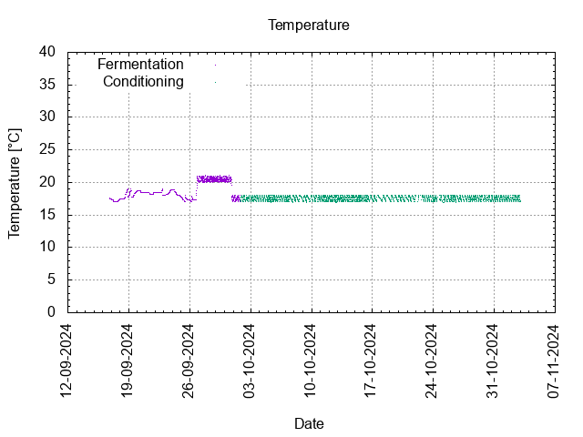
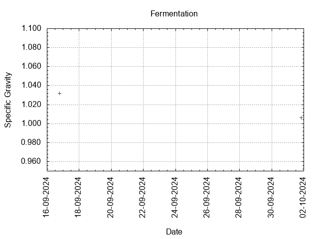
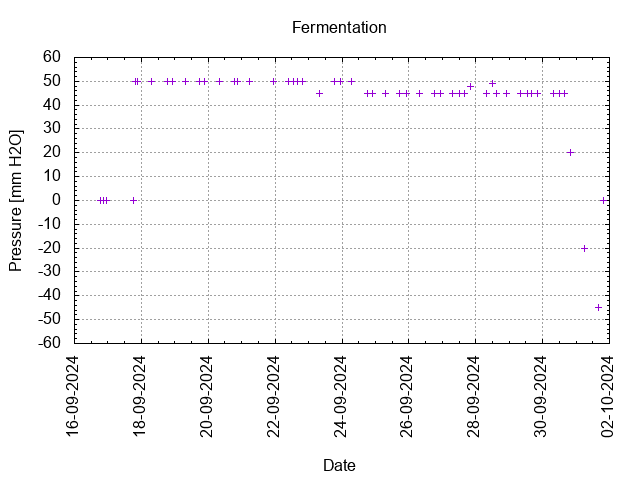

# Batch #40 - Wet Hops Blonde Ale (Willamette) v2

## Milestones

15-09-2024 Start brewing.

16-09-2024 Start fermentation.

30-09-2024 Start conditioning.

Completed conditioning.

Archived.

## Process

[Results](./Batch__results.pdf)

### Evaluation

|                         | Recipe | Batch | Diff   | Unit |
|-------------------------|--------|-------|--------|------|
| Pre-Boil Volume:        | 6.86   | 8.5   | +1.64  | L    |
| Post-Boil Volume (HOT): | 5.96   | 7.5   | +1.54  | L    |
| Boil Off per Hour:      | 1.8    | 2.0   | +0.2   | L    |
| Batch Volume:           | 5.6    | 5.6   |  0     | L    |
| Trub/Chiller Loss:      | 0.12   | 1.6   | +1.48  | L    |
| Bottling Volume:        | 5.0    | 4.5   | -0.5   | L    |
| Pre-Boil Gravity:       | 1.035  | 1.028 | -0.007 |      |
| Post-Boil Gravity:      | 1.041  | 1.032 | -0.009 |      |
| Original Gravity:       | 1.041  | 1.032 | -0.009 |      |
| Final Gravity:          | 1.010  | 1.006 | -0.004 |      |
| Alcohol By Volume:      | 4.3    | 3.8   | -0.5   | %    |
| Apparent Attenuation:   | 76.1   | 82.4  | +6.3   | %    |
| Mash Efficiency:        | 73     | 72.66 | -0.34  | %    |
| Brewhouse Efficiency:   | 72     | 56.5  | -15.5  | %    |
| IBU:                    | 24     | 21    | -3     |      |
| BU/GU Ratio:            | 0.56   | 0.60  | +0.04  |      |
| RB Ratio:               | 0.56   | 0.64  | +0.08  |      |
| Color                   | 9.3    | 7.9   | -1.4   | EBC  |
| Mash pH:                | 5.37   | 5.38  | +0.01  |      |

## Tasting notes

| No. | Date       | Age | Score | Notes |
|-----|------------|-----|-------|-------|
|     | 15-09-2024 |     |       | Brew day. |
|     | 30-09-2024 |   0 |       | Bottling day. |
|   1 |  |  |  |  |
|   2 |  |  |  |  |
|   3 |  |  |  |  |
|   4 |  |  |  |  |
|   5 |  |  |  |  |
|   6 |  |  |  |  |
|   7 |  |  |  |  |
|   8 |  |  |  |  |
|   9 |  |  |  |  |
|  10 |  |  |  |  |
|  11 |  |  |  |  |
|  12 |  |  |  |  |
|  13 |  |  |  |  |
|  14 |  |  |  |  |
|  15 |  |  |  |  |
