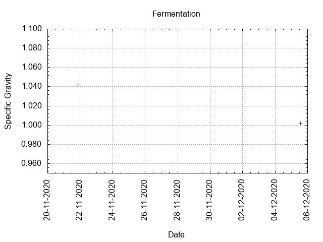
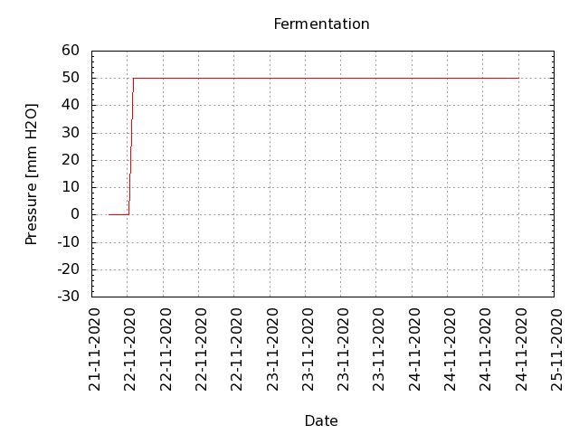
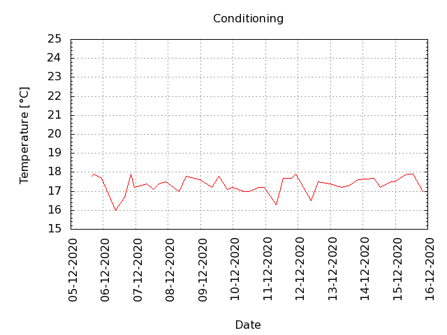

# Batch #5 - 05 SMaSH Centennial

## Milestones

21-11-2020 10:10 Start brewing.

21-11-2020 20:50 Start fermentation.

05-12-2020 15:01 Start conditioning.

19-01-2021 23:22 Completed conditioning.

Archived.

## Process data

[Results](./Batch_5_05_SMaSH_Centennial_results.pdf)

### Evaluation

|                         | Recipe | Batch | Diff   | Unit |
|-------------------------|--------|-------|--------|------|
| Pre-Boil Volume:        | 7.76   | 8.0   | +0.24  | L    |
| Post-Boil Volume (HOT): | 5.96   | 5.75  | -0.21  | L    |
| Boil Off per Hour:      | 1.8    | 2.25  | +0.45  | L    |
| Batch Volume:           | 5.6    | 5.6   | 0.0    | L    |
| Fermenter Top Up        | 0.0    | 1.0   | +1.0   | L    |
| Fermenter Volume        | 5.6    | 5.6   | 0.0    | L    |
| Trub/Chiller Loss:      | 0.12   | -0.08 | -0.20  | L    |
| Bottling Volume:        | 5.0    | 4.62  | -0.38  | L    |
| Pre-Boil Gravity:       | 1.037  | 1.030 | -0.007 |      |
| Post-Boil Gravity:      | 1.049  | 1.051 | +0.002 |      |
| Original Gravity:       | 1.051  | 1.042 | -0.009 |      |
| Final Gravity:          | 1.010  | 1.002 | -0-008 |      |
| Alcohol By Volume:      | 5.4    | 5.3   | -0,1   | %    |
| Apparent Attenuation:   | 79.7   | 95.1  | +15.4  | %    |
| Mash Efficiency:        | 73.3   | 61    | -12    | %    |
| Brewhouse Efficiency:   | 71.8   | 75    | +3     | %    |
| IBU:                    | 38     | 42    | +4     |      |
| BU/GU Ratio:            | 0.74   | 0.99  | +0.25  |      |
| RB Ratio:               | 0.76   | 1.17  | +0.41  |      |
| Color                   | 9.3    | 9.5   | +0.2   | EBC  |
| Mash pH:                | 5.40   | 5.5   | +0.1   |      |
