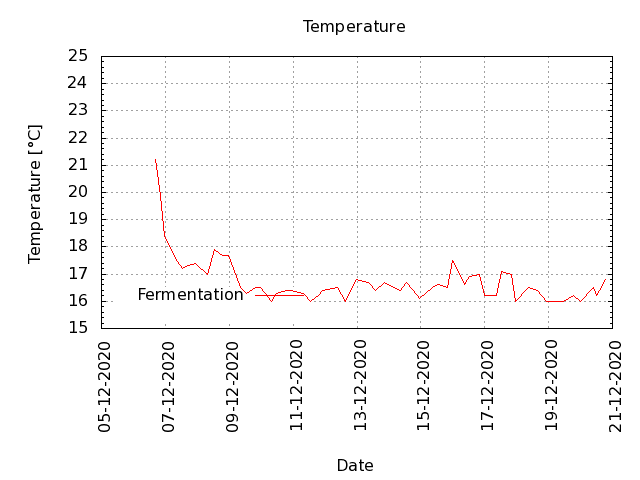
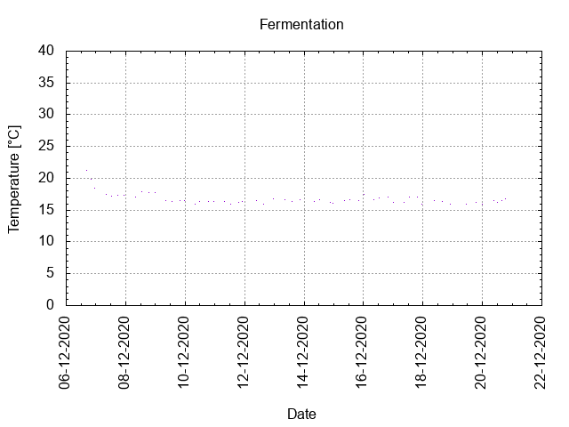
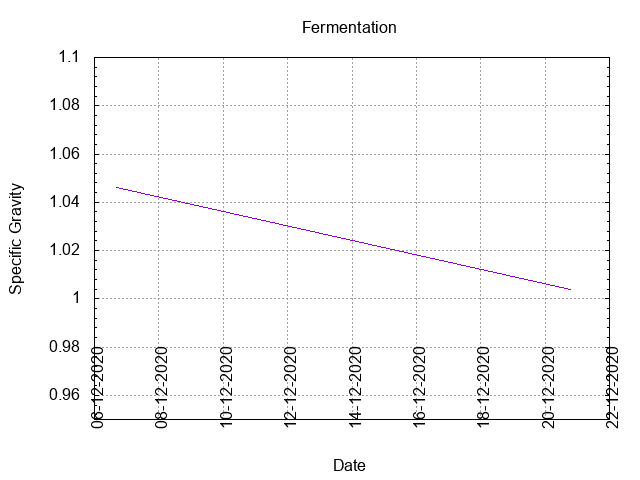
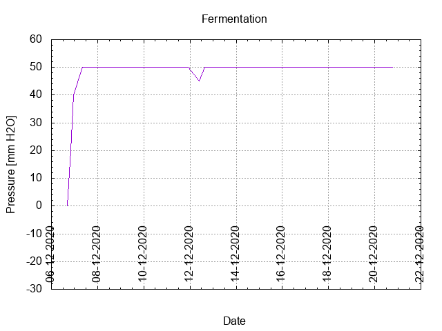
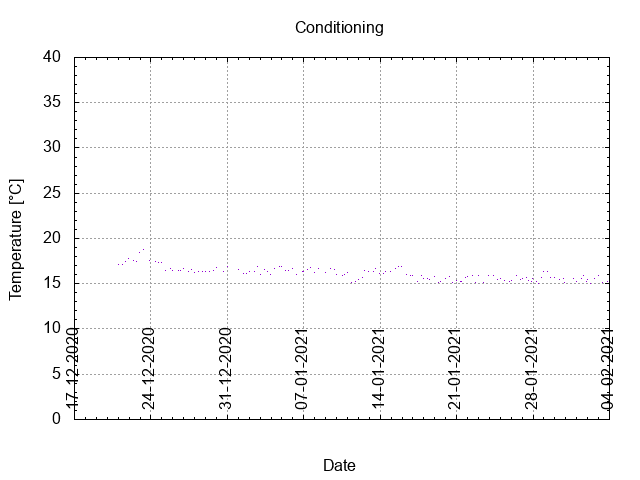

# Batch #6 - SMaSH Citra

## Milestones

Start brewing.

Start fermentation.

Start conditioning.

Completed conditioning.

Archived.

## Preparation

[Brew day sheet](./Batch_6_06_SMaSH_Citra_brew_day_sheet.pdf)

[Checklist](./Batch_6_06_SMaSH_Citra_checklist.pdf)

## Process

[Results](./Batch_6_06_SMaSH_Citra_results.pdf)

### Evaluation

|                         | Recipe | Batch | Diff   | Unit |
|-------------------------|--------|-------|--------|------|
| Pre-Boil Volume:        |        |       |        | L    |
| Post-Boil Volume (HOT): |        |       |        | L    |
| Boil Off per Hour:      |        |       |        | L    |
| Batch Volume:           |        |       |        | L    |
| Trub/Chiller Loss:      |        |       |        | L    |
| Bottling Volume:        |        |       |        | L    |
| Pre-Boil Gravity:       |        |       |        |      |
| Post-Boil Gravity:      |        |       |        |      |
| Original Gravity:       |        |       |        |      |
| Final Gravity:          |        |       |        |      |
| Alcohol By Volume:      |        |       |        | %    |
| Apparent Attenuation:   |        |       |        | %    |
| Mash Efficiency:        |        |       |        | %    |
| Brewhouse Efficiency:   |        |       |        | %    |
| IBU:                    |        |       |        |      |
| BU/GU Ratio:            |        |       |        |      |
| RB Ratio:               |        |       |        |      |
| Color                   |        |       |        | EBC  |
| Mash pH:                |        |       |        |      |

### Tasting notes

## Batch notes

### Brew day

### Fermentation

#### Day 0 in fermentation

#### Day 1 in fermentation

#### Day 2 in fermentation

#### Day 3 in fermentation

#### Day 4 in fermentation

#### Day 5 in fermentation

#### Day 6 in fermentation

#### Day 7 in fermenatation

#### Day 8 in fermentation

#### Day 9 in fermentation

#### Day 10 in fermentation

### Bottling day

### Conditioning

#### Day 1 in conditioning

#### Day 2 in conditioning

#### Day 3 in conditioning

#### Day 4 in conditioning

#### Day 5 in conditioning

#### Day 6 in conditioning

#### Day 7 in conditioning

#### Day 8 in conditioning

#### Day 9 in conditioning

#### Day 10 in conditioning

#### Day 11 in conditioning

#### Day 12 in conditioning

#### Day 13 in conditioning

#### Day 14 in conditioning

#### Day 15 in conditioning

#### Day 16 in conditioning

#### Day 17 in conditioning

#### Day 18 in conditioning

#### Day 19 in conditioning

#### Day 20 in conditioning

#### Day 21 in conditioning

#### Day 22 in conditioning

#### Day 23 in conditioning

#### Day 24 in conditioning

#### Day 25 in conditioning

#### Day 26 in conditioning

#### Day 27 in conditioning

#### Day 28 in conditioning

#### Day 29 in conditioning

#### Day 30 in conditioning

#### Day 31 in conditioning

#### Day 32 in conditioning

#### Day 33 in conditioning

#### Day 34 in conditioning

#### Day 35 in conditioning

#### Day 36 in conditioning

#### Day 37 in conditioning

#### Day 38 in conditioning

#### Day 39 in conditioning

#### Day 40 in conditioning

#### Day 41 in conditioning

#### Day 42 in conditioning

#### Day 43 in conditioning

#### Day 44 in conditioning

#### Day 45 in conditioning

