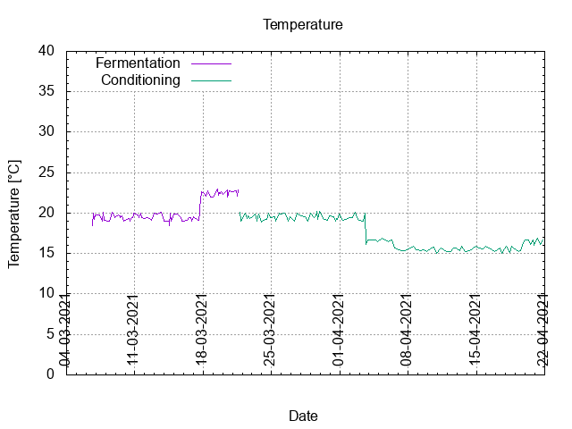
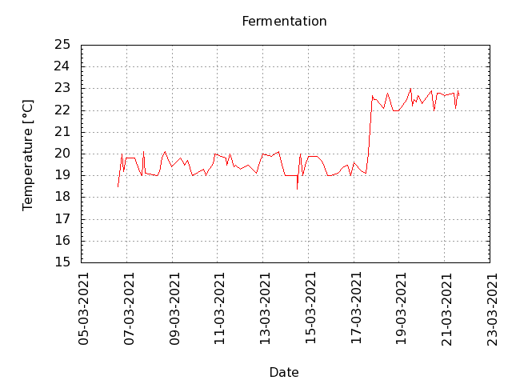
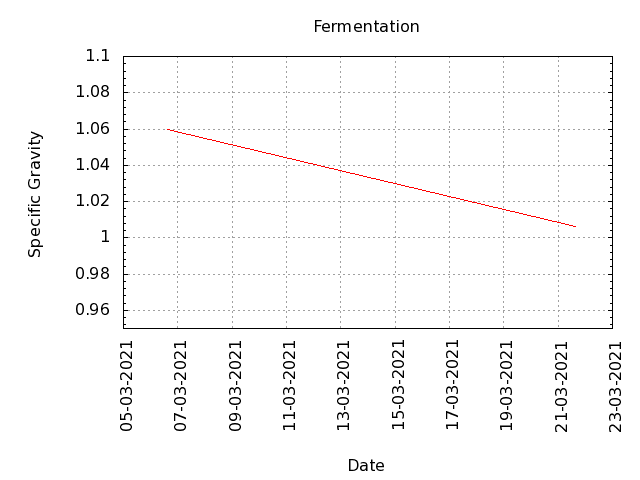
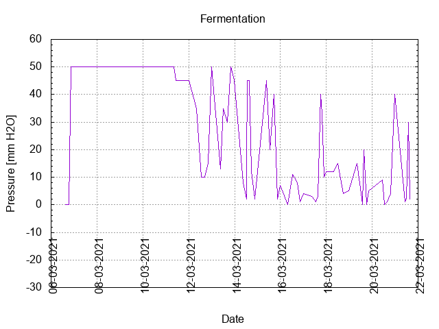
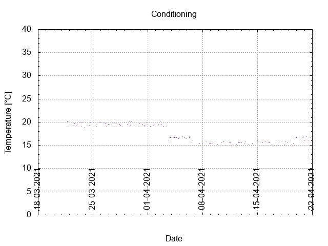

# Batch #7 - 06 SMaSH Citra

## Milestones

Start brewing.

Start fermentation.

Start conditioning.

Completed conditioning.

Archived.

## Process data

[Results](./Batch_7_06_SMaSH_Citra_results.pdf)

### Evaluation

|                         | Recipe | Batch | Diff   | Unit |
|-------------------------|--------|-------|--------|------|
| Pre-Boil Volume:        | 7.76   |       |        | L    |
| Post-Boil Volume (HOT): | 5.96   |       |        | L    |
| Boil Off per Hour:      | 1.8    |       |        | L    |
| Batch Volume:           | 5.6    |       |        | L    |
| Trub/Chiller Loss:      | 0.12   |       |        | L    |
| Bottling Volume:        | 5.0    |       |        | L    |
| Pre-Boil Gravity:       | 1.041  |       |        |      |
| Post-Boil Gravity:      | 1.053  |       |        |      |
| Original Gravity:       | 1.055  |       |        |      |
| Final Gravity:          | 1.009  |       |        |      |
| Alcohol By Volume:      | 6.0    |       |        | %    |
| Apparent Attenuation:   | 83     |       |        | %    |
| Mash Efficiency:        | 73.3   |       |        | %    |
| Brewhouse Efficiency:   | 71.8   |       |        | %    |
| IBU:                    | 40     |       |        |      |
| BU/GU Ratio:            | 0.73   |       |        |      |
| RB Ratio:               | 0.78   |       |        |      |
| Color                   | 9.7    |       |        | EBC  |
| Mash pH:                | 5.40   |       |        |      |
