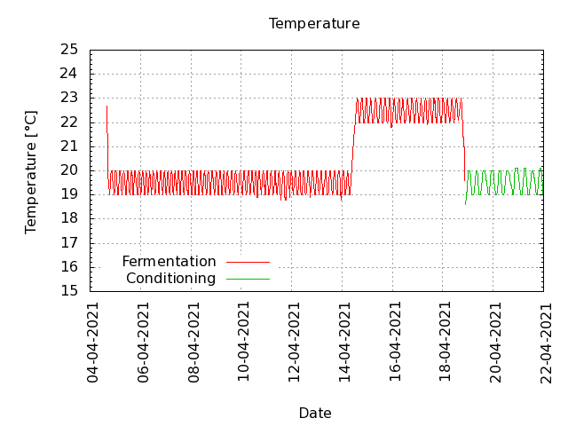
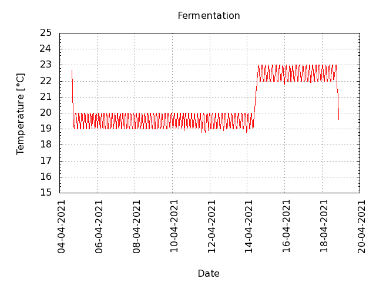
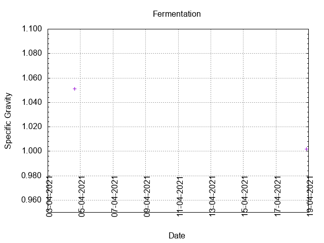
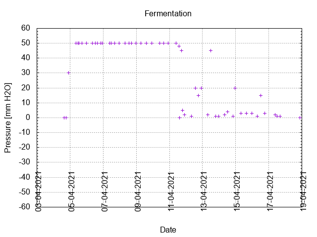
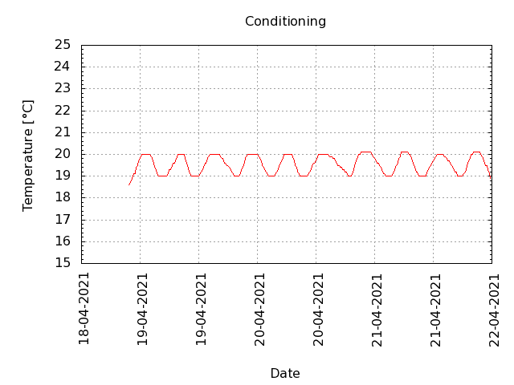

# Batch #8 - 07 SMaSH Simcoe

## Milestones

04-04-2021 10:38 Start brewing.

04-04-2021 15:45 Start fermentation.

18-04-2021 21:35 Start conditioning.

01-06-2021 23:15 Completed conditioning.

Archived.

## Process

[Results](./Batch_8_07_SMaSH_Simcoe_results.pdf)

## Evaluation

|                         | Recipe | Batch | Diff   | Unit |
|-------------------------|--------|-------|--------|------|
| Pre-Boil Volume:        | 7.76   | 8.25  | +0.49  | L    |
| Post-Boil Volume (HOT): | 5.96   | 6.5   | +0.54  | L    |
| Boil Off per Hour:      | 1.8    | 1.75  | -0.05  | L    |
| Batch Volume:           | 5.6    | 5.6   |  0     | L    |
| Trub/Chiller Loss:      | 0.12   | 0     | -0.12  | L    |
| Bottling Volume:        | 5      | 5.115 | +0.115 | L    |
| Pre-Boil Gravity:       | 1.041  | 1.041 |  0.000 |      |
| Post-Boil Gravity:      | 1.054  | 1.051 | -0.003 |      |
| Original Gravity:       | 1.054  | 1.051 | -0.003 |      |
| Total Gravity:          | 1.056  | 1.054 | -0.002 |      |
| Final Gravity:          | 1.010  | 1.002 | -0.008 |      |
| Alcohol By Volume:      | 6.0    | 6.8   | +0.8   | %    |
| Apparent Attenuation:   | 81.4   | 96.1  | +14.7  | %    |
| Mash Efficiency:        | 73     | 78    | +5     | %    |
| Brewhouse Efficiency:   | 72     | 68    | -4     | %    |
| IBU:                    | 39     | 36    | -3     |      |
| BU/GU Ratio:            | 0.69   | 0.67  | -0.02  |      |
| RB Ratio:               | 0.72   | 0.80  | +0.08  |      |
| Color                   | 9.9    | 9.3   | -0.6   | EBC  |
| Mash pH:                | 5.4    | 5.5   | +0.1   |      |

## [Tasting notes](./Batch_8_07_SMaSH_Simcoe_BJCP_Scoresheet.pdf)

| No. | Date       | Age | Score | Notes |
|-----|------------|-----|-------|-------|
|     | 04-04-2021 |   0 |       | Brew day. |
|     | 18-04-2021 |  14 |       | Bottling day. |
|   1 | 02-05-2021 |  28 |  2.50 | Served @ 10 C. Gave a small puff. No distinct carbonation. Citrusy as in lemon or grapefruit, not bitter at all, clear and crisp … just no bubbles. |
|   2 | 04-06-2021 |  61 |  2.75 | Served @ 10 C. Gave a small puff. No distinct carbonation. Thin mouthfeel. Citrusy as in lemon or grapefruit, not bitter at all, clear and crisp … just no bubbles. |
|   3 | 31-07-2021 | 118 |  3.25 | Served @ 10 C. Gave a small puff. Low carbonation, small foam head. Citrusy as in lemon or grapefruit, not bitter at all, clear and crisp. |
|   4 | 14-08-2021 | 132 |  3.25 | Served @ 10 C. Gave a small puff. Low carbonation, small foam head. Citrusy as in lemon or grapefruit, not bitter at all, clear and crisp. |
|   5 | 28-08-2021 | 146 |  3.25 | Served @ 10 C. Gave a small puff. Low carbonation, small foam head. Citrusy as in lemon or grapefruit, not bitter at all, clear and crisp. |
|   6 | 05-09-2021 | 154 |  3.00 |  |
|   7 | 16-10-2021 | 195 |  3.00 |  |
|   8 | 14-11-2021 | 224 |  3.00 | Served @ 11 C. Gave a small puff. Low carbonation, small foam head. Citrusy as in lemon or grapefruit, not bitter at all, clear and crisp. |
|   9 | 04-12-2021 | 244 |  3.00 |  |
|  10 |            |     |       |  |
|  11 |            |     |       |  |
|  12 |            |     |       |  |
|  13 |            |     |       |  |
