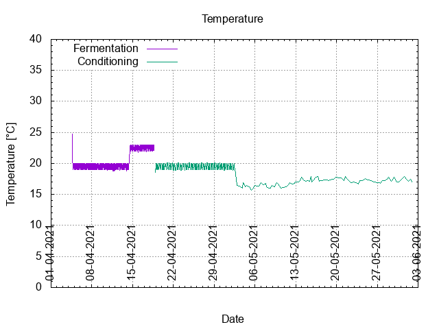
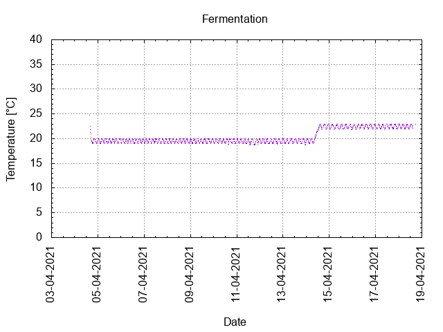
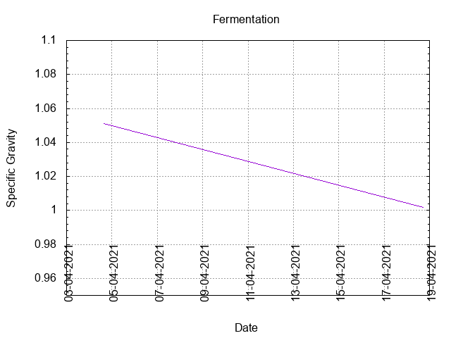
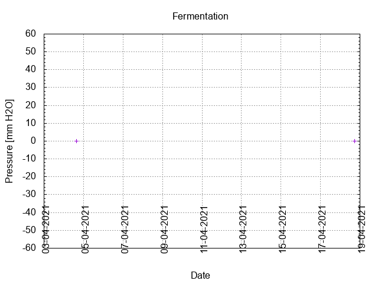
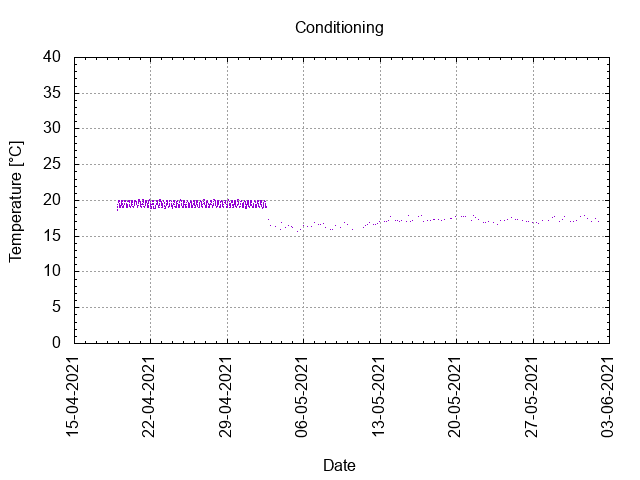

# Batch #9 - SMaSH Simcoe v2

## Milestones

04-04-2021 10:38 Start brewing.

04-04-2021 15:45 Start fermentation.

18-04-2021 21:35 Start conditioning.

01-06-2021 23:15 Completed conditioning.

31-07-2021 21:12 Archived.

## Process

[Results](./Batch_9_SMaSH_Simcoe_v2_results.pdf)

## Evaluation

|                         | Recipe | Batch | Diff   | Unit |
|-------------------------|--------|-------|--------|------|
| Pre-Boil Volume:        | 3.68   | 3.68  |  0     | L    |
| Post-Boil Volume (HOT): | 1.87   | 1.2   | -0.67  | L    |
| Boil Off per Hour:      | 1.8    | 2.48  | +0.68  | L    |
| Batch Volume:           | 1.2    | 1.2   |  0     | L    |
| Trub/Chiller Loss:      | 0.6    | 0.05  | -0.65  | L    |
| Bottling Volume:        | 1.2    | 0.66  | -0.54  | L    |
| Pre-Boil Gravity:       | 1.028  | 1.041 | +0.013 |      |
| Post-Boil Gravity:      | 1.055  | 1.051 | -0.004 |      |
| Original Gravity:       | 1.055  | 1.051 | -0.004 |      |
| Final Gravity:          | 1.011  | 1.002 | -0.009 |      |
| Alcohol By Volume:      | 5.8    | 6.4   | +0.6   | %    |
| Apparent Attenuation:   | 79.2   | 95.9  | +16.7  | %    |
| Mash Efficiency:        | 79     | 116   | +37    | %    |
| Brewhouse Efficiency:   | 43     | 49    | -4     | %    |
| IBU:                    | 40     | 56    | +16    |      |
| BU/GU Ratio:            | 0.73   | 1.10  | -0.37  |      |
| RB Ratio:               | 0.75   | 1.31  | +0.56  |      |
| Color                   | 9.5    | 12.8  | +3.3   | EBC  |
| Mash pH:                | 4.67   | 5.5   | +0.83  |      |

## [Tasting notes](./20210731_Batch_9_SMaSH_Simcoe_v2_BJCP_Scoresheet_2_2.pdf)

| No. | Date       | Age | Score | Notes |
|-----|------------|-----|-------|-------|
|     | 04-04-2021 |   0 |       | Brew day. |
|     | 18-04-2021 |  14 |       | Bottling day. |
|   1 | 19-06-2021 |  76 |  2.75 | Served @ 11 C. Clean, crisp, low carbonation, hardly any hop taste decernible. |
|   2 | 31-07-2021 | 118 |  2.75 | Served @ 11 C. Clean, crisp, low carbonation, hardly any hop taste decernible. |
