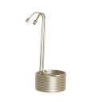
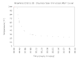

# New equipment @ July 30th, 2020.

I bought a Brewferm Chil'lin 20 Stainless steel immersion cooler.

The Brewferm Chill'in 20 cooler.

I did a clocked test run with the immersion cooler in approximately 6 L
boiling water in a 12 L kettle ... required water was a trickle ...
around 25 L tap water in 30 minutes ... at 60 C I fiddled with the flow
a little bit ... took me 2 minutes to get the kettle from the hob into
the garden ...

And the graph to visualize the performance.

