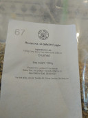
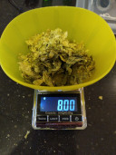
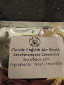

# Brew day @ October 24th, 2020.

I brewed another batch of British Golden Ale, this time with Crisp Extra
Pale Maris Otter malt, Fuggle hops and Classic English Ales yeast from
The Malt Miller.

A new ale in the Single Malt and Single Hops series named SMaSH Fuggle.

I'm hoping this will turn out to be a bit smoother than the SMaSH Godiva.

