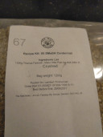
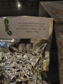
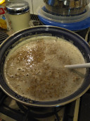
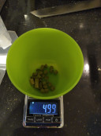
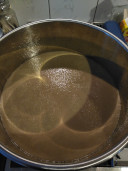

# Brew day @ November 21st, 2020.

I brewed a Single malt and single hop American Pale Ale with Thomas
Fawcett Maris Otter Pale Ale malt and Centennial hops.

Late additions and hopstand for flavour over bitterness.

