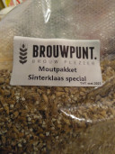
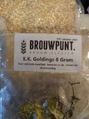
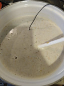
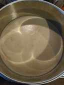

# Brew day @ December 6th, 2020.

Today a Sinterklaas Special all grain brew kit from Brouwpunt.

Following the recipe I was a bit  short on pre boil volume and specific
gravity on target.

A second batch sparge solved the volume problem against a lower specific
gravity.

Boiling went well, and a lot of trub left in the kettle.

