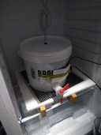

# Brew day @ March 6th, 2021.

Today I brewed a single malt and single hop American Pale Ale with
Thomas Fawcett Maris Otter Pale Ale malt and Citra hops.

Late additions and hopstand for flavour over bitterness.

Fermenter in the brew fridge.
