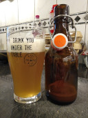

# Tasting @ April 3rd, 2021.

I just had a first taste of my SMaSH Citra.

It was set up as a Pale Ale and became an IPA.

It's still hazy two weeks after bottling, but Citra all over the place.

Good head of foam, good retention and good lacing.

Very pleased with this one, my best brew so far.

