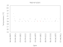

# New equipment @ April 7th, 2021.

I just downloaded the temperature data from the Inkbird ITC-308WiFi
temperature controller and put it in a graph ... goes beyond my
expectations of a brew fridge and temperature controller (set point is
20 C, delta is 1 C, so it errs on the low side, pitched yeast at 22.4 C).

