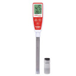
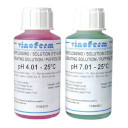

# New equipment @ May 30th, 2021.

I bought a Brewferm Cobra Pen pH meter with calibration liquids because I
was fed up using paper strips and wanted to improve on accuracy.

The Brewferm Cobra Pen.

And some calibration liquids.

