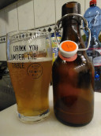

# Tasting @ July 2nd, 2021.

First taste of my Blonde ale with Magnum bittering hops and dry hopped
with Citra and Centennial.

It has a bit of a sweet and citrusy taste.

5 % ABV and an IBU of 20.

The carbonation and retention/lacing are a bit low ... it's been 47 days
after bottling (patience, patience) ... maybe it's just that one bottle
in the batch ... will try another one this weekend.

Quite good beer actually, a bit of a lawnmower beer for soccer pitches
... you can have several and still finish the job without anybody
noticing you had a couple.

I call it "Three Hops Blonde":

100 % TF Maris Otter Pale Ale malt, mashed @63 C for 60 min.

13.2 IBU Magnum (10.7 %) @30 min.

7.2 IBU Magnum @10 min.

2.5 IBU Magnum 15 min. hopstand @80 C.

2.5 g/L Citra (13.8 %) dry hopped for 7 days.

2.5 g/L Centennial (9 %) dry hopped for 7 days.

S-04 yeast 14 days @17 C 
