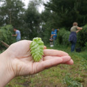
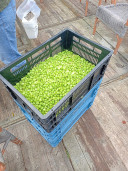
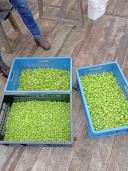
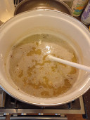

# Brew day @ September 12th, 2021.

I went hop picking fresh green Chinook hop cones yesterday.

So will be brewing a wet hops Blonde ale today.

As green as they come.

Today's harvest of Perle hops.

Yesterday's harvest for the brewery, Chinook (top), Cascade (right) and
Perle (bottom).

Mashing.

Green Chinook hops.
