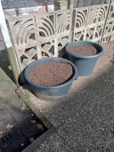

# Hop growing experiment @ April 3rd, 2022.

Started a hop growing experiment in some large tubs.

I bought some Willamette and Bramling Cross rhizomes the other week.

Found a good location with the most sunshine during the day and when
shoots emerge I will have to install some ropes for the bines to climb
onto.

