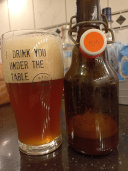

# Beer tasting day @ December 15th, 2022.

Impatient ... and Thirsty is my middle name ... I just had to have a
tasting of my first brewed best bitter after the clone recipe of Five
Points and pre-milled grist ordered at TMM.

Sweet, malty and strong, yet not boozy ... mild on hops and balanced
... not really hops over malts or vice versa, and no astringencies.

Nice foamy head with good lacing and retention.

Some yeast in suspension ... hazy because of Lallemand's fluffy London
... and this otter was impatient with pouring.

Nice amber colour, I really liked how this brew turned out ... it can
only get better.

